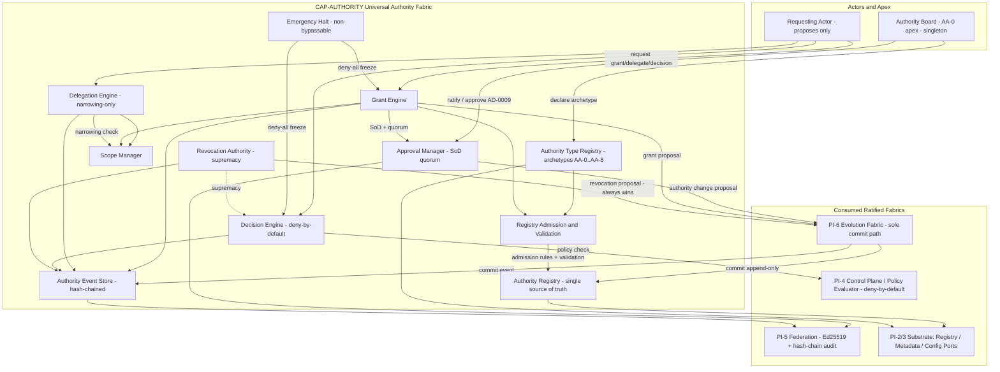
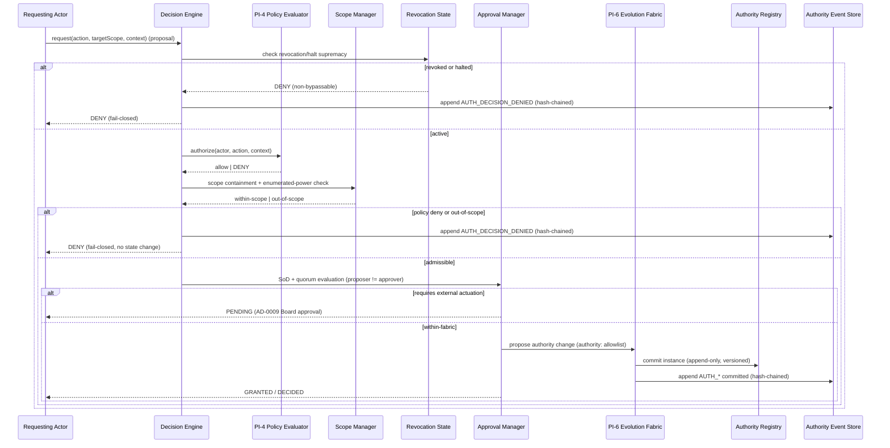
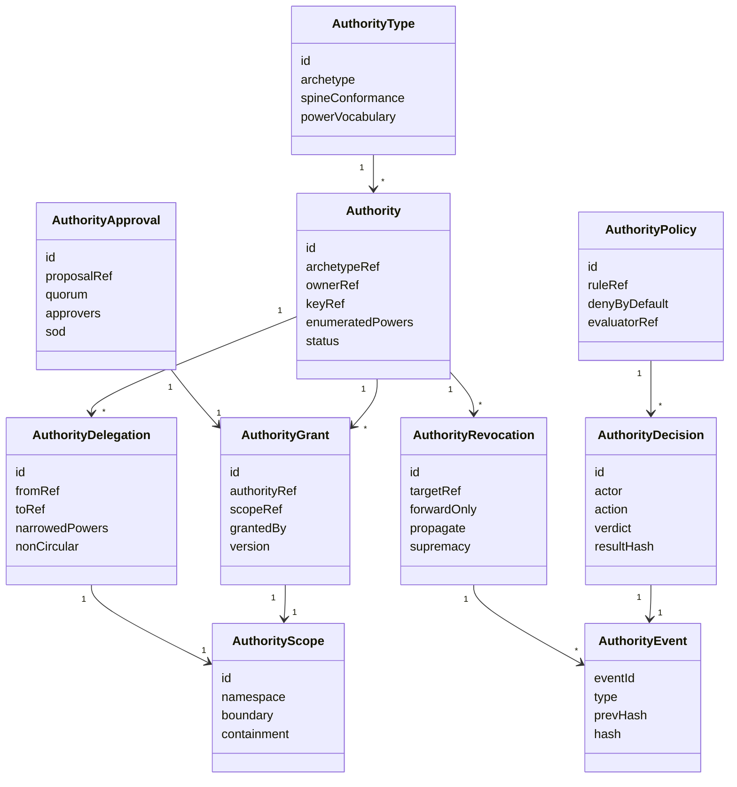
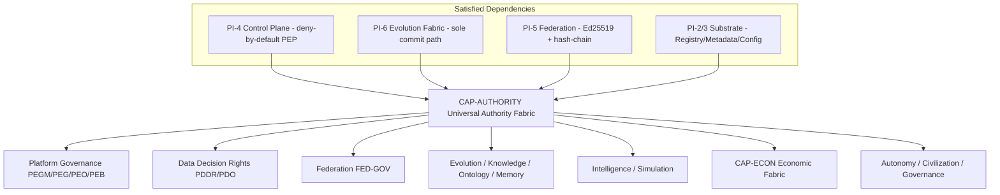

# Design Document: UCOS-CAP-AUTHORITY-CONSTRUCTION-0000

| Field | Value |
|-------|-------|
| Spec ID | `UCOS-CAP-AUTHORITY-CONSTRUCTION-0000` |
| Capability | **CAP-AUTHORITY — Universal Authority Fabric (Construction)** |
| Layer | ARCH (Authority) → SPEC (Construction) |
| Workflow | Design-First (Design → Requirements → Tasks) |
| Status | **DESIGN — DRAFT** (requirements & tasks deferred to later phases) |
| Design detail | High-Level Design **and** Low-Level Design (both requested) |
| Notation | Structured Pseudocode (`pascal`), technology-neutral per `PEP-010` |
| Position | Foundational construction specification — the composable authority substrate every governed fabric registers into |

> **Governing discipline.** This is an **architecture/specification** artifact. It selects **no**
> technology, cloud, datastore, language, framework, runtime, broker, or vendor (`AUTH-004` §6.5,
> `PEP-010` Platform Independence). It **does not amend, supersede, merge, or delete** the immutable
> Authority Layer `AUTH-001..012` (`AUTH-009` §6.6): it **composes over** it. The Authority Board
> remains the singular apex (`AA-0`); no fabric may instantiate a competing apex. It performs **no**
> external actuation — every real-world authority change remains `AD-0009` Approval-Required. It
> preserves `INV-1..13`, enrolls **no** existential invariant (`INV-14..20`), keeps the **AD-0014 Ω∞
> boundary** intact, and does **not** release the Article IX generation lock. It refines and realizes
> the `AUTH-UNIV-001` Universal Composable Authority Fabric review (`UAF-SPINE` S-A1..S-A10, archetypes
> `AA-0..AA-8`) and honors the non-inverting authority hierarchy of `PCAMG-0008` (Layers 0–8) and
> `AUTH-INDEX-001` §1/§2.

---

## 0. Traceability Anchors

| Axis | Anchor |
|------|--------|
| Authority | `AUTH-004` (Architecture Canon), `AUTH-005` (Domain Canon), `AUTH-006` (Capability Canon), `AUTH-007` (Data Canon), `AUTH-008` (Security — S1/S3/S4), `AUTH-009` (Governance — approval-by-exception, AD-0009, §6.6 immutability), `AUTH-010` (Traceability Canon), `AUTH-012` (Decision Log), `AUTH-INDEX-001` §1 (hierarchy) / §2 (Authority-wins) |
| Constitution | `UCOS-CONST-001` Art. IX (generation lock), Art. XI (immutability), Art. XII (approval-by-exception) |
| Principles | `IP-04` Configuration-Driven, `IP-05` Policy-Driven, `IP-06` Deterministic Execution, `IP-10` Auditability, `IP-13` Versioning, `IP-14` Migration-Only Evolution, `IP-15` Backward Compatibility, `INV-6` Determinism, `INV-13` Infinite Extensibility |
| Fabric spec (refined) | `AUTH-UNIV-001` (Universal Composable Authority Fabric — `UAF-SPINE` S-A1..S-A10, archetypes `AA-0..AA-8`, `UAF-C1..C4`) |
| Hierarchy | `PCAMG-0008` (Authority Hierarchy Layers 0–8; non-inversion guarantees G-1..G-5) |
| Capability | **CAP-AUTHORITY** (platform authority substrate); custodian `CAP-15` Platform Governance; realized-through `CAP-19` Registry & Discovery, `CAP-18` Policy & Decisioning |
| Fabrics consumed | PI-4 Control Plane / Policy Evaluator (**deny-by-default host**), PI-6 Evolution Fabric (**sole commit path**), PI-5 Federation (crypto + audit assertions), PI-2/3 Substrate (Registry / Metadata / Config ports) |
| Forward consumers | Every governed fabric — Platform (`PEGM/PEG/PEO/PEB`), Data (`PDDR/PDO`), Federation, Evolution, Knowledge, Ontology, Memory, Intelligence, Simulation, **Economic (`CAP-ECON`)**, Autonomy, Civilization, Governance — all re-express their governance as registered `authority:*` instances |

**Entry state (input).** The program carries `~14` behaviourally isomorphic authority models
(`~140` bespoke authority declarations). `AUTH-UNIV-001` determined **COLLAPSE FEASIBLE** into one
composable fabric under conditions `UAF-C1..C4`. This design is the **construction candidate** that
realizes that fabric as an additive `src/control/authority/*` layer once the requirements and tasks
phases complete and the Article IX / scoped-release gate opens. Construction remains **BLOCKED** until
a scoped Article IX release act is recorded (a prospective `AD-00xx`).

---

## 1. Capability Purpose

CAP-AUTHORITY is the **governed, registry-driven, event-sourced authority substrate** of UCOS. It lets
every fabric **grant, delegate, scope, evaluate, approve, and revoke** enumerated, bounded powers under
a single composable model — **without any fabric owning its own definition of what an authority *is*,
without hardcoding any authorization rule, and without ever actuating a real-world authority change
autonomously**.

Its load-bearing safety property is structural: **the only way authority state changes is a
deny-by-default, deterministic, Separation-of-Duties-checked proposal that the PI-6 Evolution Fabric
commits after PI-4 Control-Plane policy evaluation**, with any external-actuation of authority
additionally gated by `AD-0009`, and with **revocation supremacy** guaranteeing that a revoked or
halted authority can never be exercised. A compromised proposer's maximum blast radius is *rejected
proposals + audit noise*: it can grant itself nothing, widen no power, and bypass no halt.

**Why CAP-AUTHORITY is foundational.** Authority is the shared spine every other capability depends on.
`AUTH-UNIV-001` proved that Platform, Data, Control, Federation, Evolution, Knowledge, Ontology, Memory,
Intelligence, Simulation, **Economic**, Autonomy, Civilization, and Governance fabrics all terminate
escalation at the same apex (the Authority Board) and repeat the same archetypes. Building the fabric
first, registry-first, guarantees those fabrics **compose** their governance by *registering instances*
(`INV-13`) rather than re-defining authority — collapsing `~140` declarations into `8` archetypes +
`10` spine invariants + `N` registered instances.

**Explicit non-goals.** CAP-AUTHORITY is **not** a new apex and **does not** replace the Authority
Board (`AA-0` is preserved unchanged). It does **not** amend `AUTH-001..012`. It is **not** an identity
provider, a secrets manager, or a cryptographic primitive — it reuses PI-4 (policy), PI-5 (Ed25519 +
hash-chain), and PI-6 (commit). It performs **no** external actuation of authority.

---

## 2. Architecture (High-Level Design)

### 2.1 Architectural stance

CAP-AUTHORITY is a **composable, deny-by-default, propose-not-act authority ledger & coordination
subsystem**, realized additively as control-layer components over the ratified substrate/control/
evolution fabrics. All behavior is **driven by registries and configuration**: the archetype set,
enumerated powers, scopes, policies, and delegation chains are **registry/metadata records** — no
authorization rule, role, or power is embedded in code (`IP-04`, `IP-05`). Every authority instance
conforms to the ten spine invariants `UAF-SPINE S-A1..S-A10`.

### 2.2 Component composition



### 2.3 The governed authority loop (primary sequence)



### 2.4 Layer placement and boundaries

- **Layer:** Platform (authority substrate), consumed by every fabric via versioned contracts
  (`AUTH-004` §6.2/§6.3). CAP-AUTHORITY sits at `PCAMG-0008` **Layer 6 (Capabilities)** realizing
  **Layer 5 (Policies)** authorization, anchored to **Layer 0 (Invariant Principles)** and
  **Layer 1 (Meta-Constitution)**; it may **never invert** a higher layer (non-inversion guarantees
  `G-1..G-5`).
- **Additivity:** all prospective construction is confined to `packages/platform-runtime/src/control/authority/*`
  plus a reserved `authority:*` metadata keyspace. **Zero** modification of substrate core dirs
  (`src/meta-core`, `src/registry-runtime`, `src/metadata-runtime`, `src/configuration-runtime`,
  `src/contracts`) and **zero** amendment of `AUTH-001..012` (`UAF-C2`, `G-2`).

---

## 3. Domain Model

CAP-AUTHORITY realizes ten governed constructs (`AUTH-C1..C10`). Each is a **metadata-backed record**
under `authority:<kind>:<id>`, single-owner, signed, lifecycle-governed, deny-by-default, and conformant
to the spine `UAF-SPINE S-A1..S-A10`. The constructs are typed instances of the archetypes
`AA-0..AA-8`; no construct defines a new authority model.



| # | Construct | Definition | Key rules | Archetype |
|---|-----------|------------|-----------|:---------:|
| C1 | **Authority** | A registered instance holding enumerated, bounded powers in a scope | Single owner (`S-A1`); enumerated powers only (`S-A9`); signed (`S-A7`); revocable | AA-1..AA-8 |
| C2 | **AuthorityType** | An archetype definition (`AA-0..AA-8`) with its spine-conformance profile and power vocabulary | Fixed archetype set; no fabric may define a new type; apex `AA-0` is singleton/non-instantiable | AA-* meta |
| C3 | **AuthorityGrant** | Instantiation of an archetype into a scope with enumerated powers | Board/owner grant only (`S-A2`); versioned (`IP-13`); commit via Evolution (`S-A5`) | AA-1/AA-6 |
| C4 | **AuthorityRevocation** | Forward-only, fail-closed removal of powers | **Revocation supremacy** — always wins; propagates transitively; never widens | AA-4 |
| C5 | **AuthorityDelegation** | Narrowing-only re-grant from one authority to another | Narrowing-only; non-circular; bounded; cannot exceed delegator's powers | AA-7 |
| C6 | **AuthorityScope** | Namespace/boundary within which powers are valid | Containment-enforced; namespace-isolated; local-shadows-foreign | spine |
| C7 | **AuthorityPolicy** | Externalized authorization rule evaluated deny-by-default | Deny-by-default (`S-A6`); resolved from registry; no hardcoded rule | AA-2/spine |
| C8 | **AuthorityApproval** | SoD + quorum-gated attestation for an authority change | proposer ≠ certifier ≠ ratifier ≠ revoker (`S-A2`); quorum (`S-A3`); AD-0009 for external actuation | AA-2/AA-3 |
| C9 | **AuthorityDecision** | Deterministic allow/deny verdict for a requested action | Pure function of recorded inputs (`INV-6`); `resultHash` reproducible; deny-by-default | spine |
| C10 | **AuthorityEvent** | Hash-chained, append-only record of every authority state change | Tamper-evident (`S-A7`); replayable; never deleted/rewritten (append-only) | spine |

---

## 4. Registry Schema (Low-Level Design)

The **Authority Registry** is the **single source of truth** for authority state, and the **Authority
Type Registry** is the single source of truth for the archetype vocabulary. Every construct, power,
scope, policy, and delegation chain is a **registry/metadata record** under the reserved `authority:*`
keyspace — no authorization logic is compiled in. New fabrics extend the platform by **registering
instances**, not by code change (`INV-13`, `UAF-C4` register-then-retire).

```pascal
STRUCTURE AuthorityTypeRecord            // Authority Type Registry (archetype vocabulary)
  id: AuthorityTypeId                    // "authority:type:AA-<n>"
  archetype: EnumArchetype               // AA-0 | AA-1 | ... | AA-8
  instantiable: Boolean                  // FALSE for AA-0 (apex singleton, non-instantiable)
  powerVocabulary: Set<EnumPower>        // the bounded powers this archetype may enumerate
  spineConformance: Set<SpineInvariantId> // MUST include S-A1..S-A10 as applicable
  version: SemVer                        // IP-13
END STRUCTURE

STRUCTURE AuthorityRecord                // Authority Registry (instances)
  id: AuthorityId                        // "authority:<fabric>:<uuid>"  (keyspace: authority:<kind>:<id>)
  archetypeRef: AuthorityTypeId          // typed instance of AA-1..AA-8 (never AA-0)
  ownerRef: OwnerId                      // single accountable owner (S-A1)
  keyRef: KeyRef                         // signing key BY REFERENCE only (S3; never embedded)
  enumeratedPowers: Set<EnumPower>       // subset of archetype powerVocabulary (S-A9); no implicit power
  scopeRef: ScopeId                      // AuthorityScope this instance is bound to
  grantedBy: AuthorityId                 // provenance chain (never self-granted)
  sourceRef: RegistryRef                 // Authority/Constitution source anchor (S-A10; AUTH-010)
  version: SemVer
  status: EnumLifecycle                  // proposed | active | suspended | revoked | retired
END STRUCTURE

STRUCTURE AuthorityScopeRecord
  id: ScopeId                            // "authority:scope:<slug>"
  namespace: Namespace                   // isolated; local-shadows-foreign
  boundary: BoundarySpec                 // containment predicate
  parentScopeRef: ScopeId?               // scope tree (containment)
END STRUCTURE

STRUCTURE AuthorityDelegationRecord
  id: DelegationId                       // "authority:delegation:<uuid>"
  fromRef: AuthorityId
  toRef: AuthorityId
  narrowedPowers: Set<EnumPower>         // MUST be subset of from.enumeratedPowers (narrowing-only)
  scopeRef: ScopeId                      // MUST be contained within from.scope
  expiry: Timestamp
  version: SemVer
END STRUCTURE

STRUCTURE AuthorityPolicyRecord
  id: PolicyId                           // "authority:policy:<slug>"
  ruleRef: RegistryRef                   // externalized deterministic rule (IP-05)
  evaluatorRef: RegistryRef              // PI-4 policy evaluator binding
  denyByDefault: Boolean = TRUE          // non-overridable floor (S-A6)
  version: SemVer
END STRUCTURE

STRUCTURE RevocationRecord
  id: RevocationId                       // "authority:revocation:<uuid>"
  targetRef: AuthorityId
  forwardOnly: Boolean = TRUE            // fail-closed, forward-only
  propagate: Boolean = TRUE              // transitively revoke delegations
  reason: RevocationReason
END STRUCTURE
```

**Registry rules (enforced — admission + validation).**
1. Every record has exactly one owner (`S-A1`; `AUTH-005`/`AUTH-007` single-owner mandate).
2. Every record is classified (`AUTH-007` §6.3); unclassified ⇒ blocking gap (S4).
3. Every record is versioned (`IP-13`); breaking changes require a new version + migration (`IP-14/15`).
4. No authorization behavior is hardcoded: policies and rules are **records** resolved from the registry
   (`IP-04`/`IP-05`).
5. Every instance references a valid archetype in the Authority Type Registry; **no** instance may be an
   `AA-0` apex (apex is singleton, preserved, non-instantiable per fabric — `UAF-C3`).
6. Every instance's `enumeratedPowers ⊆ archetype.powerVocabulary` (no implicit or widened power).
7. Every instance traces to an Authority/Constitution source (`S-A10`, `AUTH-010`).
8. Registry is the single source of truth; runtime never caches authority state without an
   invalidation event.

```pascal
PROCEDURE admitAuthority(record, requestingAuthority)
  INPUT: record (AuthorityRecord), requestingAuthority (AuthorityId)
  OUTPUT: Result

  SEQUENCE
    // deny-by-default: only an authority holding the grant power may admit
    ASSERT hasPower(requestingAuthority, "grant") AND NOT revokedOrHalted(requestingAuthority)

    // admission rules (all fail-closed)
    archetype <- TypeRegistry.resolve(record.archetypeRef)
    ASSERT archetype <> NULL AND archetype.instantiable = TRUE          // no AA-0 instances
    ASSERT record.enumeratedPowers SUBSET_OF archetype.powerVocabulary  // S-A9
    ASSERT isWellFormed(record) AND isClassified(record)                // S4
    ASSERT resolves(record.scopeRef) AND resolves(record.sourceRef)     // S-A10
    ASSERT record.ownerRef IS SINGLE AND record.grantedBy <> record.id  // S-A1, no self-grant

    IF Registry.exists(record.id) THEN
      RETURN Error("Authority already registered; use migration (IP-14)")
    END IF

    // admission is itself an Evolution-committed change (single source of truth, S-A5)
    proposal <- buildAdmissionProposal(record)
    RETURN Evolution.commit(proposal, key = record.id)                  // sole commit path
  END SEQUENCE
END PROCEDURE
```

---

## 5. Configuration Model

Behavior is tuned through **hierarchical configuration** resolved from the substrate Configuration port
(`IP-04`), never hardcoded. Precedence: `default -> fabric-profile -> environment -> instance`
(deep-merge; later overrides earlier).

```pascal
STRUCTURE AuthorityConfig
  denyByDefault: Boolean = TRUE                 // non-overridable floor (S-A6)
  delegationMaxDepth: Integer                   // bounded delegation chain
  quorumFloor: Integer                          // minimum ratification quorum (S-A3)
  externalActuationGate: EnumGate = "AD-0009"   // non-overridable floor (external authority change)
  revocationSupremacy: Boolean = TRUE           // non-overridable floor (revocation always wins)
  singleApex: Boolean = TRUE                    // non-overridable floor (AA-0 apex only, UAF-C3)
  federationMode: EnumFedMode = "advisory-only" // non-overridable floor (foreign deny-only, S-A8)
  evolutionOnlyCommit: Boolean = TRUE           // non-overridable floor (S-A5)
END STRUCTURE
```

**Configuration floors (non-waivable).** Certain values are **floors** that configuration may tighten
but never relax: `denyByDefault = TRUE`, `revocationSupremacy = TRUE`, `singleApex = TRUE`,
`externalActuationGate = AD-0009`, `federationMode = advisory-only`, `evolutionOnlyCommit = TRUE`, and
the S1/S3/S4 controls. Any configuration attempting to relax a floor is rejected as a governance
violation.

```pascal
FUNCTION resolveConfig(scope)
  OUTPUT: AuthorityConfig
  SEQUENCE
    merged <- deepMerge(default, fabricProfile(scope), environment(scope), instance(scope))
    ASSERT merged.denyByDefault = TRUE
    ASSERT merged.revocationSupremacy = TRUE
    ASSERT merged.singleApex = TRUE
    ASSERT merged.externalActuationGate = "AD-0009"
    ASSERT merged.federationMode = "advisory-only"
    ASSERT merged.evolutionOnlyCommit = TRUE
    RETURN merged
  END SEQUENCE
END FUNCTION
```

---

## 6. Event Model (Event Sourcing)

Every authority state change is an **event** appended to a hash-chained, append-only stream (`S-A7`;
`IP-10`; S6). The current authority state (which powers exist, in which scope, active/suspended/revoked)
is a **projection** replayed from the event stream — the stream, not the projection, is authoritative.
This gives deterministic reconstruction, tamper-evident auditability, and reversibility by governed
compensating events (never silent edits — `AUTH-009` §6.6 append-only).

### 6.1 Canonical event vocabulary

```pascal
STRUCTURE AuthorityEvent
  eventId: Uuid
  streamId: EventStreamId
  sequence: MonotonicInt              // strictly increasing per stream
  prevHash: Hash                      // hash-chain (tamper-evident)
  hash: Hash                          // = H(prevHash || canonical(payload))
  type: EnumAuthEventType
  payload: EventPayload
  actor: ActorId
  authorityRef: AuthorityId
  resultHash: Hash                    // determinism proof for decisions (INV-6)
  timestamp: LogicalClock
  classification: ClassificationTag
END STRUCTURE

ENUM EnumAuthEventType
  AUTH_TYPE_DECLARED           // archetype registered (Board)
  AUTH_GRANTED                 // enumerated powers instantiated in a scope
  AUTH_DELEGATED               // narrowing-only re-grant
  AUTH_DELEGATION_REVOKED
  AUTH_SCOPE_DEFINED
  AUTH_POLICY_REGISTERED
  AUTH_DECISION_ALLOWED        // deterministic verdict
  AUTH_DECISION_DENIED         // fail-closed
  AUTH_APPROVAL_REQUESTED      // SoD + quorum pending
  AUTH_APPROVAL_GRANTED        // quorum met
  AUTH_APPROVAL_PENDING_AD0009 // external actuation escalated to Board
  AUTH_REVOKED                 // revocation supremacy
  AUTH_SUSPENDED
  AUTH_EMERGENCY_HALT          // non-bypassable deny-all freeze
  AUTH_RESUMED                 // by DISTINCT authority (SoD)
  AUTH_FEDERATION_ADVISORY     // foreign authority advisory-only
END ENUM
```

### 6.2 Revocation supremacy event

```pascal
STRUCTURE RevocationPayload
  targetRef: AuthorityId
  propagatedDelegations: List<DelegationId>   // transitively revoked
  forwardOnly: Boolean = TRUE
END STRUCTURE
```

### 6.3 Projection (deterministic replay)

```pascal
FUNCTION projectAuthorityState(streamId)
  OUTPUT: Map<AuthorityId, AuthorityView>
  SEQUENCE
    state <- emptyMap()
    prev <- GENESIS_HASH
    FOR each event IN eventStore.readOrdered(streamId) DO
      ASSERT event.prevHash = prev                          // chain integrity
      ASSERT event.hash = H(prev, canonical(event.payload)) // tamper-evidence
      applyEvent(state, event)
      // revocation supremacy: a revoked authority stays revoked forever (forward-only)
      IF event.type = AUTH_REVOKED THEN
        markRevokedTransitive(state, event.payload.targetRef)
      END IF
      ASSERT invariantsHold(state)   // single-owner, enumerated-power, scope-containment, single-apex
      prev <- event.hash
    END FOR
    RETURN state
  END SEQUENCE
END FUNCTION
```

**Preconditions:** stream exists; genesis anchored. **Postconditions:** authority state reproduces
deterministically for the same stream (`INV-6`); any hash/invariant breach halts replay fail-closed.
**Loop invariant:** at every iteration single-owner, enumerated-power, scope-containment, single-apex,
and revocation-supremacy invariants hold; no revoked authority is ever re-activated by a later event
except an explicit, Board-approved new grant with a new id.

---

## 7. API Model (Low-Level Design)

CAP-AUTHORITY exposes **contract-first, versioned** operations (`AUTH-004` §6.1/§6.3). All are
**propose-not-act**: they enqueue governed proposals; none mutates authority state directly. Every
exposed operation is deny-by-default and policy-evaluated, and passes through the revocation/halt
supremacy check first.

```pascal
INTERFACE AuthorityFabricAPI  // version v1.0 (IP-13)

  // --- Type & registry (single source of truth) ---
  PROCEDURE declareAuthorityType(typeRecord, boardApprover): Result   // Board only (AA-0)
  PROCEDURE registerScope(scopeRecord, authority): Result
  PROCEDURE registerPolicy(policyRecord, authority): Result
  FUNCTION  getAuthority(authorityId): AuthorityView                  // read-only projection
  FUNCTION  listPowers(authorityId): Set<EnumPower>                   // read-only

  // --- Grant / delegate / scope (propose only) ---
  PROCEDURE grantAuthority(authorityRecord, granter): GrantReceipt    // AA-1/AA-6
  PROCEDURE delegateAuthority(delegation, delegator): DelegationReceipt // AA-7 narrowing-only
  PROCEDURE narrowScope(authorityId, subScope, authority): Result

  // --- Decision (deterministic, deny-by-default) ---
  FUNCTION  decide(actor, action, targetScope, context): AuthorityDecision  // pure + resultHash

  // --- Approval & safety (Approval-Required where noted) ---
  PROCEDURE requestApproval(proposal, proposer): ApprovalReceipt      // SoD + quorum
  PROCEDURE revokeAuthority(targetId, revoker): Result                // supremacy (AA-4)
  PROCEDURE emergencyHalt(scope, invoker): Result                     // deny-all freeze
  PROCEDURE resume(scope, distinctResumeAuthority): Result            // SoD: distinct from halt

END INTERFACE
```

### 7.1 Decision API — formal specification

```pascal
FUNCTION decide(actor, action, targetScope, context)
  INPUT: actor (ActorId), action (EnumPower), targetScope (ScopeId), context (DecisionContext)
  OUTPUT: AuthorityDecision

  SEQUENCE
    // 0. revocation / halt supremacy (non-bypassable, checked FIRST)
    IF EmergencyHalt.isActive(targetScope) OR isRevoked(actor) THEN
      audit(AUTH_DECISION_DENIED, reason = "revoked-or-halted")
      RETURN Deny("revoked-or-halted", resultHash = H(context))       // revocation always wins
    END IF

    // 1. policy (deny-by-default) -- PI-4 Control Plane
    decision <- ControlPlane.authorize(actor, action, context)
    IF decision <> ALLOW THEN
      audit(AUTH_DECISION_DENIED, reason = "policy-deny")
      RETURN Deny("policy-deny", resultHash = H(context))
    END IF

    // 2. enumerated-power + scope containment (fail-closed)
    ASSERT hasEnumeratedPower(actor, action)                          // S-A9, no implicit power
    ASSERT scopeContains(actor.scope, targetScope)                    // containment
    ASSERT NOT exceedsDelegationBounds(actor, action)                 // narrowing-only (AA-7)

    // 3. determinism gate (INV-6): decision is a pure function of recorded inputs
    resultHash <- H(canonical(actor.powers, action, targetScope, context))
    ASSERT deterministicVerifier.reproduces(resultHash)

    // 4. external actuation gate
    IF actuatesExternalAuthority(action) THEN
      audit(AUTH_APPROVAL_PENDING_AD0009)
      RETURN Pending("AD-0009 approval required")                     // never autonomous
    END IF

    audit(AUTH_DECISION_ALLOWED, resultHash)
    RETURN Allow(resultHash)
  END SEQUENCE
END FUNCTION
```

**Preconditions:** actor authenticated (S1); target scope well-formed; archetype resolved.
**Postconditions:** a deterministic `Allow | Deny | Pending` verdict with a reproducible `resultHash`;
a revoked or halted actor is **always** denied; no external authority change occurs without `AD-0009`;
the decision itself mutates **no** authority state (state changes only via §7.2 grant/approval →
Evolution commit). **Loop invariants:** N/A (no unbounded loop; delegation-chain walk is bounded by
`delegationMaxDepth`).

### 7.2 Grant API — formal specification

```pascal
FUNCTION grantAuthority(record, granter)
  INPUT: record (AuthorityRecord), granter (AuthorityId)
  OUTPUT: GrantReceipt
  SEQUENCE
    IF EmergencyHalt.isActive(record.scopeRef) OR isRevoked(granter) THEN
      RETURN Reject("halted-or-revoked")
    END IF
    ASSERT decide(granter, "grant", record.scopeRef, ctx) = Allow(_)  // deny-by-default
    ASSERT record.enumeratedPowers SUBSET_OF granter.enumeratedPowers // cannot grant beyond own (narrowing)
    ASSERT proposer(record) <> approver(record)                       // SoD (S-A2)
    approval <- Approval.evaluate(record, quorum = resolveConfig().quorumFloor)  // S-A3
    IF NOT approval.met THEN
      RETURN Pending("quorum-not-met")
    END IF
    committed <- Evolution.commit(grantProposal(record), key = record.id)  // sole commit path (S-A5)
    audit(AUTH_GRANTED, record.id, committed.hash)
    RETURN Granted(committed.ref)
  END SEQUENCE
END FUNCTION
```

---

## 8. Governance Model

CAP-AUTHORITY is governed by the ten spine invariants (`UAF-SPINE S-A1..S-A10`) and the eight archetypes
(`AA-0..AA-8`) of `AUTH-UNIV-001`, enforced at runtime as guards. It is **subordinate** to
`AUTH-001..012` and the `PCAMG-0008` non-inversion guarantees.

| Governance dimension | Mechanism |
|----------------------|-----------|
| Apex | Single Authority Board (`AA-0`), preserved unchanged; non-instantiable per fabric (`S-A4`, `UAF-C3`) |
| Authority | Enumerated, signed, revocable powers per instance (`C1`); all granted by a superior (never self) (`S-A9`) |
| Separation of duties | `propose ≠ certify ≠ ratify ≠ revoke`; halt-invoker ≠ resume-authority (`S-A2`) |
| Ratification | Quorum-gated approval for authority changes (`S-A3`) |
| Deny-by-default | Every decision/grant/delegation denied unless policy allows + scope/power checks pass (`S-A6`) |
| Evolution-only commit | No independent write/rollback path; PI-6 is the sole authority-commit path (`S-A5`) |
| Revocation supremacy | Revocation is forward-only, propagates transitively, and always wins over any grant/decision |
| Determinism | Decisions/policy evaluation are pure functions of recorded inputs (`S-A?`, `INV-6`) |
| No external actuation | External-world authority change is `AD-0009` Approval-Required |
| Auditability | Hash-chained events; reversible only by governed compensating events (`S-A7`, S6) |
| Federation | Foreign authority advisory/deny-only, trust-clamped, namespace-isolated, local-shadows-foreign (`S-A8`) |
| Emergency halt | Non-bypassable deny-all freeze; resume by a distinct authority (`AA-8`) |
| Non-inversion | No lower layer grants itself authority over a higher layer (`PCAMG-0008` G-1..G-5) |

### 8.1 Decision-rights (summary)

| Class | Proposer | Authorizer | External-act approver | Revoker |
|-------|----------|-----------|-----------------------|---------|
| Declare archetype (`AA-0`) | Board | Board (quorum) | — | Board |
| Grant (`AA-1/AA-6`) | Grant authority | Policy (PEP) + SoD + quorum | AD-0009 (if external) | Revocation authority |
| Delegate (`AA-7`) | Delegating authority | Narrowing + containment check | — | Revocation authority / delegator |
| Decision (`spine`) | Requesting actor | Decision Engine (deny-by-default) | AD-0009 (if external) | (revocation denies) |
| Revoke (`AA-4`) | Revocation authority | (supremacy — no counter-authorization) | — | — |
| Emergency halt (`AA-8`) | Human/Board / auto-trigger | (none to halt) | distinct resume authority | — |

**Constitutional compliance.** CAP-AUTHORITY is subordinate to `AUTH-001..012` and `UCOS-CONST-001`;
it amends none of them (`AUTH-009` §6.6, `G-2`). Construction cannot begin until the Article IX
generation lock is released for a scoped authority subtree (a prospective `AD-00xx`); non-waivable
S1/S3/S4 are preserved; every governed action is auditable and traceable (`AUTH-010`).

---

## 9. Dependency Graph



- **Hard, satisfied:** PI-4 (policy), PI-6 (commit), PI-5 (crypto/audit), PI-2/3 (substrate ports).
  CAP-AUTHORITY is constructible on these; it adds **no** new core mechanism (`AUTH-UNIV-001` §5.3).
- **Forward consumers:** every governed fabric re-expresses its governance as registered `authority:*`
  instances via **register-then-retire** (`UAF-C4`); no consumer requires a CAP-AUTHORITY core change
  (`INV-13`). Bespoke per-fabric model text is superseded/linked, **never deleted** (`AUTH-009` §6.6).

---

## 10. Correctness Properties

Universal properties CAP-AUTHORITY must satisfy (verified by tests in §15 and formalized in the
requirements phase):

1. **Single apex.** No `AA-0` apex instance may be created; the Authority Board is the sole terminal
   escalation (`∀ a ∈ authorities: a.archetype ≠ AA-0`).
2. **Enumerated powers.** No authority holds a power outside its archetype's vocabulary
   (`∀ a: a.enumeratedPowers ⊆ typeOf(a).powerVocabulary`).
3. **Deny-by-default.** Absent an explicit ALLOW policy decision, every requested action is denied.
4. **Revocation supremacy.** A revoked (or halted) authority is denied at every subsequent decision
   point; revocation is forward-only and propagates to all delegations
   (`∀ a revoked, t > revokeTime: decide(a, ...) = DENY`).
5. **Narrowing-only delegation.** A delegated authority's powers/scope never exceed its delegator's
   (`∀ d: d.narrowedPowers ⊆ from(d).enumeratedPowers ∧ contains(from(d).scope, d.scope)`).
6. **Separation of duties.** For any authority change, proposer ≠ certifier ≠ ratifier ≠ revoker; and
   halt-invoker ≠ resume-authority.
7. **Determinism.** Replaying the same event stream yields identical authority state; identical decision
   inputs yield identical `resultHash` (`INV-6`).
8. **Propose-not-act.** No API path mutates authority state except through `Evolution.commit`
   (`∀ stateChange: originatedFrom(EvolutionFabric)`).
9. **No external actuation.** No decision that actuates real-world authority commits without an
   `AD-0009` approval.
10. **Auditability.** Every state-changing event is hash-chained and reconstructs the chain on replay
    (tamper-evident); no event is deleted or rewritten (append-only).
11. **Non-inversion.** No lower-layer authority can grant itself authority over a higher `PCAMG-0008`
    layer (`G-1`).
12. **Additivity.** Construction changes no substrate core dir, amends no `AUTH-001..012`, and preserves
    the existing baseline green (0 regressions) (`UAF-C2`).

---

## 11. Evidence Requirements

To advance CAP-AUTHORITY from design to ratified construction (feeding `governanceVerdict` toward `GO`):

| Evidence ID | Evidence | Class | Source |
|-------------|----------|-------|--------|
| EV-DESIGN | This design + requirements + tasks approved | E-DESIGN | Spec workflow |
| EV-TRACE | Full lineage: CAP-AUTHORITY → constructs → contracts → events → tests (`AUTH-010`; 0 orphans) | E-DESIGN | Traceability matrix |
| EV-CODE-APEX | Single-apex enforced (no `AA-0` instance admissible) | E-CODE | `authority.test` |
| EV-CODE-POWER | Enumerated-power containment (no implicit/widened power) | E-CODE | Property test |
| EV-CODE-DENY | Deny-by-default across all APIs | E-CODE | Policy test |
| EV-CODE-RVK | Revocation supremacy (revoked ⇒ always denied; transitive propagation) | E-CODE | Property test |
| EV-CODE-DELEG | Narrowing-only delegation (non-circular, bounded depth) | E-CODE | Property test |
| EV-CODE-DET | Deterministic replay + `resultHash` reproduction | E-CODE | Replay test (`INV-6`) |
| EV-CODE-SOD | Separation of duties + quorum enforced | E-CODE | Governance test |
| EV-SEC | S1/S3/S4 enforced; signed authorities; keys by reference | E-CODE | `AUTH-008` conformance |
| EV-THREAT | Adversarial suite (AC1–ACn); 0 residual High/High | E-CODE | `authority-adversarial.test` |
| EV-AUDIT | Hash-chained events; offline replay proof; append-only | E-HIST | `AUTH-010` / S6 conformance |
| EV-ADDITIVE | 0 prohibited-core-dir change; 0 `AUTH-*` amendment; baseline green | E-CODE | Directory + test gate |
| EV-GOV | Scoped Article IX release act recorded (`AD-00xx`) | E-HIST | `AUTH-012` ledger |

**Non-optimistic discipline:** absence of any required evidence = FAIL (per `OP-CERT-001`).

---

## 12. Completion Criteria

CAP-AUTHORITY construction is **complete** when **all** hold (fail-closed conjunction):

1. All 12 correctness properties (§10) are proven by passing tests.
2. All 10 constructs (`AUTH-C1..C10`) and the eight archetypes (`AA-1..AA-8`, with `AA-0` preserved
   non-instantiable) are implemented registry-first with **no hardcoded authorization logic**.
3. Deny-by-default, enumerated-power, scope-containment, narrowing-only delegation, SoD/quorum,
   revocation-supremacy, and Evolution-only-commit gates are enforced at the decision/grant boundary.
4. Event sourcing is authoritative: authority state is a projection; replay is deterministic and
   tamper-evident.
5. The adversarial suite passes with **0 residual High/High**.
6. Non-waivable S1/S3/S4 enforced; external authority actuation remains `AD-0009`-gated.
7. Registry is the single source of truth; onboarding a new fabric requires **no core change**
   (`INV-13`; `UAF-C4` register-then-retire).
8. Additive-only: 0 prohibited-core-dir change; 0 `AUTH-001..012` amendment (`G-2`); prior baseline
   remains green.
9. Full traceability recorded (`AUTH-010`); all EV-* evidence present.
10. A scoped Article IX release act (`AD-00xx`) authorizes the `src/control/authority/*` construction.

---

## 13. Implementation Phases

Registry-first, additive build waves (each wave: additive-only; baseline green at the boundary). The
wave labels W0–W9 map to the exit gates below.

| Wave | Scope | Exit gate |
|------|-------|-----------|
| **W0 Foundations** | `types`, Authority Type Registry (`AA-0..AA-8`), Authority Registry skeleton, spine-conformance checks (`S-A1..S-A10`) | Build + baseline green |
| **W1 Registry & Admission** | Authority Registry admission rules, validation, versioning, `authority:*` keyspace, classification | Admission fail-closed tests; single-owner/enumerated-power |
| **W2 Event Store** | Hash-chained append-only Authority Event Store, projection, deterministic replay | Tamper-evidence + deterministic replay tests |
| **W3 Scope & Policy** | Scope Manager (containment/namespace isolation), Authority Policy records + PI-4 binding, config floors | Scope containment; deny-by-default |
| **W4 Decision Engine** | Deterministic Decision Engine (`decide`), `resultHash` verifier | Determinism (`INV-6`); deny-by-default across APIs |
| **W5 Grant Engine** | Grant Engine, enumerated-power containment, provenance (no self-grant), Evolution commit | Grant fail-closed; propose-not-act |
| **W6 Delegation Engine** | Delegation Engine (narrowing-only, non-circular, bounded depth) | Narrowing-only + non-circular tests |
| **W7 Approval & SoD** | Approval Manager (SoD + quorum), AD-0009 external-actuation escalation | SoD/quorum; AD-0009 pending path |
| **W8 Revocation & Halt** | Revocation Authority (supremacy, transitive propagation), Emergency Halt/Resume (SoD) | Revocation supremacy; halt/resume distinct-authority |
| **W9 Federation & Adversarial** | Federation Guard (advisory/deny-only, clamped), full adversarial suite, register-then-retire migration harness | 0 residual High/High; audit replay proof; additivity gate |

**Approval-Required acts (`AD-0009`)** — declare archetype, external authority actuation, scoped
Article IX release — are deferred to runtime/Board and never auto-executed.

---

## 14. Migration Strategy

Governed by `AUTH-007` §6.5 (migration-only evolution), `AUTH-009` §6.6 (append-only immutability), and
`IP-13/14/15`.

- **Model collapse via register-then-retire (`UAF-C4`).** The `~14` existing authority models are
  onboarded by **registering instances** of `AA-1..AA-8` in `authority:<fabric>:*`; the bespoke model
  text is **superseded/linked, never deleted**. No `AUTH-001..012` artifact is edited or merged away
  (`G-2`).
- **Schema/registry evolution:** all archetype / instance / scope / policy schema changes occur through
  **reversible, recorded migrations**; never destructive in-place edits. Each migration is versioned and
  traceable.
- **Event stream evolution:** event types are additive and versioned; older events remain replayable
  (upcasters map old → new payloads deterministically). No event is deleted or rewritten (append-only).
- **Backward compatibility (`IP-15`):** API is versioned (`v1.0`); N and N-1 coexist during deprecation
  windows; breaking contract changes require a new major version + migration path.
- **Rollback:** every grant/delegation/scope change is reversible by a **governed compensating event**
  (e.g., revocation/narrowing); there is no silent delete or in-place edit.
- **Fold-map preservation (`G-1`):** every folded construct maps to exactly one archetype with equal or
  stricter powers; no power is widened, none dropped.
- **External irreversibility:** any migration touching real-world authority actuation is `AD-0009`
  Approval-Required.

---

## 15. Test Strategy

### 15.1 Unit testing
- Per-construct: registry CRUD-by-migration, classification inheritance, single-owner enforcement,
  enumerated-power containment, archetype resolution, scope containment, config floor enforcement,
  provenance (no self-grant).

### 15.2 Property-based testing
Property library selected at construction time (must be deterministic-seedable). Core properties:

```pascal
PROPERTY singleApexAlwaysHolds
  FOR ALL authority a:
    a.archetype <> AA-0

PROPERTY enumeratedPowerContainment
  FOR ALL authority a:
    a.enumeratedPowers SUBSET_OF typeOf(a).powerVocabulary

PROPERTY denyByDefault
  FOR ALL action req WITHOUT explicit ALLOW:
    decide(req) = DENY

PROPERTY revocationSupremacy
  FOR ALL authority a revoked at time r, request q at time t > r:
    decide(a, q) = DENY                          // revocation always wins, transitively

PROPERTY narrowingOnlyDelegation
  FOR ALL delegation d:
    d.narrowedPowers SUBSET_OF from(d).enumeratedPowers
    AND contains(from(d).scope, d.scope)
    AND acyclic(delegationGraph)

PROPERTY deterministicReplay
  FOR ALL stream st:
    projectAuthorityState(st) = projectAuthorityState(st)   // stable; same resultHash

PROPERTY separationOfDuties
  FOR ALL authority change c:
    proposer(c) <> certifier(c) <> ratifier(c) <> revoker(c)
```

### 15.3 Adversarial testing (AC1–ACn)
One test per authority threat, targeting: apex forgery (creating an `AA-0`), self-grant, power
widening, scope escape, delegation cycles / depth overflow, revocation bypass, halt bypass, SoD
collusion, quorum evasion, non-deterministic decision injection, audit-chain tampering, external
actuation without AD-0009, cross-node foreign-authority auto-grant. **Pass criterion:** 0 residual
High/High; each attack yields rejection + audit noise only.

### 15.4 Integration testing
- End-to-end governed loop (request → revocation/halt check → policy → scope/power → SoD/quorum →
  Evolution commit → hash-chained audit) against the implemented PI-4/PI-5/PI-6 fabrics.
- Register-then-retire migration: onboard a representative fabric's governance as `authority:*`
  instances and prove behaviour-preservation (`G-3`).
- Additivity gate: run the full existing platform-runtime baseline; require **0 regressions** and
  **0 `AUTH-*` amendments**.

---

## 16. Operational Model

| Concern | Design |
|---------|--------|
| **Ownership** | Custodian `CAP-15` Platform Governance; apex = Authority Board (`AA-0`); single accountable owner per registry record |
| **Observability** | Every authority event emits structured, classified, hash-chained audit records; authority-state projections and decision deny-rates are queryable read-models |
| **Failure handling** | All failures are **fail-closed** (deny; no state change); policy/scope/SoD failures produce `AUTH_DECISION_DENIED` + audit; nothing is silently allowed |
| **Recovery** | Authority state recovered by deterministic event replay; governed compensating events for corrections; RPO/RTO floors inherit from `UCOS-ASR-NFR-001` (values `PENDING ASR RATIFICATION`, N-1) |
| **Emergency control** | Non-bypassable Emergency Halt freezes all/scoped authority activity to deny-all; resume requires a **distinct** authority (SoD, `AA-8`) |
| **Federation** | Advisory-only, deny-only, trust-clamped, namespace-isolated, local-shadows-foreign; no cross-node auto-grant; fail-closed on partition (`S-A8`) |
| **Auditability** | Hash-chained `AUTH_*` events; offline replay proof; append-only retention (`S-A7`, S6, `AUTH-009` §6.6) |
| **Determinism guarantee** | Decisions and policy evaluation are pure functions of recorded inputs; any non-reproducible `resultHash` is inadmissible (`INV-6`) |

---

## 17. Error Handling

| Scenario | Condition | Response | Recovery |
|----------|-----------|----------|----------|
| Revoked/halted actor | Revocation active or scope halted | `AUTH_DECISION_DENIED`; non-bypassable | New Board-approved grant (new id) or distinct resume authority |
| Policy deny | Control Plane returns not-ALLOW | `AUTH_DECISION_DENIED`; fail-closed | Actor re-requests with valid authority/context |
| Power not enumerated | Requested power outside archetype vocabulary | Deny (no implicit power) | Request a proper grant of the enumerated power |
| Scope escape | Target scope not contained by actor scope | Deny | Narrow request to contained scope |
| Apex forgery | Attempt to instantiate `AA-0` | Reject admission | None — apex is singleton, non-instantiable |
| Self-grant | `grantedBy = id` | Reject admission | Route through a superior granting authority |
| Delegation overflow | Cycle or depth > `delegationMaxDepth` | Reject | Restructure delegation chain (narrowing, acyclic) |
| Quorum not met | Approvers < quorum floor | `Pending("quorum-not-met")` | Obtain additional distinct approvers (SoD) |
| External actuation | Decision actuates real-world authority | `Pending("AD-0009")` — never autonomous | Human/Board approval |
| Chain break | Event `prevHash`/`hash` mismatch on replay | Halt replay fail-closed; flag tamper | Governance investigation; restore from audit |

---

## 18. Security Considerations

- **S1 (Authentication/Authorization):** every actor authenticated; deny-by-default authorization via
  the PI-4 policy evaluator; authorities are enumerated, signed, revocable (`S-A6`, `S-A9`).
- **S3 (Secrets/Keys):** signing keys referenced, never embedded; signed authority acts reuse PI-5
  Ed25519 assertions (no custom cryptography — `S-A7`).
- **S4 (Data Protection):** authority/scope records carry inherited classification (`AUTH-007` §6.3);
  classification is monotonic and enforced on projections/exports.
- **S6 (Audit):** immutable, hash-chained, append-only authority audit trail; independently
  replayable/verifiable (`AUTH-009` §6.6).
- **Blast radius:** structural — a compromised proposer can only cause rejected proposals + audit
  noise; it cannot forge an apex, self-grant, widen a power, escape scope, bypass revocation/halt, or
  actuate external authority (enumerated powers + Evolution-only commit + revocation supremacy +
  `AD-0009`).
- **Non-waivable:** S1/S3/S4 floors and the `denyByDefault`/`revocationSupremacy`/`singleApex`/
  `externalActuationGate=AD-0009`/`advisory-only`/`evolutionOnlyCommit` configuration floors cannot be
  relaxed by configuration.

---

## 19. Open Items and Deferrals

| ID | Item | Disposition |
|----|------|-------------|
| OI-1 | Scoped Article IX release for `src/control/authority/*` | Authority Board act (`AD-00xx`); construction blocked until granted |
| OI-2 | Board adoption of `UAF-SPINE` + `AA-1..AA-8` as the governing authority model | Approval-Required (`AUTH-009` §8; `UAF-C1`); this design is a construction candidate, not an enactment |
| OI-3 | Register-then-retire migration order across the ~14 fabrics | Sequenced in tasks phase; append-only, no deletion (`UAF-C4`) |
| OI-4 | ASR/NFR quantitative values (RPO/RTO/latency) | `PENDING ASR RATIFICATION` (Trusted Op N-1, Prompt 02) |
| OI-5 | Harmonization of `PCAMG-0008` (proposed) with `AUTH-INDEX-001` §1 (ratified) | Reconciled by version increment + `AUTH-012`, never silent rewrite; Board review pending |

---

## 20. Traceability Links

- **Refines:** `AUTH-004`, `AUTH-005`, `AUTH-006`, `AUTH-007`, `AUTH-008`, `AUTH-009`, `AUTH-010`,
  `AUTH-INDEX-001` (§1/§2), `UCOS-CONST-001` (Art. IX/XI/XII), `AUTH-UNIV-001` (`UAF-SPINE`,
  `AA-0..AA-8`, `UAF-C1..C4`), `PCAMG-0008` (Layers 0–8, `G-1..G-5`).
- **Refined by:** `UCOS-CAP-AUTHORITY-CONSTRUCTION-0000/requirements.md` (next phase),
  `UCOS-CAP-AUTHORITY-CONSTRUCTION-0000/tasks.md` (later phase).
- **Consumes:** PI-4 Control Plane, PI-5 Federation, PI-6 Evolution Fabric, PI-2/3 Substrate (satisfied).
- **Enables:** every governed fabric — Platform, Data, Federation, Evolution, Knowledge, Ontology,
  Memory, Intelligence, Simulation, **Economic (`CAP-ECON`)**, Autonomy, Civilization, Governance — via
  registered `authority:*` instances (`INV-13`, `UAF-C4`).
- **Preserves:** `AUTH-001..012` (unamended, `G-2`), `INV-1..13`, `AUTH-012`, `AD-0014` (Ω∞ boundary),
  Article IX generation lock, single apex (`AA-0`, `UAF-C3`).
- **Owner:** UCOS Authority Board (custodian: Platform Governance `CAP-15`).

**END design.md — DESIGN — DRAFT. Requirements and tasks deferred to their own phases.**
