# UCOS-CAP-AUTHORITY-CONSTRUCTION-0000 — Tasks

| Field | Value |
|-------|-------|
| Spec ID | `UCOS-CAP-AUTHORITY-CONSTRUCTION-0000` |
| Capability | **CAP-AUTHORITY — Universal Authority Fabric (Construction)** |
| Phase | **Tasks** |
| Status | **TASKS — DRAFT** |
| Inputs | `design.md` (COMPLETE), `requirements.md` (COMPLETE) |
| Requirements Count | FR=25, NFR=20, GR=20, DR=15, SR=15 (Total: 95) |
| Acceptance Criteria Count | AC=40 |
| Completion Criteria Count | CC=20 |
| Work Breakdown | W0–W9 (10 waves) |
| Total Tasks | 164 tasks |
| Critical Path Tasks | 39 tasks |
| Coverage | 100% (Requirements → Tasks, AC → Tasks, Evidence → Tasks) |

---

## Executive Summary

This document decomposes CAP-AUTHORITY construction into **10 implementation waves** (W0–W9) aligned
with `design.md` §13, producing **164 tasks** that fully satisfy all 95 requirements (FR/NFR/GR/DR/SR),
all 40 acceptance criteria (AC-AUTH-001..040), and all 20 completion criteria (CC-AUTH-001..020).

Every task is traceable to at least one requirement, evidence artifact (`EV-CAP-AUTH-*`), and
completion criterion. The wave structure follows the registry-first, additive build discipline —
each wave's exit gate enforces additive-only construction, baseline preservation (green), and
fail-closed verification. Waves W0–W2 establish the authority substrate (types, registry, event
store), W3–W5 build the governance engines (scope/policy, decision, grant/delegation), W6–W7 add
approval/revocation/halt, W8 enforces federation, and W9 executes the adversarial suite and
register-then-retire migration harness with full closure evidence acceptance.

The **critical path** (39 tasks) runs through the registry-to-decision-to-commit stack, governing
the latency from authority proposal to Evolution-committed state. Non-critical tasks (125) include
parallelizable federation, migration, reconciliation, and evidence-production work.

All wave boundaries enforce the **additivity gate** — zero prohibited-core-dir change, zero
`AUTH-001..012` amendment, existing baseline green — plus per-wave verification checkpoints.
Construction cannot proceed to W0 until the scoped Article IX release act (OI-1) and Board adoption
of `UAF-SPINE`/`AA-1..AA-8` (OI-2) are recorded; these prerequisites remain **PENDING**.

---

## Work Breakdown Structure

### Wave Summary

| Wave | Scope | Tasks | Critical | Exit Gate | Dependencies |
|------|-------|-------|----------|-----------|--------------|
| **W0 Foundations** | Types, Authority Type Registry, Authority Registry skeleton, spine-conformance checks | 19 | 7 | Build + baseline green + single-apex/enumerated-power/single-owner property tests | Prerequisites OI-1/OI-2 satisfied |
| **W1 Registry & Admission** | Admission rules, validation, versioning, `authority:*` keyspace, classification | 16 | 5 | Admission fail-closed tests + adversarial (self-grant, power widening) | W0 COMPLETE |
| **W2 Event Store** | Hash-chained append-only Authority Event Store, projection, deterministic replay | 16 | 6 | Tamper-evidence + deterministic-replay property tests | W0, W1 COMPLETE |
| **W3 Scope & Policy** | Scope Manager, Authority Policy records + PI-4 binding, config floors | 16 | 4 | Scope containment + deny-by-default policy tests | W0, W1, W2 COMPLETE |
| **W4 Decision Engine** | Deterministic Decision Engine, `resultHash` verifier, gate sequence | 18 | 6 | Determinism property tests + PI-4 integration | W3 COMPLETE |
| **W5 Grant Engine** | Grant Engine, enumerated-power containment, Evolution commit | 13 | 4 | Grant fail-closed + propose-not-act property tests | W4 COMPLETE |
| **W6 Delegation Engine** | Delegation Engine (narrowing-only, non-circular, bounded depth) | 12 | 3 | Narrowing-only + non-circular property tests | W5 COMPLETE |
| **W7 Approval & SoD** | Approval Manager (SoD + quorum), AD-0009 external-actuation escalation | 14 | 4 | SoD/quorum property tests + AD-0009 pending path | W5, W6 COMPLETE |
| **W8 Revocation & Halt** | Revocation Authority (supremacy, transitive), Emergency Halt/Resume (SoD) | 13 | 3 | Revocation supremacy + halt/resume property tests | W7 COMPLETE |
| **W9 Federation & Adversarial** | Federation Guard, adversarial suite, register-then-retire migration harness, closure evidence | 27 | 0 | 0 residual High/High + audit replay proof + additivity gate + closure review | W8 COMPLETE |
| **Total** | | **164** | **39** | | |

### Critical Path Definition

The **critical path** (39 tasks) is the longest dependency-constrained sequence governing the latency
from authority proposal to Evolution-committed state. It runs through:

1. **W0 foundations** → Authority Type Registry + Authority Registry skeleton (7 tasks)
2. **W1 admission** → admission rules + Evolution commit integration (5 tasks)
3. **W2 event store** → hash-chained append-only stream + projection engine (6 tasks)
4. **W3 scope/policy** → PI-4 policy binding + deny-by-default enforcement (4 tasks)
5. **W4 decision** → deterministic Decision Engine + gate sequence (6 tasks)
6. **W5 grant** → Grant Engine + Evolution commit (4 tasks)
7. **W6 delegation** → (bypassed; not on decision-to-commit path)
8. **W7 approval** → Approval Manager + SoD/quorum (4 tasks)
9. **W8 revocation** → Revocation supremacy guard (3 tasks)
10. **W9 closure** → (evidence acceptance; not on decision-path latency)

All 125 non-critical tasks (delegation detail, federation, migration, reconciliation, evidence production) are
parallelizable or dependency-independent once their wave prerequisites are satisfied.

---

## W0 — Foundations (19 tasks, 7 critical)

**Scope:** Authority types, Authority Type Registry (`AA-0..AA-8`), Authority Registry skeleton,
spine-conformance checks (`S-A1..S-A10`), build infrastructure.

**Exit Gate:** Build + baseline green + single-apex / enumerated-power / single-owner property tests passing.

**Dependencies:** Prerequisites OI-1 (scoped Article IX release) and OI-2 (Board adoption of `UAF-SPINE`/`AA-1..AA-8`) satisfied.

| Task ID | Task Description | Requirement Traceability | AC Traceability | Evidence | Critical Path | Dependencies | Estimate |
|---------|------------------|--------------------------|-----------------|----------|---------------|--------------|----------|
| W0-T001 | Define `EnumArchetype` (`AA-0..AA-8`), `EnumPower`, `EnumLifecycle`, `SpineInvariantId` type enumerations (technology-neutral structured pseudocode → implementation types) | FR-AUTH-003, DR-AUTH-002 | AC-AUTH-005 | EV-CAP-AUTH-IMP | ✓ CRITICAL | OI-1, OI-2 | 2d |
| W0-T002 | Define `AuthorityTypeId`, `AuthorityId`, `ScopeId`, `DelegationId`, `PolicyId`, `RevocationId` identifier types with `authority:*` keyspace convention | FR-AUTH-001, DR-AUTH-001 | AC-AUTH-001 | EV-CAP-AUTH-IMP | ✓ CRITICAL | W0-T001 | 1d |
| W0-T003 | Implement `STRUCTURE AuthorityTypeRecord` (archetype, instantiable, powerVocabulary, spineConformance, version) with registry binding | FR-AUTH-003, DR-AUTH-002 | AC-AUTH-005, AC-AUTH-006 | EV-CAP-AUTH-IMP | ✓ CRITICAL | W0-T001, W0-T002 | 2d |
| W0-T004 | Implement Authority Type Registry (single source of truth for `AA-0..AA-8`) with resolve/list operations | FR-AUTH-003, DR-AUTH-002, GR-AUTH-002 | AC-AUTH-005, AC-AUTH-006 | EV-CAP-AUTH-IMP | ✓ CRITICAL | W0-T003 | 3d |
| W0-T005 | Seed Authority Type Registry with `AA-0` (apex, non-instantiable), `AA-1..AA-8` archetype definitions per `design.md` §3 / `AUTH-UNIV-001` | FR-AUTH-003, FR-AUTH-022, GR-AUTH-008 | AC-AUTH-005 | EV-CAP-AUTH-IMP | ✓ CRITICAL | W0-T004 | 2d |
| W0-T006 | Implement `STRUCTURE AuthorityRecord` (id, archetypeRef, ownerRef, keyRef, enumeratedPowers, scopeRef, grantedBy, sourceRef, version, status) | FR-AUTH-001, DR-AUTH-001 | AC-AUTH-001, AC-AUTH-002 | EV-CAP-AUTH-IMP | ✓ CRITICAL | W0-T002, W0-T003 | 3d |
| W0-T007 | Implement Authority Registry skeleton (CRUD stubs, registry-as-source-of-truth binding) with `authority:<kind>:<id>` keyspace routing | FR-AUTH-001, GR-AUTH-002, DR-AUTH-001, CC-AUTH-004 | AC-AUTH-001, AC-AUTH-004 | EV-CAP-AUTH-IMP | ✓ CRITICAL | W0-T006 | 2d |
| W0-T008 | Implement single-owner invariant checker (`S-A1`: every record has exactly one owner) | FR-AUTH-002, NFR-AUTH-014 | AC-AUTH-002 | EV-CAP-AUTH-IMP | Non-critical | W0-T006 | 1d |
| W0-T009 | Implement classification inheritance and monotonicity checker (S4: every record classified, monotonic) | FR-AUTH-002, NFR-AUTH-009, SR-AUTH-009 | AC-AUTH-002 | EV-CAP-AUTH-IMP, EV-CAP-AUTH-SEC | Non-critical | W0-T006 | 2d |
| W0-T010 | Implement versioning checker (`IP-13`: every record versioned; SemVer) | FR-AUTH-002, GR-AUTH-016 | AC-AUTH-002 | EV-CAP-AUTH-IMP | Non-critical | W0-T006 | 1d |
| W0-T011 | Implement source-reference resolver (`S-A10`: every instance traces to Authority/Constitution source) | FR-AUTH-002, NFR-AUTH-017 | AC-AUTH-002 | EV-CAP-AUTH-IMP, EV-CAP-AUTH-TRACE | Non-critical | W0-T006 | 2d |
| W0-T012 | Implement archetype resolution and instantiable check (no `AA-0` instance admissible per `UAF-C3`) | FR-AUTH-003, FR-AUTH-025, GR-AUTH-008 | AC-AUTH-005 | EV-CAP-AUTH-IMP | Non-critical | W0-T004, W0-T007 | 2d |
| W0-T013 | Implement enumerated-power containment checker (`S-A9`: enumeratedPowers ⊆ archetype.powerVocabulary; no implicit power) | FR-AUTH-003, FR-AUTH-008, NFR-AUTH-014 | AC-AUTH-006, AC-AUTH-016 | EV-CAP-AUTH-IMP | Non-critical | W0-T003, W0-T006 | 2d |
| W0-T014 | Unit test: Authority Type Registry archetype resolution (all `AA-0..AA-8` resolvable; `AA-0.instantiable = FALSE`) | FR-AUTH-003, DR-AUTH-002 | AC-AUTH-005, AC-AUTH-006 | EV-CAP-AUTH-TEST | Non-critical | W0-T004, W0-T005 | 1d |
| W0-T015 | Property test: Single-apex invariant (no `AA-0` instance admissible; ≥100 iterations) | FR-AUTH-003, FR-AUTH-025, GR-AUTH-008, CC-AUTH-015 | AC-AUTH-005, AC-AUTH-039 | EV-CAP-AUTH-TEST | Non-critical | W0-T012 | 2d |
| W0-T016 | Property test: Enumerated-power containment (enumeratedPowers ⊆ powerVocabulary; ≥100 iterations) | FR-AUTH-003, FR-AUTH-008 | AC-AUTH-006, AC-AUTH-016 | EV-CAP-AUTH-TEST | Non-critical | W0-T013 | 2d |
| W0-T017 | Property test: Single-owner invariant (every record has exactly one owner; ≥100 iterations) | FR-AUTH-002, NFR-AUTH-014 | AC-AUTH-002 | EV-CAP-AUTH-TEST | Non-critical | W0-T008 | 1d |
| W0-T019 | Implement keys-by-reference handling (`keyRef` only; no embedded key material) reusing PI-5 Ed25519 assertions + security-conformance test (S3, no custom cryptography) | SR-AUTH-005 | AC-AUTH-002 | EV-CAP-AUTH-IMP, EV-CAP-AUTH-SEC | Non-critical | W0-T006 | 2d |
| W0-T018 | Baseline regression test: existing platform-runtime baseline remains green (0 regressions; additivity gate) | NFR-AUTH-020, GR-AUTH-020, FR-AUTH-025 | AC-AUTH-039 | EV-CAP-AUTH-IMP | Non-critical | W0-T001..W0-T017, W0-T019 | 1d |

**W0 Totals:** 19 tasks, 7 critical, estimate 34d (critical path ~15d).

---

## W1 — Registry & Admission (16 tasks, 5 critical)

**Scope:** Authority Registry admission rules, validation, versioning, `authority:*` keyspace enforcement, classification, PI-6 Evolution commit integration.

**Exit Gate:** Admission fail-closed tests + adversarial (self-grant, power widening, malformed record) passing + baseline green.

**Dependencies:** W0 COMPLETE.

| Task ID | Task Description | Requirement Traceability | AC Traceability | Evidence | Critical Path | Dependencies | Estimate |
|---------|------------------|--------------------------|-----------------|----------|---------------|--------------|----------|
| W1-T001 | Implement `PROCEDURE admitAuthority` (admission controller: deny-by-default, grant-power check, revocation/halt check, no-self-grant, archetype instantiable, power containment, well-formed, classified, source-resolved) | FR-AUTH-004, GR-AUTH-002, SR-AUTH-009, CC-AUTH-005 | AC-AUTH-003, AC-AUTH-004 | EV-CAP-AUTH-IMP | ✓ CRITICAL | W0 COMPLETE | 4d |
| W1-T002 | Integrate PI-6 Evolution Fabric commit path for admission (`Evolution.commit(grantProposal(record), key = record.id)`) | FR-AUTH-004, FR-AUTH-021, GR-AUTH-004 | AC-AUTH-003, AC-AUTH-025, AC-AUTH-039 | EV-CAP-AUTH-IMP | ✓ CRITICAL | W1-T001 | 3d |
| W1-T003 | Implement admission rejection branches (fail-closed: missing owner/classification/version/source, unresolved archetype, `AA-0` instance, self-grant, power widening, revoked granter) | FR-AUTH-002, FR-AUTH-004 | AC-AUTH-002, AC-AUTH-003 | EV-CAP-AUTH-IMP | ✓ CRITICAL | W1-T001 | 2d |
| W1-T004 | Implement registry existence check + migration gate (duplicate id → reject; use migration `IP-14`) | FR-AUTH-004, GR-AUTH-016 | AC-AUTH-003 | EV-CAP-AUTH-IMP | Non-critical | W1-T001 | 1d |
| W1-T005 | Implement `authority:*` keyspace enforcement and routing (all authority constructs share `authority:<kind>:<id>` namespace) | FR-AUTH-001, DR-AUTH-001 | AC-AUTH-001 | EV-CAP-AUTH-IMP | Non-critical | W1-T001 | 2d |
| W1-T006 | Implement Authority Registry version-controlled CRUD operations (create via admission, read, update via migration, no delete per `AUTH-009` §6.6) | FR-AUTH-001, GR-AUTH-016 | AC-AUTH-001, AC-AUTH-004 | EV-CAP-AUTH-IMP | Non-critical | W1-T002, W1-T004 | 3d |
| W1-T007 | Implement invalidation-event binding (no uninvalidated authority cache; registry remains source of truth) | FR-AUTH-001, GR-AUTH-002, SR-AUTH-009 | AC-AUTH-004 | EV-CAP-AUTH-IMP | Non-critical | W1-T006 | 2d |
| W1-T008 | Unit test: Admission accepts well-formed, owned, classified, versioned, source-resolved, non-self-granted, power-contained record via Evolution commit | FR-AUTH-004, FR-AUTH-002 | AC-AUTH-003 | EV-CAP-AUTH-TEST | ✓ CRITICAL | W1-T002, W1-T003 | 2d |
| W1-T009 | Unit test: Admission rejects record missing owner/classification/version/source | FR-AUTH-002 | AC-AUTH-002 | EV-CAP-AUTH-TEST | Non-critical | W1-T003 | 1d |
| W1-T010 | Unit test: Admission rejects unresolved archetype or `AA-0` instance | FR-AUTH-003, GR-AUTH-008 | AC-AUTH-005 | EV-CAP-AUTH-TEST | Non-critical | W1-T003 | 1d |
| W1-T011 | Unit test: Admission rejects self-granted record (`grantedBy = id`) | FR-AUTH-004 | AC-AUTH-003 | EV-CAP-AUTH-TEST | Non-critical | W1-T003 | 1d |
| W1-T012 | Property test: Admission fail-closed (any missing gate → reject; ≥100 iterations) | FR-AUTH-002, FR-AUTH-004, NFR-AUTH-005 | AC-AUTH-002, AC-AUTH-003 | EV-CAP-AUTH-TEST | Non-critical | W1-T003 | 2d |
| W1-T013 | Adversarial test: Self-grant rejected (actor attempts `grantedBy = actor.id`) | FR-AUTH-004, SR-AUTH-009 | AC-AUTH-003 | EV-CAP-AUTH-TEST, EV-CAP-AUTH-SEC | Non-critical | W1-T003 | 1d |
| W1-T014 | Adversarial test: Power widening rejected (enumeratedPowers ⊄ archetype.powerVocabulary) | FR-AUTH-003, FR-AUTH-008 | AC-AUTH-006, AC-AUTH-016 | EV-CAP-AUTH-TEST, EV-CAP-AUTH-SEC | Non-critical | W1-T003 | 1d |
| W1-T015 | Integration test: Admission commits via PI-6 Evolution Fabric (no alternate write path) | FR-AUTH-021, GR-AUTH-004, CC-AUTH-018 | AC-AUTH-025, AC-AUTH-039 | EV-CAP-AUTH-TEST | ✓ CRITICAL | W1-T002 | 2d |
| W1-T016 | Baseline regression test: existing baseline green post-admission (additivity gate) | NFR-AUTH-020, GR-AUTH-020 | AC-AUTH-039 | EV-CAP-AUTH-IMP | Non-critical | W1-T001..W1-T015 | 1d |

**W1 Totals:** 16 tasks, 5 critical, estimate 29d (critical path ~11d).

---

## W2 — Event Store (16 tasks, 6 critical)

**Scope:** Hash-chained append-only Authority Event Store, `AuthorityEvent` vocabulary, projection engine, deterministic replay.

**Exit Gate:** Tamper-evidence + deterministic-replay property tests passing + baseline green.

**Dependencies:** W0, W1 COMPLETE.

| Task ID | Task Description | Requirement Traceability | AC Traceability | Evidence | Critical Path | Dependencies | Estimate |
|---------|------------------|--------------------------|-----------------|----------|---------------|--------------|----------|
| W2-T001 | Implement `STRUCTURE AuthorityEvent` (eventId, streamId, sequence, prevHash, hash, type, payload, actor, authorityRef, resultHash, timestamp, classification) | FR-AUTH-017, DR-AUTH-008, DR-AUTH-009 | AC-AUTH-027, AC-AUTH-028 | EV-CAP-AUTH-IMP | ✓ CRITICAL | W0, W1 COMPLETE | 3d |
| W2-T002 | Implement `ENUM EnumAuthEventType` (AUTH_TYPE_DECLARED, AUTH_GRANTED, AUTH_DELEGATED, AUTH_SCOPE_DEFINED, AUTH_POLICY_REGISTERED, AUTH_DECISION_ALLOWED, AUTH_DECISION_DENIED, AUTH_APPROVAL_*, AUTH_REVOKED, AUTH_SUSPENDED, AUTH_EMERGENCY_HALT, AUTH_RESUMED, AUTH_FEDERATION_ADVISORY) | FR-AUTH-017, DR-AUTH-008 | AC-AUTH-027 | EV-CAP-AUTH-IMP | ✓ CRITICAL | W2-T001 | 2d |
| W2-T003 | Implement hash-chained append (strictly increasing per-stream `sequence`, `hash = H(prevHash || canonical(payload))`, genesis-anchored) | FR-AUTH-017, DR-AUTH-010, SR-AUTH-007 | AC-AUTH-028 | EV-CAP-AUTH-IMP | ✓ CRITICAL | W2-T001, W2-T002 | 4d |
| W2-T004 | Implement Authority Event Store (append-only per-stream storage, no delete/rewrite) | FR-AUTH-017, FR-AUTH-018, DR-AUTH-008, SR-AUTH-008, CC-AUTH-006 | AC-AUTH-027, AC-AUTH-029 | EV-CAP-AUTH-IMP | ✓ CRITICAL | W2-T003 | 3d |
| W2-T005 | Implement canonical payload encoding (deterministic serialization for hash input) | FR-AUTH-017, SR-AUTH-007 | AC-AUTH-028 | EV-CAP-AUTH-IMP | ✓ CRITICAL | W2-T003 | 2d |
| W2-T006 | Implement `FUNCTION projectAuthorityState` (ordered replay, hash-chain integrity asserts, genesis anchor, single-owner/enumerated-power/scope-containment/single-apex/revocation-supremacy invariants at each event) | FR-AUTH-019, DR-AUTH-012, NFR-AUTH-001, CC-AUTH-007 | AC-AUTH-031, AC-AUTH-032 | EV-CAP-AUTH-IMP | ✓ CRITICAL | W2-T004, W2-T005 | 4d |
| W2-T007 | Implement chain-break detection and fail-closed halt (prevHash/hash mismatch → halt replay + flag tamper) | FR-AUTH-019, SR-AUTH-006, NFR-AUTH-015 | AC-AUTH-032 | EV-CAP-AUTH-IMP, EV-CAP-AUTH-SEC | Non-critical | W2-T006 | 2d |
| W2-T008 | Implement revocation-supremacy projection rule (revoked authority stays revoked forward-only; no re-activation except new grant with new id) | FR-AUTH-015, FR-AUTH-019, DR-AUTH-012 | AC-AUTH-018, AC-AUTH-031 | EV-CAP-AUTH-IMP | Non-critical | W2-T006 | 3d |
| W2-T009 | Unit test: Append event with valid hash chain (genesis → event1 → event2) | FR-AUTH-017 | AC-AUTH-027, AC-AUTH-028 | EV-CAP-AUTH-TEST | Non-critical | W2-T003, W2-T004 | 1d |
| W2-T010 | Unit test: Chain-break detection halts replay fail-closed (tampered prevHash/hash → halt + flag) | FR-AUTH-019, SR-AUTH-006 | AC-AUTH-032 | EV-CAP-AUTH-TEST, EV-CAP-AUTH-SEC | Non-critical | W2-T007 | 2d |
| W2-T011 | Property test: Deterministic replay (same stream → identical authority state across runs/hosts; ≥100 iterations) | FR-AUTH-019, NFR-AUTH-001, GR-AUTH-013 | AC-AUTH-031, AC-AUTH-011 | EV-CAP-AUTH-TEST | Non-critical | W2-T006 | 3d |
| W2-T012 | Property test: Hash-chain integrity (appended events maintain `hash = H(prevHash || canonical(payload))`; ≥100 iterations) | FR-AUTH-017, DR-AUTH-010 | AC-AUTH-028 | EV-CAP-AUTH-TEST, EV-CAP-AUTH-AUDIT | Non-critical | W2-T005, W2-T006 | 2d |
| W2-T013 | Replay test: Offline audit replay proof (reconstruct state from event stream independently; verify hash chain) | FR-AUTH-017, NFR-AUTH-007, SR-AUTH-010 | AC-AUTH-035 | EV-CAP-AUTH-AUDIT | Non-critical | W2-T006, W2-T012 | 3d |
| W2-T015 | Implement + unit-test read-only authority projection query API (`getAuthority`, `listPowers`) plus authority-state and decision deny-rate read-models; assert queries derive from the stream and mutate no state | FR-AUTH-020, NFR-AUTH-008 | AC-AUTH-033 | EV-CAP-AUTH-IMP, EV-CAP-AUTH-TEST | Non-critical | W2-T006 | 2d |
| W2-T016 | Implement additive, version-tagged event upcasters + replay test proving historical events remain replayable with identical state and no delete/rewrite | FR-AUTH-018, NFR-AUTH-016, SR-AUTH-008 | AC-AUTH-030 | EV-CAP-AUTH-IMP, EV-CAP-AUTH-TEST, EV-CAP-AUTH-AUDIT | Non-critical | W2-T004, W2-T006 | 2d |
| W2-T014 | Baseline regression test: existing baseline green post-event-store (additivity gate) | NFR-AUTH-020, GR-AUTH-020 | AC-AUTH-039 | EV-CAP-AUTH-IMP | Non-critical | W2-T001..W2-T013, W2-T015, W2-T016 | 1d |

**W2 Totals:** 16 tasks, 6 critical, estimate 39d (critical path ~18d).

---

## W3 — Scope & Policy (16 tasks, 4 critical)

**Scope:** Scope Manager (containment, namespace isolation), Authority Policy records + PI-4 binding, config floors.

**Exit Gate:** Scope containment + deny-by-default policy tests passing + baseline green.

**Dependencies:** W0, W1, W2 COMPLETE.

| Task ID | Task Description | Requirement Traceability | AC Traceability | Evidence | Critical Path | Dependencies | Estimate |
|---------|------------------|--------------------------|-----------------|----------|---------------|--------------|----------|
| W3-T001 | Implement `STRUCTURE AuthorityScopeRecord` (id, namespace, boundary, parentScopeRef) | FR-AUTH-013, DR-AUTH-003 | AC-AUTH-017 | EV-CAP-AUTH-IMP | Non-critical | W0, W1, W2 COMPLETE | 2d |
| W3-T002 | Implement Scope Manager (containment predicate, namespace isolation, local-shadows-foreign, scope tree) | FR-AUTH-013, DR-AUTH-003 | AC-AUTH-017 | EV-CAP-AUTH-IMP | Non-critical | W3-T001 | 3d |
| W3-T003 | Implement scope containment checker (target scope contained within actor scope; fail-closed) | FR-AUTH-008, FR-AUTH-013 | AC-AUTH-016, AC-AUTH-017 | EV-CAP-AUTH-IMP | Non-critical | W3-T002 | 2d |
| W3-T004 | Implement `registerScope` admission (admit scope via Admission + Evolution commit) | FR-AUTH-013 | AC-AUTH-017 | EV-CAP-AUTH-IMP | Non-critical | W3-T001, W1-T002 | 2d |
| W3-T005 | Implement `STRUCTURE AuthorityPolicyRecord` (id, ruleRef, evaluatorRef, denyByDefault = TRUE floor, version) | FR-AUTH-005, DR-AUTH-005 | AC-AUTH-007, AC-AUTH-009 | EV-CAP-AUTH-IMP | ✓ CRITICAL | W3-T001 | 2d |
| W3-T006 | Integrate PI-4 Control_Plane policy evaluator binding (`authorize(actor, action, context)` → ALLOW/DENY) | FR-AUTH-005, GR-AUTH-003, SR-AUTH-001 | AC-AUTH-007, AC-AUTH-039 | EV-CAP-AUTH-IMP | ✓ CRITICAL | W3-T005, W1-T002 | 3d |
| W3-T007 | Implement deny-by-default enforcement (no explicit ALLOW → DENY fail-closed + `AUTH_DECISION_DENIED` event) | FR-AUTH-006, GR-AUTH-006, SR-AUTH-003, CC-AUTH-008 | AC-AUTH-008, AC-AUTH-009, AC-AUTH-040 | EV-CAP-AUTH-IMP | ✓ CRITICAL | W3-T006 | 2d |
| W3-T008 | Implement `STRUCTURE AuthorityConfig` with non-waivable floors (`denyByDefault = TRUE`, `revocationSupremacy = TRUE`, `singleApex = TRUE`, `externalActuationGate = AD-0009`, `federationMode = advisory-only`, `evolutionOnlyCommit = TRUE`) | NFR-AUTH-013, SR-AUTH-014, GR-AUTH-020, CC-AUTH-013 | AC-AUTH-039 | EV-CAP-AUTH-IMP | Non-critical | W3-T005 | 2d |
| W3-T009 | Implement `FUNCTION resolveConfig` (hierarchical precedence default → fabric → env → instance; deep-merge; floor relaxation rejected) | NFR-AUTH-013, SR-AUTH-014 | AC-AUTH-039 | EV-CAP-AUTH-IMP | Non-critical | W3-T008 | 2d |
| W3-T010 | Unit test: Scope containment enforced (child ⊆ parent; out-of-scope action denied) | FR-AUTH-013, FR-AUTH-008 | AC-AUTH-016, AC-AUTH-017 | EV-CAP-AUTH-TEST | Non-critical | W3-T003 | 2d |
| W3-T011 | Unit test: Namespace isolation enforced (local shadows foreign; cross-namespace denied) | FR-AUTH-013 | AC-AUTH-017 | EV-CAP-AUTH-TEST | Non-critical | W3-T002 | 1d |
| W3-T012 | Integration test: PI-4 policy evaluation invoked on every governed action | FR-AUTH-005, GR-AUTH-003, CC-AUTH-017 | AC-AUTH-007, AC-AUTH-039 | EV-CAP-AUTH-TEST | ✓ CRITICAL | W3-T006, W3-T007 | 2d |
| W3-T013 | Property test: Deny-by-default (no explicit ALLOW → DENY across all governed APIs; ≥100 iterations) | FR-AUTH-006, GR-AUTH-006 | AC-AUTH-008, AC-AUTH-009 | EV-CAP-AUTH-TEST | Non-critical | W3-T007 | 2d |
| W3-T014 | Property test: Config floor enforcement (relaxation rejected; ≥100 iterations) | NFR-AUTH-013, SR-AUTH-014 | AC-AUTH-039 | EV-CAP-AUTH-TEST, EV-CAP-AUTH-SEC | Non-critical | W3-T009 | 2d |
| W3-T016 | Implement registry-driven rule resolution (no hardcoded rule/role/power/archetype) enforcing that an unregistered rule/policy/scope/archetype is never honored | NFR-AUTH-010, GR-AUTH-014 | AC-AUTH-001, AC-AUTH-004 | EV-CAP-AUTH-IMP, EV-CAP-AUTH-TEST | Non-critical | W3-T005 | 2d |
| W3-T015 | Baseline regression test: existing baseline green post-scope-policy (additivity gate) | NFR-AUTH-020, GR-AUTH-020 | AC-AUTH-039 | EV-CAP-AUTH-IMP | Non-critical | W3-T001..W3-T014, W3-T016 | 1d |

**W3 Totals:** 16 tasks, 4 critical, estimate 32d (critical path ~9d).

---

## W4 — Decision Engine (18 tasks, 6 critical)

**Scope:** Deterministic Decision Engine (`decide`), `resultHash` verifier, gate sequence (revocation/halt supremacy → policy → enumerated-power/scope/delegation bounds → determinism → external actuation).

**Exit Gate:** Determinism property tests + PI-4 integration passing + baseline green.

**Dependencies:** W3 COMPLETE.

| Task ID | Task Description | Requirement Traceability | AC Traceability | Evidence | Critical Path | Dependencies | Estimate |
|---------|------------------|--------------------------|-----------------|----------|---------------|--------------|----------|
| W4-T001 | Implement `FUNCTION decide` skeleton (actor, action, targetScope, context → AuthorityDecision) | FR-AUTH-009, DR-AUTH-013, CC-AUTH-009 | AC-AUTH-010 | EV-CAP-AUTH-IMP | ✓ CRITICAL | W3 COMPLETE | 3d |
| W4-T002 | Implement decision step 0: revocation/halt supremacy guard (checked FIRST, non-bypassable; revoked/halted → DENY + audit) | FR-AUTH-007, SR-AUTH-011 | AC-AUTH-018, AC-AUTH-040 | EV-CAP-AUTH-IMP | ✓ CRITICAL | W4-T001 | 3d |
| W4-T003 | Implement decision step 1: PI-4 policy authorization (`ControlPlane.authorize` → not-ALLOW → DENY fail-closed + `AUTH_DECISION_DENIED` policy-deny) | FR-AUTH-005, FR-AUTH-006, GR-AUTH-003 | AC-AUTH-007, AC-AUTH-008 | EV-CAP-AUTH-IMP | ✓ CRITICAL | W4-T001, W3-T006, W3-T007 | 2d |
| W4-T004 | Implement decision step 2: enumerated-power, scope-containment, delegation-bounds asserts (fail-closed; no implicit power, scope escape, or delegation overflow) | FR-AUTH-008 | AC-AUTH-016, AC-AUTH-040 | EV-CAP-AUTH-IMP | ✓ CRITICAL | W4-T001, W3-T003 | 3d |
| W4-T005 | Implement decision step 3: determinism gate + `resultHash` verifier (deterministic verdict from recorded inputs; non-reproducible → inadmissible) | FR-AUTH-009, NFR-AUTH-001 | AC-AUTH-010, AC-AUTH-011, AC-AUTH-012 | EV-CAP-AUTH-IMP | ✓ CRITICAL | W4-T001 | 3d |
| W4-T006 | Implement decision step 4: external-actuation gate (real-world authority change → `Pending("AD-0009")`, never autonomous) | FR-AUTH-010, GR-AUTH-005 | AC-AUTH-024, AC-AUTH-040 | EV-CAP-AUTH-IMP | ✓ CRITICAL | W4-T001 | 2d |
| W4-T007 | Implement `STRUCTURE DecisionContext` (deterministic inputs: actor powers, action, scope, timestamp logical-clock, policy evaluation result) | FR-AUTH-009, DR-AUTH-009 | AC-AUTH-010 | EV-CAP-AUTH-IMP | Non-critical | W4-T001 | 1d |
| W4-T008 | Implement decision audit event emission (`AUTH_DECISION_ALLOWED` / `AUTH_DECISION_DENIED` with reason + `resultHash`) | FR-AUTH-009, FR-AUTH-017, DR-AUTH-011, CC-AUTH-014 | AC-AUTH-010, AC-AUTH-034 | EV-CAP-AUTH-IMP, EV-CAP-AUTH-AUDIT | Non-critical | W4-T005, W2-T004 | 2d |
| W4-T009 | Unit test: Decision allows policy-ALLOW + enumerated-power + scope-contained + non-revoked action | FR-AUTH-009, FR-AUTH-008 | AC-AUTH-010 | EV-CAP-AUTH-TEST | Non-critical | W4-T002, W4-T003, W4-T004 | 2d |
| W4-T010 | Unit test: Decision denies on policy-deny (step 1 fail-closed) | FR-AUTH-006 | AC-AUTH-008 | EV-CAP-AUTH-TEST | Non-critical | W4-T003 | 1d |
| W4-T011 | Unit test: Decision denies revoked/halted actor (step 0 supremacy, non-bypassable) | FR-AUTH-007, SR-AUTH-011 | AC-AUTH-018, AC-AUTH-040 | EV-CAP-AUTH-TEST, EV-CAP-AUTH-SEC | Non-critical | W4-T002 | 2d |
| W4-T012 | Unit test: Decision denies power not enumerated (step 2 no implicit power) | FR-AUTH-008 | AC-AUTH-016, AC-AUTH-040 | EV-CAP-AUTH-TEST | Non-critical | W4-T004 | 1d |
| W4-T013 | Unit test: Decision denies scope escape (step 2 containment) | FR-AUTH-008 | AC-AUTH-016 | EV-CAP-AUTH-TEST | Non-critical | W4-T004 | 1d |
| W4-T014 | Unit test: Decision returns `Pending("AD-0009")` for external-actuation action (step 4 never autonomous) | FR-AUTH-010, GR-AUTH-005 | AC-AUTH-024, AC-AUTH-040 | EV-CAP-AUTH-TEST | Non-critical | W4-T006 | 2d |
| W4-T015 | Property test: Determinism (identical inputs → identical `resultHash` across runs/hosts; ≥100 iterations) | FR-AUTH-009, NFR-AUTH-001, GR-AUTH-013, CC-AUTH-016 | AC-AUTH-010, AC-AUTH-011, AC-AUTH-012, AC-AUTH-039 | EV-CAP-AUTH-TEST | Non-critical | W4-T005, W4-T008 | 3d |
| W4-T017 | Implement + property-test decision non-inversion guard (reject a lower-layer authority holding or granting power over a higher `PCAMG-0008` layer; fold-map equal-or-stricter; `G-1..G-5`) | FR-AUTH-025, GR-AUTH-012, SR-AUTH-015 | AC-AUTH-038, AC-AUTH-040 | EV-CAP-AUTH-IMP, EV-CAP-AUTH-TEST | Non-critical | W4-T001, W4-T004 | 3d |
| W4-T018 | Implement authenticated-actor precondition (S1) on the decision path + adversarial test (unauthenticated grant/delegate/decide/approve/revoke request rejected fail-closed) | SR-AUTH-002 | AC-AUTH-007 | EV-CAP-AUTH-IMP, EV-CAP-AUTH-SEC | Non-critical | W4-T001, W3-T006 | 2d |
| W4-T016 | Baseline regression test: existing baseline green post-decision-engine (additivity gate) | NFR-AUTH-020, GR-AUTH-020 | AC-AUTH-039 | EV-CAP-AUTH-IMP | Non-critical | W4-T001..W4-T015, W4-T017, W4-T018 | 1d |

**W4 Totals:** 18 tasks, 6 critical, estimate 37d (critical path ~16d).

---

## W5 — Grant Engine (13 tasks, 4 critical)

**Scope:** Grant Engine (narrowing-only, no self-grant, SoD/quorum, Evolution commit), enumerated-power containment, provenance.

**Exit Gate:** Grant fail-closed + propose-not-act property tests passing + baseline green.

**Dependencies:** W4 COMPLETE.

| Task ID | Task Description | Requirement Traceability | AC Traceability | Evidence | Critical Path | Dependencies | Estimate |
|---------|------------------|--------------------------|-----------------|----------|---------------|--------------|----------|
| W5-T001 | Implement `FUNCTION grantAuthority` skeleton (record, granter → GrantReceipt) | FR-AUTH-011, DR-AUTH-007, CC-AUTH-010 | AC-AUTH-013 | EV-CAP-AUTH-IMP | ✓ CRITICAL | W4 COMPLETE | 3d |
| W5-T002 | Implement grant revocation/halt guard (halted/revoked granter → reject) | FR-AUTH-011, FR-AUTH-007 | AC-AUTH-013 | EV-CAP-AUTH-IMP | ✓ CRITICAL | W5-T001, W4-T002 | 2d |
| W5-T003 | Implement grant decision check (`decide(granter, "grant", record.scopeRef)` → not-Allow → reject) | FR-AUTH-011 | AC-AUTH-013 | EV-CAP-AUTH-IMP | ✓ CRITICAL | W5-T001, W4-T001 | 2d |
| W5-T004 | Implement grant narrowing check (granted enumeratedPowers ⊆ granter.enumeratedPowers; cannot grant beyond own) | FR-AUTH-011, FR-AUTH-008 | AC-AUTH-013, AC-AUTH-040 | EV-CAP-AUTH-IMP | ✓ CRITICAL | W5-T001 | 2d |
| W5-T005 | Implement grant SoD check (proposer ≠ approver; `S-A2`) | FR-AUTH-011, FR-AUTH-014, GR-AUTH-010 | AC-AUTH-013, AC-AUTH-022 | EV-CAP-AUTH-IMP | Non-critical | W5-T001 | 2d |
| W5-T006 | Implement grant quorum evaluation (quorum ≥ `quorumFloor`; not met → `Pending("quorum-not-met")`) | FR-AUTH-011, FR-AUTH-014 | AC-AUTH-013, AC-AUTH-023 | EV-CAP-AUTH-IMP | Non-critical | W5-T001 | 2d |
| W5-T007 | Implement grant Evolution commit (`Evolution.commit(grantProposal(record), key = record.id)` sole path) | FR-AUTH-011, FR-AUTH-021, GR-AUTH-004 | AC-AUTH-013, AC-AUTH-025, AC-AUTH-039 | EV-CAP-AUTH-IMP | Non-critical | W5-T001, W1-T002 | 3d |
| W5-T008 | Implement grant audit event emission (`AUTH_GRANTED` + committed hash) | FR-AUTH-017, DR-AUTH-011 | AC-AUTH-034 | EV-CAP-AUTH-IMP, EV-CAP-AUTH-AUDIT | Non-critical | W5-T007, W2-T004 | 1d |
| W5-T009 | Unit test: Grant succeeds when granter holds power, SoD met, quorum met, Evolution-committed | FR-AUTH-011 | AC-AUTH-013, AC-AUTH-025 | EV-CAP-AUTH-TEST | Non-critical | W5-T002..W5-T008 | 2d |
| W5-T010 | Unit test: Grant rejects when granted powers exceed granter's powers (narrowing violation) | FR-AUTH-011 | AC-AUTH-013, AC-AUTH-040 | EV-CAP-AUTH-TEST | Non-critical | W5-T004 | 1d |
| W5-T011 | Property test: Grant propose-not-act (grant submission mutates no state until Evolution commit; ≥100 iterations) | FR-AUTH-011, GR-AUTH-007, DR-AUTH-007 | AC-AUTH-013, AC-AUTH-026, AC-AUTH-039 | EV-CAP-AUTH-TEST | Non-critical | W5-T007 | 2d |
| W5-T012 | Adversarial test: Grant self-escalation blocked (actor grants itself wider power → rejected) | FR-AUTH-011, SR-AUTH-009 | AC-AUTH-013 | EV-CAP-AUTH-TEST, EV-CAP-AUTH-SEC | Non-critical | W5-T004 | 2d |
| W5-T013 | Baseline regression test: existing baseline green post-grant-engine (additivity gate) | NFR-AUTH-020, GR-AUTH-020 | AC-AUTH-039 | EV-CAP-AUTH-IMP | Non-critical | W5-T001..W5-T012 | 1d |

**W5 Totals:** 13 tasks, 4 critical, estimate 27d (critical path ~9d).

---

## W6 — Delegation Engine (12 tasks, 0 critical)

**Scope:** Delegation Engine (narrowing-only, non-circular, bounded depth), scope containment.

**Exit Gate:** Narrowing-only + non-circular property tests passing + baseline green.

**Dependencies:** W5 COMPLETE.

| Task ID | Task Description | Requirement Traceability | AC Traceability | Evidence | Critical Path | Dependencies | Estimate |
|---------|------------------|--------------------------|-----------------|----------|---------------|--------------|----------|
| W6-T001 | Implement `STRUCTURE AuthorityDelegationRecord` (id, fromRef, toRef, narrowedPowers, scopeRef, expiry, version) | FR-AUTH-012, DR-AUTH-004 | AC-AUTH-014 | EV-CAP-AUTH-IMP | Non-critical | W5 COMPLETE | 2d |
| W6-T002 | Implement `FUNCTION delegateAuthority` skeleton (delegation, delegator → DelegationReceipt) | FR-AUTH-012, CC-AUTH-010 | AC-AUTH-014 | EV-CAP-AUTH-IMP | Non-critical | W6-T001 | 2d |
| W6-T003 | Implement delegation narrowing check (narrowedPowers ⊆ from.enumeratedPowers; cannot exceed delegator) | FR-AUTH-012, GR-AUTH-011 | AC-AUTH-014, AC-AUTH-040 | EV-CAP-AUTH-IMP | Non-critical | W6-T002 | 2d |
| W6-T004 | Implement delegation scope containment check (delegation.scopeRef ⊆ from.scopeRef) | FR-AUTH-012, DR-AUTH-004 | AC-AUTH-014 | EV-CAP-AUTH-IMP | Non-critical | W6-T002, W3-T003 | 2d |
| W6-T005 | Implement delegation acyclicity check (delegation graph remains acyclic; cycle → reject) | FR-AUTH-012, GR-AUTH-011 | AC-AUTH-015, AC-AUTH-040 | EV-CAP-AUTH-IMP | Non-critical | W6-T002 | 3d |
| W6-T006 | Implement delegation depth bound check (chain depth ≤ `delegationMaxDepth`; overflow → reject) | FR-AUTH-012, NFR-AUTH-013 | AC-AUTH-015 | EV-CAP-AUTH-IMP | Non-critical | W6-T002 | 2d |
| W6-T007 | Implement delegation admission and Evolution commit | FR-AUTH-012, GR-AUTH-004 | AC-AUTH-014 | EV-CAP-AUTH-IMP | Non-critical | W6-T002, W1-T002 | 2d |
| W6-T008 | Unit test: Delegation admits when narrowedPowers ⊆ delegator, scope contained, acyclic, bounded | FR-AUTH-012 | AC-AUTH-014, AC-AUTH-015 | EV-CAP-AUTH-TEST | Non-critical | W6-T003, W6-T004, W6-T005, W6-T006 | 2d |
| W6-T009 | Property test: Narrowing-only (delegation never exceeds delegator powers/scope; ≥100 iterations) | FR-AUTH-012, GR-AUTH-011 | AC-AUTH-014, AC-AUTH-040 | EV-CAP-AUTH-TEST | Non-critical | W6-T003, W6-T004 | 2d |
| W6-T010 | Property test: Non-circular (delegation graph acyclic; ≥100 iterations) | FR-AUTH-012, GR-AUTH-011 | AC-AUTH-015, AC-AUTH-040 | EV-CAP-AUTH-TEST | Non-critical | W6-T005 | 2d |
| W6-T011 | Adversarial test: Delegation cycle rejected + depth overflow rejected | FR-AUTH-012, SR-AUTH-004 | AC-AUTH-015 | EV-CAP-AUTH-TEST, EV-CAP-AUTH-SEC | Non-critical | W6-T005, W6-T006 | 2d |
| W6-T012 | Baseline regression test: existing baseline green post-delegation-engine (additivity gate) | NFR-AUTH-020, GR-AUTH-020 | AC-AUTH-039 | EV-CAP-AUTH-IMP | Non-critical | W6-T001..W6-T011 | 1d |

**W6 Totals:** 12 tasks, 0 critical (bypassed; delegation not on decision-to-commit critical path), estimate 24d (critical path ~0d — parallelizable after W5).

---

## W7 — Approval & SoD (14 tasks, 4 critical)

**Scope:** Approval Manager (SoD + quorum), AD-0009 external-actuation escalation, `AuthorityApprovalRecord`.

**Exit Gate:** SoD/quorum property tests + AD-0009 pending path passing + baseline green.

**Dependencies:** W5, W6 COMPLETE.

| Task ID | Task Description | Requirement Traceability | AC Traceability | Evidence | Critical Path | Dependencies | Estimate |
|---------|------------------|--------------------------|-----------------|----------|---------------|--------------|----------|
| W7-T001 | Implement `STRUCTURE AuthorityApprovalRecord` (id, proposalRef, quorum, approvers, sod) | FR-AUTH-014, DR-AUTH-013 | AC-AUTH-022, AC-AUTH-023 | EV-CAP-AUTH-IMP | ✓ CRITICAL | W5, W6 COMPLETE | 2d |
| W7-T002 | Implement `FUNCTION requestApproval` (proposal, proposer → ApprovalReceipt) | FR-AUTH-014, CC-AUTH-011 | AC-AUTH-022, AC-AUTH-023 | EV-CAP-AUTH-IMP | ✓ CRITICAL | W7-T001 | 2d |
| W7-T003 | Implement SoD evaluation (proposer ≠ certifier ≠ ratifier ≠ revoker; distinct roles enforced) | FR-AUTH-014, GR-AUTH-010, SR-AUTH-013 | AC-AUTH-022, AC-AUTH-040 | EV-CAP-AUTH-IMP | ✓ CRITICAL | W7-T002 | 3d |
| W7-T004 | Implement quorum evaluation (approvers ≥ `quorumFloor`; not met → `Pending("quorum-not-met")`) | FR-AUTH-014, GR-AUTH-010 | AC-AUTH-023 | EV-CAP-AUTH-IMP | ✓ CRITICAL | W7-T002 | 2d |
| W7-T005 | Implement AD-0009 external-actuation escalation (external authority change → `Pending("AD-0009 approval required")`, never auto-execute) | FR-AUTH-010, GR-AUTH-005, GR-AUTH-017 | AC-AUTH-024, AC-AUTH-040 | EV-CAP-AUTH-IMP | Non-critical | W7-T002 | 2d |
| W7-T006 | Implement approval audit event emission (`AUTH_APPROVAL_REQUESTED`, `AUTH_APPROVAL_GRANTED`, `AUTH_APPROVAL_PENDING_AD0009`) | FR-AUTH-017, DR-AUTH-011, DR-AUTH-013 | AC-AUTH-034 | EV-CAP-AUTH-IMP, EV-CAP-AUTH-AUDIT | Non-critical | W7-T002, W2-T004 | 1d |
| W7-T007 | Implement approval-to-Evolution integration (quorum met → `Evolution.commit` for grant/delegation/scope) | FR-AUTH-011, FR-AUTH-021 | AC-AUTH-013, AC-AUTH-025 | EV-CAP-AUTH-IMP | Non-critical | W7-T004, W5-T007 | 2d |
| W7-T008 | Unit test: Approval accepts when SoD met + quorum ≥ floor | FR-AUTH-014 | AC-AUTH-022, AC-AUTH-023 | EV-CAP-AUTH-TEST | Non-critical | W7-T003, W7-T004 | 2d |
| W7-T009 | Unit test: Approval rejects when proposer = approver (SoD violation) | FR-AUTH-014, GR-AUTH-010 | AC-AUTH-022, AC-AUTH-040 | EV-CAP-AUTH-TEST | Non-critical | W7-T003 | 1d |
| W7-T010 | Unit test: Approval returns `Pending("quorum-not-met")` when approvers < floor | FR-AUTH-014 | AC-AUTH-023 | EV-CAP-AUTH-TEST | Non-critical | W7-T004 | 1d |
| W7-T011 | Unit test: External actuation returns `Pending("AD-0009")` and does not auto-commit | FR-AUTH-010, GR-AUTH-005 | AC-AUTH-024, AC-AUTH-040 | EV-CAP-AUTH-TEST | Non-critical | W7-T005 | 2d |
| W7-T012 | Property test: SoD role distinctness (proposer/certifier/ratifier/revoker never same; ≥100 iterations) | FR-AUTH-014, GR-AUTH-010, SR-AUTH-013 | AC-AUTH-022, AC-AUTH-040 | EV-CAP-AUTH-TEST, EV-CAP-AUTH-SEC | Non-critical | W7-T003 | 2d |
| W7-T013 | Adversarial test: SoD collusion blocked + quorum evasion blocked | FR-AUTH-014, SR-AUTH-013 | AC-AUTH-022, AC-AUTH-023 | EV-CAP-AUTH-TEST, EV-CAP-AUTH-SEC | Non-critical | W7-T003, W7-T004 | 2d |
| W7-T014 | Baseline regression test: existing baseline green post-approval (additivity gate) | NFR-AUTH-020, GR-AUTH-020 | AC-AUTH-039 | EV-CAP-AUTH-IMP | Non-critical | W7-T001..W7-T013 | 1d |

**W7 Totals:** 14 tasks, 4 critical, estimate 25d (critical path ~9d).

---

## W8 — Revocation & Halt (13 tasks, 3 critical)

**Scope:** Revocation Authority (supremacy, forward-only, transitive propagation), Emergency Halt/Resume (non-bypassable, distinct SoD).

**Exit Gate:** Revocation supremacy + halt/resume property tests passing + baseline green.

**Dependencies:** W7 COMPLETE.

| Task ID | Task Description | Requirement Traceability | AC Traceability | Evidence | Critical Path | Dependencies | Estimate |
|---------|------------------|--------------------------|-----------------|----------|---------------|--------------|----------|
| W8-T001 | Implement `STRUCTURE RevocationRecord` (id, targetRef, forwardOnly = TRUE, propagate = TRUE, reason) | FR-AUTH-015, DR-AUTH-006 | AC-AUTH-019 | EV-CAP-AUTH-IMP | ✓ CRITICAL | W7 COMPLETE | 2d |
| W8-T002 | Implement `FUNCTION revokeAuthority` (targetId, revoker → Result; supremacy — no counter-authorization) | FR-AUTH-015, GR-AUTH-009, CC-AUTH-012 | AC-AUTH-018, AC-AUTH-019, AC-AUTH-040 | EV-CAP-AUTH-IMP | ✓ CRITICAL | W8-T001 | 3d |
| W8-T003 | Implement revocation supremacy guard (revoked authority always denied at every decision point; forward-only) | FR-AUTH-007, FR-AUTH-015, SR-AUTH-011 | AC-AUTH-018, AC-AUTH-040 | EV-CAP-AUTH-IMP | ✓ CRITICAL | W8-T002, W4-T002 | 3d |
| W8-T004 | Implement transitive revocation propagation (revocation → revoke all derived delegations) | FR-AUTH-015, DR-AUTH-006 | AC-AUTH-019 | EV-CAP-AUTH-IMP | Non-critical | W8-T002, W6-T001 | 3d |
| W8-T005 | Implement `markRevokedTransitive` projection rule (revoked authority stays revoked on replay) | FR-AUTH-015, FR-AUTH-019 | AC-AUTH-018, AC-AUTH-031 | EV-CAP-AUTH-IMP | Non-critical | W8-T004, W2-T006 | 2d |
| W8-T006 | Implement `FUNCTION emergencyHalt` (scope, invoker → Result; non-bypassable deny-all freeze) | FR-AUTH-016, SR-AUTH-012, NFR-AUTH-019 | AC-AUTH-020 | EV-CAP-AUTH-IMP | Non-critical | W8-T001 | 2d |
| W8-T007 | Implement `FUNCTION resume` (scope, distinctResumeAuthority → Result; SoD: distinct from halt) | FR-AUTH-016, GR-AUTH-010, SR-AUTH-013 | AC-AUTH-021, AC-AUTH-040 | EV-CAP-AUTH-IMP | Non-critical | W8-T006 | 2d |
| W8-T008 | Implement halt-active check in decision gate (halted scope → non-bypassable DENY) | FR-AUTH-007, FR-AUTH-016 | AC-AUTH-020 | EV-CAP-AUTH-IMP | Non-critical | W8-T006, W4-T002 | 2d |
| W8-T009 | Unit test: Revocation denies every subsequent action by revoked authority (supremacy) | FR-AUTH-015, SR-AUTH-011 | AC-AUTH-018, AC-AUTH-040 | EV-CAP-AUTH-TEST, EV-CAP-AUTH-SEC | Non-critical | W8-T003 | 2d |
| W8-T010 | Unit test: Halt non-bypassably denies all scoped activity | FR-AUTH-016, SR-AUTH-012 | AC-AUTH-020 | EV-CAP-AUTH-TEST, EV-CAP-AUTH-SEC | Non-critical | W8-T008 | 1d |
| W8-T011 | Unit test: Resume requires distinct authority (halt-invoker ≠ resume-authority) | FR-AUTH-016, GR-AUTH-010 | AC-AUTH-021, AC-AUTH-040 | EV-CAP-AUTH-TEST, EV-CAP-AUTH-SEC | Non-critical | W8-T007 | 1d |
| W8-T012 | Property test: Revocation supremacy (revoked → always DENY; transitive; ≥100 iterations) | FR-AUTH-015, GR-AUTH-009 | AC-AUTH-018, AC-AUTH-019, AC-AUTH-040 | EV-CAP-AUTH-TEST, EV-CAP-AUTH-SEC | Non-critical | W8-T003, W8-T004 | 3d |
| W8-T013 | Baseline regression test: existing baseline green post-revocation-halt (additivity gate) | NFR-AUTH-020, GR-AUTH-020 | AC-AUTH-039 | EV-CAP-AUTH-IMP | Non-critical | W8-T001..W8-T012 | 1d |

**W8 Totals:** 13 tasks, 3 critical, estimate 27d (critical path ~8d).

---

## W9 — Federation & Adversarial (27 tasks, 0 critical)

**Scope:** Federation Guard (advisory-only, deny-only, trust-clamped, namespace-isolated, local-shadows-foreign), adversarial suite (AC1–ACn), register-then-retire migration harness, closure evidence acceptance.

**Exit Gate:** 0 residual High/High + audit replay proof + additivity gate + closure review + all 7 `EV-CAP-AUTH-*` artifacts accepted.

**Dependencies:** W8 COMPLETE.

| Task ID | Task Description | Requirement Traceability | AC Traceability | Evidence | Critical Path | Dependencies | Estimate |
|---------|------------------|--------------------------|-----------------|----------|---------------|--------------|----------|
| W9-T001 | Implement Federation Guard (foreign authority advisory-only, deny-only, trust-clamped, namespace-isolated, local-shadows-foreign) | FR-AUTH-023, DR-AUTH-015, NFR-AUTH-019 | AC-AUTH-037 | EV-CAP-AUTH-IMP | Non-critical | W8 COMPLETE | 4d |
| W9-T002 | Implement federation fail-closed on partition (partition → deny-all foreign authority; no cross-node auto-grant) | FR-AUTH-023, NFR-AUTH-004 | AC-AUTH-037 | EV-CAP-AUTH-IMP | Non-critical | W9-T001 | 2d |
| W9-T003 | Adversarial test AC1: Apex forgery (attempt to create `AA-0` instance → rejected) | FR-AUTH-003, FR-AUTH-025, GR-AUTH-008 | AC-AUTH-005, AC-AUTH-039 | EV-CAP-AUTH-SEC | Non-critical | W0, W1 | 2d |
| W9-T004 | Adversarial test AC2: Self-grant (actor grants `grantedBy = actor.id` → rejected) | FR-AUTH-004, SR-AUTH-009 | AC-AUTH-003 | EV-CAP-AUTH-SEC | Non-critical | W1 | 1d |
| W9-T005 | Adversarial test AC3: Power widening (enumeratedPowers ⊄ archetype.powerVocabulary → rejected) | FR-AUTH-003, FR-AUTH-008 | AC-AUTH-006, AC-AUTH-016, AC-AUTH-040 | EV-CAP-AUTH-SEC | Non-critical | W1 | 1d |
| W9-T006 | Adversarial test AC4: Scope escape (target scope not contained → denied) | FR-AUTH-008, FR-AUTH-013 | AC-AUTH-016 | EV-CAP-AUTH-SEC | Non-critical | W3, W4 | 1d |
| W9-T007 | Adversarial test AC5: Delegation cycle (circular delegation → rejected) | FR-AUTH-012, GR-AUTH-011 | AC-AUTH-015, AC-AUTH-040 | EV-CAP-AUTH-SEC | Non-critical | W6 | 2d |
| W9-T008 | Adversarial test AC6: Delegation depth overflow (chain depth > `delegationMaxDepth` → rejected) | FR-AUTH-012 | AC-AUTH-015 | EV-CAP-AUTH-SEC | Non-critical | W6 | 1d |
| W9-T009 | Adversarial test AC7: Revocation bypass (revoked authority exercised → always denied) | FR-AUTH-007, FR-AUTH-015, SR-AUTH-011 | AC-AUTH-018, AC-AUTH-040 | EV-CAP-AUTH-SEC | Non-critical | W8 | 2d |
| W9-T010 | Adversarial test AC8: Halt bypass (halted scope activity → non-bypassable deny) | FR-AUTH-016, SR-AUTH-012 | AC-AUTH-020 | EV-CAP-AUTH-SEC | Non-critical | W8 | 1d |
| W9-T011 | Adversarial test AC9: SoD collusion (proposer = approver → rejected) | FR-AUTH-014, SR-AUTH-013 | AC-AUTH-022, AC-AUTH-040 | EV-CAP-AUTH-SEC | Non-critical | W7 | 1d |
| W9-T012 | Adversarial test AC10: Quorum evasion (approvers < floor → pending) | FR-AUTH-014 | AC-AUTH-023 | EV-CAP-AUTH-SEC | Non-critical | W7 | 1d |
| W9-T013 | Adversarial test AC11: Non-deterministic decision injection (non-reproducible `resultHash` → inadmissible) | FR-AUTH-009, NFR-AUTH-001 | AC-AUTH-010, AC-AUTH-039 | EV-CAP-AUTH-SEC | Non-critical | W4 | 2d |
| W9-T014 | Adversarial test AC12: Audit-chain tampering (prevHash/hash mismatch → halt replay + flag) | FR-AUTH-017, SR-AUTH-006 | AC-AUTH-032 | EV-CAP-AUTH-SEC | Non-critical | W2 | 2d |
| W9-T015 | Adversarial test AC13: External actuation without AD-0009 (autonomous external authority change → blocked) | FR-AUTH-010, GR-AUTH-005 | AC-AUTH-024, AC-AUTH-040 | EV-CAP-AUTH-SEC | Non-critical | W4, W7 | 2d |
| W9-T016 | Adversarial test AC14: Cross-node foreign-authority auto-grant (federation auto-grant → rejected) | FR-AUTH-023, CC-AUTH-019 | AC-AUTH-037 | EV-CAP-AUTH-SEC | Non-critical | W9-T001, W9-T002 | 2d |

**W9 Adversarial Suite Subtotal:** 15 adversarial tests (AC1–AC15; AC15 = layer inversion at W9-T026); verify 0 residual High/High.

| Task ID | Task Description | Requirement Traceability | AC Traceability | Evidence | Critical Path | Dependencies | Estimate |
|---------|------------------|--------------------------|-----------------|----------|---------------|--------------|----------|
| W9-T017 | Implement register-then-retire migration harness (onboard representative fabric governance as `authority:*` instances; prove behavior-preservation `G-3`) | FR-AUTH-024, NFR-AUTH-012 | AC-AUTH-037 | EV-CAP-AUTH-IMP, EV-CAP-AUTH-TEST | Non-critical | W8, OI-3 | 5d |
| W9-T018 | Integration test: Federation advisory/deny-only/clamped enforcement + partition fail-closed | FR-AUTH-023, NFR-AUTH-004 | AC-AUTH-037 | EV-CAP-AUTH-TEST | Non-critical | W9-T001, W9-T002 | 2d |
| W9-T019 | Integration test: Consumer governance admitted via instance registration with zero core-dir change | FR-AUTH-024, NFR-AUTH-012 | AC-AUTH-037, AC-AUTH-039 | EV-CAP-AUTH-TEST | Non-critical | W9-T017 | 2d |
| W9-T020 | Additivity gate final: 0 prohibited-core-dir change; 0 `AUTH-001..012` amendment; existing baseline green (0 regressions) | NFR-AUTH-020, FR-AUTH-025, GR-AUTH-020 | AC-AUTH-039 | EV-CAP-AUTH-IMP | Non-critical | W9-T001..W9-T019, W9-T025..W9-T027 | 1d |
| W9-T021 | Evidence acceptance: Verify all 7 `EV-CAP-AUTH-*` artifacts (DESIGN, IMP, TEST, AUDIT, RECON, TRACE, SEC) present, integrity-verifiable, and accepted; confirm platform-independence (technology-neutral) and governance-subordination (no `AUTH-*` amendment) design review | GR-AUTH-018, NFR-AUTH-011, NFR-AUTH-018, CC-AUTH-001, CC-AUTH-020 | AC-AUTH-039 | EV-CAP-AUTH-DESIGN, EV-CAP-AUTH-TRACE, EV-CAP-AUTH-AUDIT | Non-critical | W9-T003..W9-T020, W9-T025..W9-T027 | 2d |
| W9-T022 | Traceability / coverage validation: Verify 100% coverage (95/95 requirements, 40/40 AC, 0 orphans) | NFR-AUTH-017, GR-AUTH-015, CC-AUTH-002, CC-AUTH-003 | AC-AUTH-039 | EV-CAP-AUTH-TRACE | Non-critical | W9-T021 | 1d |
| W9-T023 | Closure review preparation: Compile completion-criteria report (CC-AUTH-001..020 all met; fail-closed conjunction) | GR-AUTH-019, CC-AUTH-020 | AC-AUTH-039 | EV-CAP-AUTH-DESIGN, EV-CAP-AUTH-TRACE | Non-critical | W9-T021, W9-T022 | 2d |
| W9-T024 | Authority Board closure review: Confirm conjunction holds (all MANDATORY criteria met; adversarial 0 residual High/High; additivity preserved; prerequisites OI-1/OI-2 recorded) | GR-AUTH-001, GR-AUTH-019, CC-AUTH-020 | AC-AUTH-039 | EV-CAP-AUTH-DESIGN, EV-CAP-AUTH-TRACE, EV-CAP-AUTH-SEC | Non-critical | W9-T023 | Board review session |
| W9-T025 | Implement compensating-event reconciliation harness: correct any committed grant/delegation/scope/authority change solely via governed compensating events (revocation/narrowing), reconcile authority events against the `AUTH-012` decision ledger, recover state by deterministic replay, with no in-place edit/delete | NFR-AUTH-006, DR-AUTH-014 | AC-AUTH-036 | EV-CAP-AUTH-RECON, EV-CAP-AUTH-AUDIT | Non-critical | W8, W2-T004, W2-T006 | 3d |
| W9-T026 | Adversarial test AC15: Layer inversion (lower-layer authority attempts to hold/grant power over a higher `PCAMG-0008` layer → rejected) | FR-AUTH-025, GR-AUTH-012 | AC-AUTH-038 | EV-CAP-AUTH-SEC | Non-critical | W4-T017, W8 | 2d |
| W9-T027 | Performance/scalability harness: verify bounded decision-path latency and append-only per-stream partitioning/throughput scaling (quantitative targets PENDING ASR ratification per OI-4; qualitative bounded/non-unbounded behavior verified now) | NFR-AUTH-002, NFR-AUTH-003 | AC-AUTH-007, AC-AUTH-027 | EV-CAP-AUTH-IMP, EV-CAP-AUTH-TEST | Non-critical | W4, W2 | 3d |

**W9 Totals:** 27 tasks, 0 critical (all closure/evidence/reconciliation; not on decision-path latency), estimate 48d (parallelizable after W8).

---

## Dependency Graph

```mermaid
graph TD
    OI1_OI2[Prerequisites: OI-1 Article IX release + OI-2 Board adoption]
    
    subgraph W0[W0 Foundations - 19 tasks]
        W0_TYPES[W0-T001..T007: Types + Registries]
        W0_INV[W0-T008..T013: Invariant checkers]
        W0_TEST[W0-T014..T018: Property tests + baseline]
    end
    
    subgraph W1[W1 Registry & Admission - 16 tasks]
        W1_ADMIT[W1-T001..T007: Admission + Evolution commit]
        W1_TEST[W1-T008..T016: Admission tests + adversarial]
    end
    
    subgraph W2[W2 Event Store - 16 tasks]
        W2_EVENT[W2-T001..T006: Event store + projection]
        W2_TEST[W2-T007..T014: Chain integrity + replay tests]
    end
    
    subgraph W3[W3 Scope & Policy - 16 tasks]
        W3_SCOPE[W3-T001..T004: Scope Manager]
        W3_POLICY[W3-T005..T009: PI-4 binding + deny-by-default]
        W3_TEST[W3-T010..T015: Scope + policy tests]
    end
    
    subgraph W4[W4 Decision Engine - 18 tasks]
        W4_DECIDE[W4-T001..T008: Decision gate sequence]
        W4_TEST[W4-T009..T016: Determinism + PI-4 tests]
    end
    
    subgraph W5[W5 Grant Engine - 13 tasks]
        W5_GRANT[W5-T001..T008: Grant + Evolution commit]
        W5_TEST[W5-T009..T013: Grant tests + adversarial]
    end
    
    subgraph W6[W6 Delegation Engine - 12 tasks]
        W6_DELEG[W6-T001..T007: Delegation + narrowing]
        W6_TEST[W6-T008..T012: Narrowing + acyclic tests]
    end
    
    subgraph W7[W7 Approval & SoD - 14 tasks]
        W7_APPR[W7-T001..T007: Approval + SoD + AD-0009]
        W7_TEST[W7-T008..T014: SoD + quorum tests]
    end
    
    subgraph W8[W8 Revocation & Halt - 13 tasks]
        W8_RVK[W8-T001..T008: Revocation + halt]
        W8_TEST[W8-T009..T013: Supremacy tests]
    end
    
    subgraph W9[W9 Federation & Adversarial - 27 tasks]
        W9_FED[W9-T001..T002: Federation guard]
        W9_ADV[W9-T003..T016, T026: Adversarial suite AC1-AC15]
        W9_MIGT[W9-T017..T019: Register-then-retire migration]
        W9_CLOSE[W9-T020..T024, T025, T027: Evidence + reconciliation + closure]
    end
    
    OI1_OI2 --> W0_TYPES
    W0_TYPES --> W0_INV
    W0_TYPES --> W0_TEST
    W0_INV --> W0_TEST
    
    W0_TEST --> W1_ADMIT
    W1_ADMIT --> W1_TEST
    
    W0_TEST --> W2_EVENT
    W1_TEST --> W2_EVENT
    W2_EVENT --> W2_TEST
    
    W0_TEST --> W3_SCOPE
    W1_TEST --> W3_SCOPE
    W2_TEST --> W3_SCOPE
    W3_SCOPE --> W3_POLICY
    W3_POLICY --> W3_TEST
    
    W3_TEST --> W4_DECIDE
    W4_DECIDE --> W4_TEST
    
    W4_TEST --> W5_GRANT
    W5_GRANT --> W5_TEST
    
    W5_TEST --> W6_DELEG
    W6_DELEG --> W6_TEST
    
    W5_TEST --> W7_APPR
    W6_TEST --> W7_APPR
    W7_APPR --> W7_TEST
    
    W7_TEST --> W8_RVK
    W8_RVK --> W8_TEST
    
    W8_TEST --> W9_FED
    W8_TEST --> W9_ADV
    W8_TEST --> W9_MIGT
    W9_FED --> W9_CLOSE
    W9_ADV --> W9_CLOSE
    W9_MIGT --> W9_CLOSE
    
    classDef critical fill:#ff6b6b,stroke:#c92a2a,stroke-width:3px
    class W0_TYPES,W1_ADMIT,W2_EVENT,W3_POLICY,W4_DECIDE,W5_GRANT,W7_APPR,W8_RVK critical
```

---

## Critical Path Analysis

The **critical path** runs through the registry-to-decision-to-commit stack, governing the end-to-end
latency from authority proposal to Evolution-committed state. It consists of **39 tasks** across
**8 waves** (W0, W1, W2, W3, W4, W5, W7, W8), bypassing W6 Delegation (not on decision-path) and W9
closure (evidence-only).

### Critical Path Sequence (39 tasks, ~76 working days)

| Wave | Critical Tasks | Description | Duration | Cumulative |
|------|----------------|-------------|----------|------------|
| **W0** | 7 tasks | W0-T001 types → W0-T002 identifiers → W0-T003 `AuthorityTypeRecord` → W0-T004 Authority Type Registry → W0-T005 seed `AA-0..AA-8` → W0-T006 `AuthorityRecord` → W0-T007 Authority Registry skeleton | 15d | 15d |
| **W1** | 5 tasks | W1-T001 `admitAuthority` → W1-T002 PI-6 Evolution commit integration → W1-T003 admission rejections → W1-T008 admission accepts test → W1-T015 Evolution commit integration test | 11d | 26d |
| **W2** | 6 tasks | W2-T001 `AuthorityEvent` → W2-T002 `EnumAuthEventType` → W2-T003 hash-chained append → W2-T004 Event Store → W2-T005 canonical encoding → W2-T006 `projectAuthorityState` | 18d | 44d |
| **W3** | 4 tasks | W3-T005 `AuthorityPolicyRecord` → W3-T006 PI-4 binding → W3-T007 deny-by-default → W3-T012 PI-4 integration test | 9d | 53d |
| **W4** | 6 tasks | W4-T001 `decide` skeleton → W4-T002 step 0 revocation/halt supremacy → W4-T003 step 1 PI-4 authorization → W4-T004 step 2 enumerated-power/scope/delegation bounds → W4-T005 step 3 determinism + `resultHash` → W4-T006 step 4 external-actuation gate | 16d | 69d |
| **W5** | 4 tasks | W5-T001 `grantAuthority` skeleton → W5-T002 revocation/halt guard → W5-T003 grant decision check → W5-T004 grant narrowing check | 9d | 78d |
| **W6** | 0 tasks | *(bypassed; delegation not on decision-to-commit latency path)* | 0d | 78d |
| **W7** | 4 tasks | W7-T001 `AuthorityApprovalRecord` → W7-T002 `requestApproval` → W7-T003 SoD evaluation → W7-T004 quorum evaluation | 9d | 87d |
| **W8** | 3 tasks | W8-T001 `RevocationRecord` → W8-T002 `revokeAuthority` → W8-T003 revocation supremacy guard integrated into decision step 0 | 8d | 95d |
| **W9** | 0 tasks | *(closure/evidence acceptance; not on decision-path latency)* | 0d | 95d |

**Critical Path Total:** 39 tasks, **95 working days** (~19 weeks, ~4.75 months).

### Non-Critical Work (125 tasks, parallelizable)

All 125 non-critical tasks (invariant checkers, property tests, adversarial suite, delegation detail,
federation, migration, reconciliation, evidence production, closure review) are parallelizable or
dependency-independent once their wave prerequisites are satisfied. Their aggregate duration does not
extend the critical path.

---

## Coverage Validation

### Requirements → Tasks Coverage

All 95 requirements (FR=25, NFR=20, GR=20, DR=15, SR=15) map to at least one task across W0–W9.

| Requirement Class | Count | Tasks Tracing | Coverage |
|-------------------|-------|---------------|----------|
| FR-AUTH-001..025 (Functional) | 25 | W0-T001..W9-T027 | 25 / 25 (100%) |
| NFR-AUTH-001..020 (Non-Functional) | 20 | W0-T001..W9-T024 | 20 / 20 (100%) |
| GR-AUTH-001..020 (Governance) | 20 | W0-T001..W9-T024 | 20 / 20 (100%) |
| DR-AUTH-001..015 (Data) | 15 | W0-T001..W9-T024 | 15 / 15 (100%) |
| SR-AUTH-001..015 (Security) | 15 | W0-T001..W9-T024 | 15 / 15 (100%) |
| **Total** | **95** | **164 tasks** | **95 / 95 (100%)** |

### Acceptance Criteria → Tasks Coverage

All 40 acceptance criteria (AC-AUTH-001..040) map to at least one task.

| Acceptance Criteria | Tasks Tracing | Coverage |
|---------------------|---------------|----------|
| AC-AUTH-001..010 (Registry, Types, Decision) | W0-T001..W4-T016 | 10 / 10 (100%) |
| AC-AUTH-011..020 (Determinism, Grant, Delegation, Scope, Revocation, Halt) | W2-T011, W4-T015, W5-T001..W6-T012, W8-T001..W8-T013 | 10 / 10 (100%) |
| AC-AUTH-021..030 (Halt/Resume, Approval, Commit, Event Sourcing) | W7-T001..W7-T014, W8-T006..W8-T007, W2-T001..W2-T016 | 10 / 10 (100%) |
| AC-AUTH-031..040 (Projection, Audit, Reconciliation, Federation, Non-Inversion, Constitutional) | W2-T006..W2-T013, W2-T015, W4-T017, W9-T001..W9-T027, W0-T015, W6-T009..W6-T010 | 10 / 10 (100%) |
| **Total** | | **40 / 40 (100%)** |

### Evidence → Tasks Coverage

All 7 evidence artifacts (`EV-CAP-AUTH-*`) are produced by at least one task.

| Evidence Artifact | Tasks Producing | Coverage |
|-------------------|-----------------|----------|
| EV-CAP-AUTH-DESIGN | *(pre-existing; approved in Design/Requirements phases)* | 1 / 1 |
| EV-CAP-AUTH-IMP | W0-T001..W9-T002 (implementation tasks across all waves) | W0–W9 (✓) |
| EV-CAP-AUTH-TEST | W0-T014..W9-T027 (unit, property, integration, simulation, reconciliation, performance tests) | W0–W9 (✓) |
| EV-CAP-AUTH-AUDIT | W2-T009..W2-T013, W2-T016, W4-T008, W5-T008, W7-T006, W9-T021, W9-T025 (audit events + offline replay + reconciliation) | W2, W4, W5, W7, W9 (✓) |
| EV-CAP-AUTH-RECON | W9-T025 (compensating-event reconciliation + `AUTH-012` ledger reconciliation + replay recovery) | W9 (✓) |
| EV-CAP-AUTH-TRACE | W9-T022 (traceability / coverage validation; orphan-free lineage proof) | W9 (✓) |
| EV-CAP-AUTH-SEC | W0-T009, W0-T019, W1-T013..W1-T014, W4-T018, W9-T003..W9-T016, W9-T026 (S1/S3/S4 conformance + adversarial suite AC1–AC15) | W0, W1, W2, W7, W8, W9 (✓) |
| **Total** | **164 tasks** | **7 / 7 (100%)** |

### Completion Criteria → Tasks Coverage

All 20 completion criteria (CC-AUTH-001..020) are discharged by at least one task.

| Completion Criterion | Tasks Discharging | Coverage |
|----------------------|-------------------|----------|
| CC-AUTH-001 Design Approved | *(pre-existing; approved in Design phase)* | ✓ |
| CC-AUTH-002 Requirements Approved | *(pre-existing; approved in Requirements phase)* | ✓ |
| CC-AUTH-003 Traceability Complete | W9-T022 | ✓ |
| CC-AUTH-004 Registry & Type Schemas Implemented | W0-T001..W0-T007, W1-T001..W1-T007 | ✓ |
| CC-AUTH-005 Admission Fail-Closed | W1-T001..W1-T003, W1-T008..W1-T015 | ✓ |
| CC-AUTH-006 Event Store Implemented | W2-T001..W2-T006 | ✓ |
| CC-AUTH-007 Projection Engine Implemented | W2-T006, W2-T011 | ✓ |
| CC-AUTH-008 Scope & Policy Implemented | W3-T001..W3-T009, W3-T012..W3-T014 | ✓ |
| CC-AUTH-009 Decision Engine Implemented | W4-T001..W4-T006, W4-T015 | ✓ |
| CC-AUTH-010 Grant & Delegation Implemented | W5-T001..W5-T007, W6-T001..W6-T007 | ✓ |
| CC-AUTH-011 Approval & SoD Implemented | W7-T001..W7-T007, W7-T012..W7-T013 | ✓ |
| CC-AUTH-012 Revocation & Halt Implemented | W8-T001..W8-T008, W8-T012 | ✓ |
| CC-AUTH-013 Security Controls Implemented | W0-T009, W3-T008..W3-T009, W9-T003..W9-T016 | ✓ |
| CC-AUTH-014 Audit Controls Implemented | W2-T009..W2-T013, W4-T008, W9-T021 | ✓ |
| CC-AUTH-015 Core Property Tests Passing | W0-T015..W0-T017, W1-T012, W2-T011..W2-T012, W3-T013..W3-T014, W4-T015, W5-T011, W6-T009..W6-T010, W7-T012, W8-T012 | ✓ |
| CC-AUTH-016 Determinism Validated | W2-T011, W4-T015 | ✓ |
| CC-AUTH-017 PI-4 Path Verified | W3-T012, W4-T003 | ✓ |
| CC-AUTH-018 PI-6 Path Verified | W1-T015, W5-T007 | ✓ |
| CC-AUTH-019 Adversarial Suite Passed | W9-T003..W9-T016 (AC1–AC14; 0 residual High/High) | ✓ |
| CC-AUTH-020 Evidence Accepted & Closure Review Passed | W9-T020..W9-T024 | ✓ |
| **Total** | **20 completion criteria** | **20 / 20 (100%)** |

### Coverage Summary

| Coverage Axis | Mapped | Total | Percentage |
|---------------|--------|-------|------------|
| Requirements → Tasks | 95 | 95 | 100% |
| Acceptance Criteria → Tasks | 40 | 40 | 100% |
| Evidence → Tasks | 7 | 7 | 100% |
| Completion Criteria → Tasks | 20 | 20 | 100% |
| Tasks → Requirements (reverse) | 164 | 164 | 100% |
| **Overall Coverage** | **326 / 326** | **326** | **100%** |

**Orphans:** NONE — every requirement, acceptance criterion, evidence artifact, and completion
criterion maps to at least one task, and every task traces to at least one requirement.

---

## Task Allocation & Execution Plan

### Wave Ordering & Parallelization

The 10 waves (W0–W9) are **sequentially dependency-chained** at the wave level (W0 must complete
before W1; W1 before W2; ...; W8 before W9), but **within-wave tasks** and **non-critical tasks across
waves** are parallelizable.

**Parallelization opportunities:**
- **W0 invariant checkers** (W0-T008..T013) and **property tests** (W0-T014..T017) can run in parallel once W0-T007 completes.
- **W1 admission tests** (W1-T008..T015) parallelize after W1-T003.
- **W2 event tests** (W2-T009..T013) parallelize after W2-T007.
- **W6 Delegation** is independent of the critical path once W5 completes; it can run fully in parallel with **W7 Approval**.
- **W9 adversarial tests** (W9-T003..T016) parallelize immediately once W8 completes.
- **W9 migration** (W9-T017) and **W9 federation** (W9-T001..T002) are independent streams that converge at W9-T020 closure.

### Recommended Team Structure

| Role | Responsibility | Waves |
|------|----------------|-------|
| **Core Registry Engineer** | Authority Type Registry, Authority Registry, admission, versioning | W0, W1 |
| **Event Store Engineer** | Hash-chained event store, projection, deterministic replay | W2 |
| **Policy/Decision Engineer** | PI-4 binding, deny-by-default, Decision Engine gate sequence | W3, W4 |
| **Grant/Approval Engineer** | Grant Engine, Approval Manager, SoD/quorum, Evolution commit integration | W5, W7 |
| **Delegation Engineer** | Delegation Engine, narrowing-only, acyclic checks | W6 |
| **Revocation/Halt Engineer** | Revocation supremacy, Emergency Halt, transitive propagation | W8 |
| **Federation/Migration Engineer** | Federation Guard, register-then-retire migration harness | W9 |
| **Test/Security Engineer** | Property tests, adversarial suite (AC1–AC14), S1/S3/S4 conformance | W0–W9 (parallel) |
| **Traceability/Closure Auditor** | Evidence acceptance, coverage validation, closure review preparation | W9 |

**Minimum team size:** 5 engineers (1 core, 1 event, 1 policy/decision, 1 grant/approval, 1 test/security), with delegation/revocation/federation work absorbed into the grant/approval role or added as a 6th parallel track.

**Optimal team size:** 7 engineers (dedicated roles per wave + parallel test/security + traceability auditor).

---

## Risk Register & Mitigation

| Risk ID | Risk Description | Probability | Impact | Mitigation |
|---------|------------------|-------------|--------|------------|
| R-TASK-001 | **Prerequisites OI-1/OI-2 unmet:** Scoped Article IX release (OI-1) or Board adoption of `UAF-SPINE`/`AA-1..AA-8` (OI-2) not granted before W0 start → construction blocked. | Medium | Critical | Monitor `AUTH-012` ledger for `AD-00xx` release act and Board adoption decision; escalate to Authority Board 4 weeks before planned W0 start. Construction MUST NOT begin without OI-1/OI-2. |
| R-TASK-002 | **PI-4/PI-6 dependency unavailable:** PI-4 Control Plane or PI-6 Evolution Fabric incomplete/unstable during W1/W3/W4/W5 → integration blocked. | Low | High | Confirm PI-4 COMPLETE and PI-6 COMPLETE status before W0 start; define stub interfaces if PI-4/PI-6 not production-ready; defer full integration to W3/W4 with stub-based development in W1/W2. |
| R-TASK-003 | **Critical path delay:** Registry-to-decision-to-commit critical path (39 tasks, 95d) delayed → overall schedule extends linearly. | Medium | High | Track critical-path task completion weekly; flag any >2d slip immediately; maintain parallel non-critical work to absorb resource reallocation if critical task blocks. |
| R-TASK-004 | **Adversarial suite residual High/High:** §15.3 adversarial suite (W9-T003..T016) finds unmitigated High/High vulnerabilities → closure blocked. | Low | Critical | Run adversarial tests incrementally (W1, W2, W4, W6, W7, W8 each have adversarial coverage); do not defer all adversarial testing to W9; require adversarial pass at each wave exit gate. |
| R-TASK-005 | **Additivity gate failure:** Prohibited-core-dir change, `AUTH-*` amendment, or baseline regression detected at any wave boundary → wave rejected. | Low | High | Enforce additivity gate at every wave exit (W0-T018, W1-T016, ..., W9-T020); automate baseline regression suite; code-review every commit for prohibited-dir edits. |
| R-TASK-006 | **Evidence artifact incomplete:** One or more `EV-CAP-AUTH-*` artifacts missing or non-integrity-verifiable at W9-T021 → closure blocked. | Low | Critical | Produce evidence incrementally across waves (IMP/TEST ongoing; AUDIT at W2/W4/W5/W7; SEC at W1/W2/W7/W8/W9; RECON at W9; TRACE at W9); validate evidence integrity at each wave exit. |
| R-TASK-007 | **Determinism test failure:** Property test for deterministic replay (W2-T011) or `resultHash` reproduction (W4-T015) fails → Determinism (INV-6) violated, unacceptable. | Low | Critical | Seed property tests with fixed deterministic inputs; verify canonical encoding early (W2-T005); require 100% determinism pass before W4 exit. |
| R-TASK-008 | **Register-then-retire migration blocked:** OI-3 migration order unresolved or representative fabric unavailable for W9-T017 → migration test incomplete. | Medium | Medium | Resolve OI-3 migration order during W7/W8; identify representative fabric candidate by W6; defer W9-T017 to parallel track if migration-order decision lags. |
| R-TASK-009 | **ASR ratification delay:** OI-4 ASR values (RPO/RTO/latency/throughput) remain `PENDING ASR RATIFICATION` → NFR-AUTH-002/003/004 quantitative targets unavailable. | Medium | Low | NFR-AUTH-002/003/004 are SUPPORTING (not MANDATORY) until ASR ratification; their qualitative bounded/fail-closed behaviors are verified; closure not blocked, but ratification should occur by W9 for production readiness. |
| R-TASK-010 | **Board closure review not held:** CC-AUTH-020 requires Authority Board closure review (W9-T024); if Board unavailable → closure verdict cannot be issued. | Low | High | Schedule Board review session 2 weeks before expected W9-T024 date; provide advance completion-criteria report (W9-T023) for Board pre-review; ensure quorum available. |

**Risk Tracking:** Review risk register at each wave exit gate; escalate any unmitigated High/Critical risk to program leadership.

---

## Wave Exit Gates

Each wave enforces a **fail-closed exit gate** — no wave may begin until its predecessor's exit gate
passes. All gates enforce the **additivity invariant** (zero prohibited-core-dir change, zero
`AUTH-*` amendment, existing baseline green).

| Wave | Exit Gate Conditions | Evidence Required | Verdict Authority |
|------|----------------------|-------------------|-------------------|
| **W0** | • Build passes • Baseline green (0 regressions; W0-T018) • Single-apex property test passing (W0-T015) • Enumerated-power property test passing (W0-T016) • Single-owner property test passing (W0-T017) • Authority Type Registry resolves all `AA-0..AA-8` • `AA-0.instantiable = FALSE` enforced | EV-CAP-AUTH-IMP (types/registries), EV-CAP-AUTH-TEST (property tests) | Engineering Lead + Test Engineer |
| **W1** | • Admission fail-closed tests passing (W1-T008..T012) • Adversarial self-grant rejected (W1-T013) • Adversarial power widening rejected (W1-T014) • PI-6 Evolution commit integration test passing (W1-T015) • Baseline green (W1-T016) | EV-CAP-AUTH-IMP (admission), EV-CAP-AUTH-TEST (admission tests), EV-CAP-AUTH-SEC (adversarial) | Engineering Lead + Test Engineer |
| **W2** | • Hash-chain integrity property test passing (W2-T012) • Deterministic-replay property test passing (W2-T011) • Chain-break detection test passing (W2-T010) • Offline audit replay proof (W2-T013) • Baseline green (W2-T014) | EV-CAP-AUTH-IMP (event store), EV-CAP-AUTH-TEST (replay tests), EV-CAP-AUTH-AUDIT (offline replay) | Engineering Lead + Test Engineer |
| **W3** | • Scope containment test passing (W3-T010) • Namespace isolation test passing (W3-T011) • PI-4 integration test passing (W3-T012) • Deny-by-default property test passing (W3-T013) • Config floor property test passing (W3-T014) • Baseline green (W3-T015) | EV-CAP-AUTH-IMP (scope/policy), EV-CAP-AUTH-TEST (PI-4 integration), EV-CAP-AUTH-SEC (floor enforcement) | Engineering Lead + Policy Engineer |
| **W4** | • Decision allows/denies tests passing (W4-T009..T014) • Determinism property test passing (W4-T015) • PI-4 authorization invoked on every path • External-actuation pending test passing (W4-T014) • Baseline green (W4-T016) | EV-CAP-AUTH-IMP (decision engine), EV-CAP-AUTH-TEST (determinism + PI-4) | Engineering Lead + Policy Engineer |
| **W5** | • Grant success/rejection tests passing (W5-T009..T010) • Propose-not-act property test passing (W5-T011) • Adversarial self-escalation blocked (W5-T012) • Baseline green (W5-T013) | EV-CAP-AUTH-IMP (grant engine), EV-CAP-AUTH-TEST (grant tests), EV-CAP-AUTH-SEC (adversarial) | Engineering Lead + Grant Engineer |
| **W6** | • Delegation narrowing property test passing (W6-T009) • Non-circular property test passing (W6-T010) • Adversarial cycle/overflow rejected (W6-T011) • Baseline green (W6-T012) | EV-CAP-AUTH-IMP (delegation engine), EV-CAP-AUTH-TEST (narrowing + acyclic), EV-CAP-AUTH-SEC (adversarial) | Engineering Lead + Delegation Engineer |
| **W7** | • SoD/quorum tests passing (W7-T008..T010) • External-actuation AD-0009 test passing (W7-T011) • SoD distinctness property test passing (W7-T012) • Adversarial SoD collusion + quorum evasion blocked (W7-T013) • Baseline green (W7-T014) | EV-CAP-AUTH-IMP (approval/SoD), EV-CAP-AUTH-TEST (SoD + quorum), EV-CAP-AUTH-SEC (adversarial) | Engineering Lead + Approval Engineer |
| **W8** | • Revocation supremacy tests passing (W8-T009, W8-T012) • Halt non-bypassable test passing (W8-T010) • Resume distinct-authority test passing (W8-T011) • Baseline green (W8-T013) | EV-CAP-AUTH-IMP (revocation/halt), EV-CAP-AUTH-TEST (supremacy), EV-CAP-AUTH-SEC (adversarial halt-bypass) | Engineering Lead + Revocation Engineer |
| **W9** | • Adversarial suite AC1–AC14 passing with **0 residual High/High** (W9-T003..T016) • Federation advisory/deny/clamped test passing (W9-T018) • Register-then-retire migration test passing (W9-T019) • Additivity gate final passing (W9-T020) • All 7 `EV-CAP-AUTH-*` artifacts present + integrity-verifiable (W9-T021) • Traceability 100% coverage (W9-T022) • Completion-criteria report compiled (W9-T023) • Authority Board closure review held + verdict issued (W9-T024) | EV-CAP-AUTH-IMP, EV-CAP-AUTH-TEST, EV-CAP-AUTH-AUDIT, EV-CAP-AUTH-RECON, EV-CAP-AUTH-TRACE, EV-CAP-AUTH-SEC (all 7) | Authority Board |

**Fail-closed discipline:** Any wave exit gate failure → wave rejected; preceding wave re-opened for
remediation; no subsequent wave may begin. A failed wave does not pessimistically block all future
work — non-dependent parallel work may continue, but dependency-chained waves halt.

---

## Task Execution Timeline

Assuming:
- **Prerequisites OI-1/OI-2 satisfied** at T=0 (construction start)
- **5-engineer team** (1 core, 1 event, 1 policy/decision, 1 grant/approval, 1 test/security)
- **Critical path tasks** run sequentially (cannot parallelize dependency-chained work on critical path)
- **Non-critical tasks** parallelize with available capacity

| Milestone | Wave(s) | Duration | Start | End | Deliverable |
|-----------|---------|----------|-------|-----|-------------|
| **M1 — Foundations** | W0 | 15d (critical) + 17d (parallel tests/checkers) = ~20d wall-clock | Week 1 | Week 4 | Authority Type Registry, Authority Registry skeleton, single-apex/enumerated-power/single-owner property tests passing |
| **M2 — Admission & Evolution** | W1 | 11d (critical) + 18d (parallel tests) = ~15d wall-clock | Week 5 | Week 7 | Admission controller + PI-6 Evolution commit integration, adversarial (self-grant, power widening) passing |
| **M3 — Event Store** | W2 | 18d (critical) + 17d (parallel tests/audit) = ~22d wall-clock | Week 8 | Week 11 | Hash-chained append-only event store, deterministic replay, offline audit proof |
| **M4 — Scope & Policy** | W3 | 9d (critical) + 21d (parallel tests) = ~12d wall-clock | Week 12 | Week 14 | Scope Manager, PI-4 deny-by-default binding, config floors enforced |
| **M5 — Decision Engine** | W4 | 16d (critical) + 16d (parallel tests) = ~18d wall-clock | Week 15 | Week 18 | Deterministic Decision Engine (revocation/halt supremacy → PI-4 → enumerated-power/scope → determinism → external-actuation), `resultHash` verifier |
| **M6 — Grant Engine** | W5 | 9d (critical) + 18d (parallel tests) = ~12d wall-clock | Week 19 | Week 21 | Grant Engine (narrowing, no self-grant, Evolution commit), propose-not-act property tests |
| **M7 — Delegation & Approval** | W6 ‖ W7 | W6: 24d (non-critical, parallelizable) W7: 9d (critical) + 16d (parallel) = ~12d wall-clock | Week 19 (W6 starts parallel with W5) Week 22 (W7 starts after W5+W6) | Week 24 | Delegation Engine (narrowing-only, acyclic, bounded) + Approval Manager (SoD + quorum + AD-0009) |
| **M8 — Revocation & Halt** | W8 | 8d (critical) + 19d (parallel tests) = ~11d wall-clock | Week 25 | Week 27 | Revocation supremacy (forward-only, transitive), Emergency Halt/Resume (distinct SoD) |
| **M9 — Closure** | W9 | 40d (all non-critical, parallelizable) = ~25d wall-clock with full team | Week 28 | Week 33 | Federation guard, adversarial suite AC1–AC14 (0 residual High/High), register-then-retire migration, all 7 evidence artifacts accepted, Board closure review |

**Total Duration:** ~33 weeks (~8 months) from prerequisites satisfied to Board closure review, assuming
5-engineer team with parallelization where feasible.

**Critical Path Alone:** 95 working days (~19 weeks ~4.75 months) if a single engineer executed the
critical path serially with no parallel work.

**Optimal Duration (7-engineer team):** ~28 weeks (~7 months) with full parallelization of non-critical work.

---

## Traceability Summary

### Requirements → Tasks Traceability Matrix (Sample — Full Matrix Available on Request)

| Requirement | Tasks Discharging Requirement | AC Traceability | Evidence |
|-------------|-------------------------------|-----------------|----------|
| FR-AUTH-001 | W0-T002, W0-T006, W0-T007, W1-T001, W1-T005, W1-T006 | AC-AUTH-001, AC-AUTH-004 | EV-CAP-AUTH-IMP |
| FR-AUTH-002 | W0-T008, W0-T009, W0-T010, W0-T011, W1-T003, W1-T009 | AC-AUTH-002 | EV-CAP-AUTH-IMP, EV-CAP-AUTH-TEST |
| FR-AUTH-003 | W0-T001, W0-T003, W0-T004, W0-T005, W0-T012, W0-T013, W0-T014, W1-T010 | AC-AUTH-005, AC-AUTH-006 | EV-CAP-AUTH-IMP, EV-CAP-AUTH-TEST |
| FR-AUTH-004 | W1-T001, W1-T002, W1-T003, W1-T008, W1-T011, W1-T012, W1-T013 | AC-AUTH-003 | EV-CAP-AUTH-IMP, EV-CAP-AUTH-TEST, EV-CAP-AUTH-SEC |
| FR-AUTH-005 | W3-T005, W3-T006, W3-T012, W4-T003 | AC-AUTH-007, AC-AUTH-039 | EV-CAP-AUTH-IMP, EV-CAP-AUTH-TEST |
| FR-AUTH-007 | W4-T002, W4-T011, W8-T003, W8-T009 | AC-AUTH-018, AC-AUTH-040 | EV-CAP-AUTH-IMP, EV-CAP-AUTH-TEST, EV-CAP-AUTH-SEC |
| FR-AUTH-009 | W4-T001, W4-T005, W4-T007, W4-T008, W4-T009, W4-T015 | AC-AUTH-010, AC-AUTH-011, AC-AUTH-012 | EV-CAP-AUTH-IMP, EV-CAP-AUTH-TEST |
| FR-AUTH-011 | W5-T001, W5-T002, W5-T003, W5-T004, W5-T005, W5-T006, W5-T007, W5-T009, W5-T011, W7-T007 | AC-AUTH-013, AC-AUTH-025 | EV-CAP-AUTH-IMP, EV-CAP-AUTH-TEST |
| FR-AUTH-012 | W6-T001, W6-T002, W6-T003, W6-T004, W6-T005, W6-T006, W6-T007, W6-T008, W6-T009, W6-T010 | AC-AUTH-014, AC-AUTH-015, AC-AUTH-040 | EV-CAP-AUTH-IMP, EV-CAP-AUTH-TEST |
| FR-AUTH-015 | W8-T001, W8-T002, W8-T003, W8-T004, W8-T005, W8-T009, W8-T012 | AC-AUTH-018, AC-AUTH-019, AC-AUTH-040 | EV-CAP-AUTH-IMP, EV-CAP-AUTH-TEST, EV-CAP-AUTH-SEC |
| FR-AUTH-017 | W2-T001, W2-T002, W2-T003, W2-T004, W2-T009, W4-T008, W5-T008, W7-T006 | AC-AUTH-027, AC-AUTH-028, AC-AUTH-034 | EV-CAP-AUTH-IMP, EV-CAP-AUTH-AUDIT |
| FR-AUTH-019 | W2-T006, W2-T007, W2-T010, W2-T011, W8-T005 | AC-AUTH-031, AC-AUTH-032 | EV-CAP-AUTH-IMP, EV-CAP-AUTH-TEST, EV-CAP-AUTH-AUDIT |
| FR-AUTH-021 | W1-T002, W1-T015, W5-T007, W7-T007 | AC-AUTH-025, AC-AUTH-039 | EV-CAP-AUTH-IMP, EV-CAP-AUTH-TEST |
| FR-AUTH-023 | W9-T001, W9-T002, W9-T016, W9-T018 | AC-AUTH-037 | EV-CAP-AUTH-IMP, EV-CAP-AUTH-TEST, EV-CAP-AUTH-SEC |
| FR-AUTH-025 | W0-T012, W0-T015, W0-T018, W9-T020 | AC-AUTH-005, AC-AUTH-038, AC-AUTH-039 | EV-CAP-AUTH-IMP, EV-CAP-AUTH-TEST |
| NFR-AUTH-001 | W2-T011, W4-T005, W4-T015, W9-T013 | AC-AUTH-010, AC-AUTH-011, AC-AUTH-012, AC-AUTH-031, AC-AUTH-039 | EV-CAP-AUTH-IMP, EV-CAP-AUTH-TEST |
| NFR-AUTH-007 | W2-T012, W2-T013, W4-T008, W9-T021 | AC-AUTH-034, AC-AUTH-035 | EV-CAP-AUTH-AUDIT |
| GR-AUTH-002 | W0-T007, W1-T001, W1-T006, W1-T007 | AC-AUTH-001, AC-AUTH-004, AC-AUTH-039 | EV-CAP-AUTH-IMP, EV-CAP-AUTH-TEST |
| GR-AUTH-003 | W3-T006, W3-T012, W4-T003 | AC-AUTH-007, AC-AUTH-039 | EV-CAP-AUTH-IMP, EV-CAP-AUTH-TEST |
| GR-AUTH-004 | W1-T002, W1-T015, W5-T007, W6-T007 | AC-AUTH-003, AC-AUTH-025, AC-AUTH-039 | EV-CAP-AUTH-IMP, EV-CAP-AUTH-TEST |
| GR-AUTH-008 | W0-T005, W0-T012, W0-T015, W1-T010 | AC-AUTH-005, AC-AUTH-039 | EV-CAP-AUTH-IMP, EV-CAP-AUTH-TEST |
| GR-AUTH-009 | W8-T002, W8-T012 | AC-AUTH-018, AC-AUTH-019, AC-AUTH-040 | EV-CAP-AUTH-IMP, EV-CAP-AUTH-TEST, EV-CAP-AUTH-SEC |
| GR-AUTH-010 | W5-T005, W5-T006, W7-T003, W7-T004, W7-T009, W7-T012, W8-T007, W8-T011 | AC-AUTH-013, AC-AUTH-021, AC-AUTH-022, AC-AUTH-023, AC-AUTH-040 | EV-CAP-AUTH-IMP, EV-CAP-AUTH-TEST, EV-CAP-AUTH-SEC |
| GR-AUTH-020 | W0-T009, W3-T008, W3-T009, W3-T014, W9-T020 | AC-AUTH-039, AC-AUTH-040 | EV-CAP-AUTH-IMP, EV-CAP-AUTH-TEST, EV-CAP-AUTH-SEC |
| SR-AUTH-003 | W3-T007, W3-T013, W4-T010 | AC-AUTH-008, AC-AUTH-009 | EV-CAP-AUTH-IMP, EV-CAP-AUTH-TEST, EV-CAP-AUTH-SEC |
| SR-AUTH-011 | W4-T002, W4-T011, W8-T003, W8-T009 | AC-AUTH-018, AC-AUTH-040 | EV-CAP-AUTH-IMP, EV-CAP-AUTH-TEST, EV-CAP-AUTH-SEC |

**Full traceability matrix (95 requirements × tasks) available in the implementation phase.**

---

## Tasks Phase Completion Statement

### Summary

This tasks document decomposes CAP-AUTHORITY construction into **164 tasks** across **10 waves** (W0–W9), fully satisfying:

- All **95 requirements** (FR=25, NFR=20, GR=20, DR=15, SR=15)
- All **40 acceptance criteria** (AC-AUTH-001..040)
- All **20 completion criteria** (CC-AUTH-001..020)
- All **7 evidence artifacts** (`EV-CAP-AUTH-DESIGN/IMP/TEST/AUDIT/RECON/TRACE/SEC`)

**Coverage:** 100% across all axes (Requirements → Tasks, AC → Tasks, Evidence → Tasks, CC → Tasks); **0 orphans**.

**Critical Path:** 39 tasks, 95 working days (~19 weeks, ~4.75 months), running through W0 (foundations) → W1 (admission) → W2 (event store) → W3 (scope/policy) → W4 (decision) → W5 (grant) → W7 (approval) → W8 (revocation) → closure.

**Total Duration (5-engineer team with parallelization):** ~33 weeks (~8 months) from prerequisites OI-1/OI-2 satisfied to Board closure review (W9-T024).

**Prerequisites (PENDING):**
- **OI-1:** Scoped Article IX release act (`AD-00xx`) recorded in `AUTH-012` before W0 start.
- **OI-2:** Authority Board adoption of `UAF-SPINE` + `AA-1..AA-8` as the governing authority model before W0 start.

**Readiness:** The Tasks artifact is **COMPLETE** and **READY FOR IMPLEMENTATION** pending OI-1/OI-2 satisfaction. Construction **MUST NOT begin** until OI-1/OI-2 are granted.

---

## Appendix A: Acronyms & Abbreviations

| Abbreviation | Definition |
|--------------|------------|
| AC | Acceptance Criteria |
| AD | Authority Decision (ledger entry in `AUTH-012`) |
| CC | Completion Criteria |
| DR | Data Requirement |
| EV | Evidence (artifact) |
| FR | Functional Requirement |
| GR | Governance Requirement |
| NFR | Non-Functional Requirement |
| OI | Open Item (deferred prerequisite) |
| PI | Platform Invariant (ratified substrate component) |
| SR | Security Requirement |
| SoD | Separation of Duties |
| W0–W9 | Wave 0 through Wave 9 (implementation phases) |

---

## Appendix B: Task Count Summary

| Wave | Critical Tasks | Non-Critical Tasks | Total Tasks | Estimate (days) |
|------|----------------|--------------------| ------------|-----------------|
| W0 | 7 | 12 | 19 | 34d (15d critical) |
| W1 | 5 | 11 | 16 | 29d (11d critical) |
| W2 | 6 | 10 | 16 | 39d (18d critical) |
| W3 | 4 | 12 | 16 | 32d (9d critical) |
| W4 | 6 | 12 | 18 | 37d (16d critical) |
| W5 | 4 | 9 | 13 | 27d (9d critical) |
| W6 | 0 | 12 | 12 | 24d (0d critical; parallelizable) |
| W7 | 4 | 10 | 14 | 25d (9d critical) |
| W8 | 3 | 10 | 13 | 27d (8d critical) |
| W9 | 0 | 27 | 27 | 48d (0d critical; parallelizable) |
| **Total** | **39** | **125** | **164** | **322d (~95d critical)** |

---

**END tasks.md — TASKS PHASE COMPLETE**

**Next Phase:** Construction (Implementation, Testing, Evidence Acceptance) — **BLOCKED pending OI-1/OI-2**.

