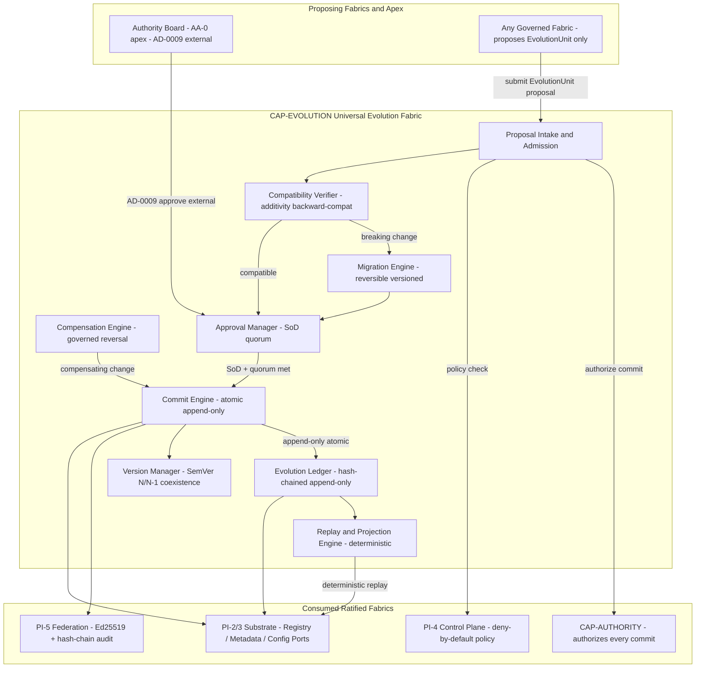
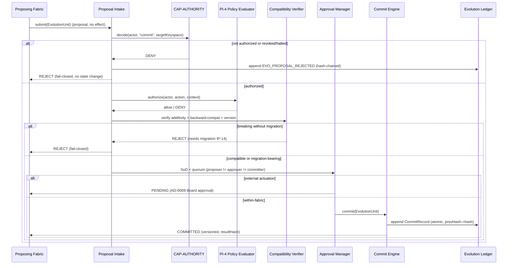
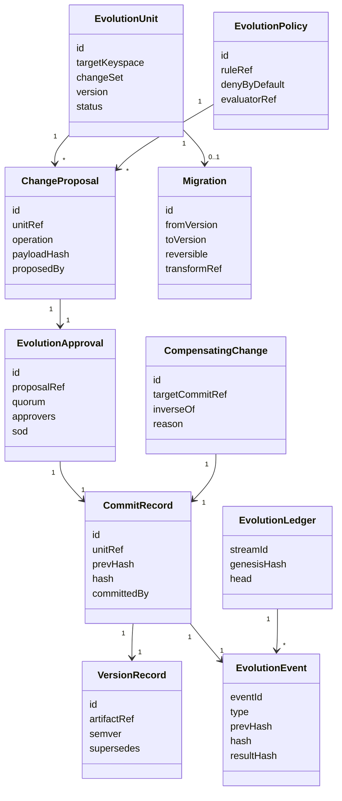
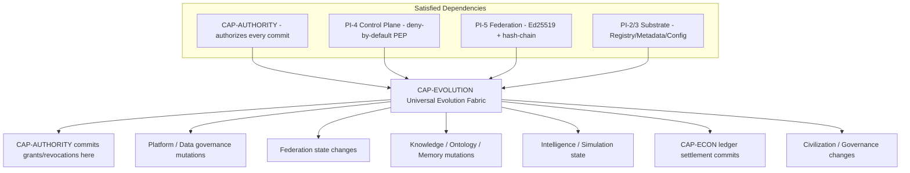

# Design Document: UCOS-CAP-EVOLUTION-CONSTRUCTION-0000

| Field | Value |
|-------|-------|
| Spec ID | `UCOS-CAP-EVOLUTION-CONSTRUCTION-0000` |
| Capability | **CAP-EVOLUTION — Universal Evolution Fabric (Construction)** |
| Layer | ARCH (Evolution) → SPEC (Construction) |
| Workflow | Design-First (Design → Requirements → Tasks) |
| Status | **DESIGN — DRAFT** (requirements & tasks in this package) |
| Design detail | High-Level Design **and** Low-Level Design (both) |
| Notation | Structured Pseudocode (`pascal`), technology-neutral per `PEP-010` |
| Position | Foundational construction specification — the sole governed mutation path every fabric commits through |

> **Governing discipline.** This is an **architecture/specification** artifact. It selects **no**
> technology, cloud, datastore, language, framework, runtime, broker, or vendor (`AUTH-004` §6.5,
> `PEP-010` Platform Independence). It **does not amend, supersede, merge, or delete** the immutable
> Authority Layer `AUTH-001..012` (`AUTH-009` §6.6): it **composes over** it and is **subordinate** to
> `CAP-AUTHORITY` for authorization of every commit. It performs **no** external actuation — every
> real-world change remains `AD-0009` Approval-Required. It preserves `INV-1..13`, enrolls **no**
> existential invariant (`INV-14..20`), keeps the **AD-0014 Ω∞ boundary** intact, and does **not**
> release the Article IX generation lock. It refines and realizes the ratified PI-6 Evolution Fabric
> (AD-0019) as a governed, registry-driven, event-sourced construction and honors the non-inverting
> authority hierarchy of `PCAMG-0008` (Layers 0–8) and `AUTH-INDEX-001` §1/§2.

---

## 0. Traceability Anchors

| Axis | Anchor |
|------|--------|
| Authority | `AUTH-004` (Architecture Canon), `AUTH-005` (Domain Canon), `AUTH-006` (Capability Canon), `AUTH-007` (Data Canon — §6.5 migration-only), `AUTH-008` (Security — S1/S3/S4), `AUTH-009` (Governance — approval-by-exception, AD-0009, §6.6 append-only immutability), `AUTH-010` (Traceability Canon), `AUTH-012` (Decision Log), `AUTH-INDEX-001` §1 (hierarchy) / §2 (Authority-wins) |
| Constitution | `UCOS-CONST-001` Art. IX (generation lock), Art. XI (immutability), Art. XII (approval-by-exception) |
| Principles | `IP-04` Configuration-Driven, `IP-05` Policy-Driven, `IP-06` Deterministic Execution, `IP-10` Auditability, `IP-13` Versioning, `IP-14` Migration-Only Evolution, `IP-15` Backward Compatibility, `INV-6` Determinism, `INV-13` Infinite Extensibility |
| Fabric spec (refined) | PI-6 Evolution Fabric (AD-0019, implemented) — the sole governed commit path; `INV-CORE-05` (Evolution Integrity) |
| Hierarchy | `PCAMG-0008` (Authority Hierarchy Layers 0–8; non-inversion guarantees G-1..G-5) |
| Capability | **CAP-EVOLUTION** (platform mutation substrate); custodian `CAP-15` Platform Governance; realized-through `CAP-19` Registry & Discovery, `CAP-10` Configuration & Metadata |
| Fabrics consumed | **CAP-AUTHORITY** (authorization of every commit — `authority:*` decisions), PI-4 Control Plane / Policy Evaluator (deny-by-default host), PI-5 Federation (Ed25519 + hash-chain audit), PI-2/3 Substrate (Registry / Metadata / Config ports) |
| Forward consumers | Every governed fabric — Authority (commits its own grants/revocations here), Platform, Data, Federation, Knowledge, Ontology, Memory, Intelligence, Simulation, **Economic (`CAP-ECON`)**, Civilization, Governance — all mutate durable governed state **only** by committing `EvolutionUnit` proposals here |

**Entry state (input).** PI-6 Evolution was implemented under AD-0019 as the sole commit path for the
control layer. Across the corpus the Evolution Fabric is named as *"the ONLY commit path"* for grants,
delegations, scopes, revocations, ontology/knowledge/memory mutations, and economic settlement. This
design formalizes that fabric as a governed, registry-driven, event-sourced **capability construction**
that every other capability composes against. Construction remains **BLOCKED** until a scoped Article IX
release act is recorded (a prospective `AD-00xx`).

---

## 1. Capability Purpose

CAP-EVOLUTION is the **governed, registry-driven, event-sourced mutation substrate** of UCOS. It is the
**single, non-bypassable path by which any durable governed state changes** — create, update, supersede,
migrate, version, or reverse — under one composable model, **without any fabric owning its own write
path, without any destructive in-place edit or delete, and without ever actuating a real-world change
autonomously**.

Its load-bearing safety property is structural: **the only way governed state changes is a
deny-by-default, deterministic, Separation-of-Duties-checked, CAP-AUTHORITY-authorized `EvolutionUnit`
proposal that the Commit Engine appends — atomically, hash-chained, versioned, and compatibility-checked
— to the append-only Evolution Ledger**, with any external-world change additionally gated by `AD-0009`,
and with **append-only immutability** guaranteeing that no committed change is ever deleted or rewritten
(corrections are governed *compensating* changes only). A compromised proposer's maximum blast radius is
*rejected proposals + audit noise*: it can commit nothing unauthorized, break no backward-compatibility
contract, and erase no history.

**Why CAP-EVOLUTION is foundational and must precede all remaining capabilities.** Authority
(`CAP-AUTHORITY`, complete) governs *whether* a change is permitted; Evolution governs *how* every
permitted change is committed, versioned, migrated, and reversed. The ratified CAP-AUTHORITY design makes
the Evolution Fabric its **sole commit path** (`evolutionOnlyCommit` floor; `S-A5`): it cannot commit a
single grant/delegation/scope/revocation except through Evolution. Every *remaining* governed capability
(Federation detail, Knowledge, Ontology, Memory, Intelligence, Simulation, Economic, Civilization,
Governance) is constitutionally required to route **all** durable mutation through this fabric
(migration-only `IP-14`, backward-compatible `IP-15`, append-only `AUTH-009` §6.6, propose-not-act). No
remaining capability can persist any governed change without it. Together, Authority + Evolution are the
minimal governed-mutation core; Authority being done, Evolution is the necessary next and precedes all
remaining capability construction.

**Explicit non-goals.** CAP-EVOLUTION is **not** an authority (it authorizes nothing — it *asks*
`CAP-AUTHORITY`); it is **not** a policy engine, identity provider, secrets manager, or cryptographic
primitive — it reuses `CAP-AUTHORITY` (authorization), PI-4 (policy), PI-5 (Ed25519 + hash-chain), and
PI-2/3 (substrate ports). It performs **no** external actuation. It defines **no** business/domain logic —
it commits *others'* governed changes.

---

## 2. Architecture (High-Level Design)

### 2.1 Architectural stance

CAP-EVOLUTION is a **composable, deny-by-default, propose-not-act, append-only mutation ledger &
coordination subsystem**, realized additively as control-layer components over the ratified
substrate/authority/control fabrics. All behavior is **driven by registries and configuration**: the
change kinds, compatibility rules, migration transforms, version lineages, and admissibility policies are
**registry/metadata records** — no mutation rule is embedded in code (`IP-04`, `IP-05`). Every committed
change conforms to the ten spine invariants `EVO-SPINE S-E1..S-E10`.

### 2.2 Component composition



### 2.3 The governed evolution loop (primary sequence)



### 2.4 Layer placement and boundaries

- **Layer:** Platform (mutation substrate), consumed by every fabric via versioned contracts
  (`AUTH-004` §6.2/§6.3). CAP-EVOLUTION sits at `PCAMG-0008` **Layer 6 (Capabilities)** realizing the
  **Layer 5 (Policies)** commit-admissibility model, anchored to **Layer 0 (Invariant Principles)** and
  **Layer 1 (Meta-Constitution)**; it may **never invert** a higher layer (`G-1..G-5`).
- **Additivity:** all prospective construction is confined to
  `packages/platform-runtime/src/control/evolution/*` plus a reserved `evolution:*` metadata keyspace.
  **Zero** modification of substrate core dirs (`src/meta-core`, `src/registry-runtime`,
  `src/metadata-runtime`, `src/configuration-runtime`, `src/contracts`) and **zero** amendment of
  `AUTH-001..012` (`G-2`).
- **Bootstrap note.** Authority commits via Evolution and Evolution authorizes via Authority — a mutual
  composition resolved by a **genesis Board-authorized commit** and the shared PI-2/3 substrate
  (see OI-1). Neither owns the other; both are subordinate to `AUTH-001..012`.

---

## 3. Domain Model

CAP-EVOLUTION realizes ten governed constructs (`EVO-C1..C10`). Each is a **metadata-backed record**
under `evolution:<kind>:<id>`, single-owner, signed, lifecycle-governed, deny-by-default, and conformant
to the spine `EVO-SPINE S-E1..S-E10`. No construct defines a business/domain model — each is a governed
description of a *change*.



| # | Construct | Definition | Key rules | Spine |
|---|-----------|------------|-----------|:-----:|
| C1 | **EvolutionUnit** | The atomic unit of governed change targeting a keyspace | Single owner; versioned (`IP-13`); propose-not-act (`S-E2`); commit only via Commit Engine (`S-E1`) | S-E1/2 |
| C2 | **ChangeProposal** | A create/update/supersede operation with payload, inside a unit | Deny-by-default; additive/compatible or migration-bearing; signed | S-E3/6 |
| C3 | **Migration** | A versioned, **reversible** transform for a breaking change | Migration-only (`S-E5`); reversible; deterministic; versioned | S-E5 |
| C4 | **CommitRecord** | The append-only, hash-chained committed change entry | Atomic; `hash = H(prevHash‖canonical)`; never deleted/rewritten (`S-E4`) | S-E4/8 |
| C5 | **CompensatingChange** | A governed inverse of a prior commit (the only reversal) | No in-place edit/delete; forward compensation only (`S-E9`) | S-E9 |
| C6 | **VersionRecord** | SemVer lineage of an artifact; supersession links | SemVer (`IP-13`); N/N-1 coexistence; supersede-not-delete (`S-E6`) | S-E6 |
| C7 | **EvolutionPolicy** | Externalized commit-admissibility rule, deny-by-default | Deny-by-default; registry-resolved; no hardcoded rule (`IP-04/05`) | S-E3 |
| C8 | **EvolutionApproval** | SoD + quorum attestation for a change | proposer ≠ approver ≠ committer (`S-E3`); quorum; AD-0009 external | S-E3 |
| C9 | **EvolutionEvent** | Hash-chained append-only record of every ledger action | Tamper-evident; replayable; determinism `resultHash` (`INV-6`) | S-E7/8 |
| C10 | **EvolutionLedger** | The append-only ordered stream (single source of truth) | Genesis-anchored; deterministic replay; single writer (`S-E1`) | S-E1/7/8 |

---

## 4. Registry Schema (Low-Level Design)

The **Evolution Registry** is the single source of truth for change/version/migration/policy state; the
**Evolution Ledger** is the append-only authoritative stream. Every construct is a registry/metadata
record under the reserved `evolution:*` keyspace — no commit logic is compiled in. New fabrics extend
UCOS by **submitting `EvolutionUnit` proposals**, not by code change (`INV-13`).

```pascal
STRUCTURE EvolutionUnitRecord            // Evolution Registry (units)
  id: EvolutionUnitId                    // "evolution:unit:<uuid>"  (keyspace: evolution:<kind>:<id>)
  targetKeyspace: KeyspaceRef            // the governed keyspace this unit mutates (e.g. authority:*)
  ownerRef: OwnerId                      // single accountable owner (single-owner mandate)
  proposedBy: AuthorityId                // provenance (never self-committed)
  changeSet: List<ProposalId>            // one or more ChangeProposals (atomic together)
  migrationRef: MigrationId?             // present iff a breaking change (S-E5)
  version: SemVer                        // IP-13
  sourceRef: RegistryRef                 // Authority/Constitution source anchor (AUTH-010)
  classification: ClassificationTag      // S4 (mandatory)
  status: EnumEvoLifecycle               // proposed | authorized | committed | compensated | retired
END STRUCTURE

STRUCTURE ChangeProposalRecord
  id: ProposalId                         // "evolution:proposal:<uuid>"
  unitRef: EvolutionUnitId
  operation: EnumChangeOp                // CREATE | UPDATE | SUPERSEDE   (never DELETE — S-E4)
  targetRef: RegistryRef                 // the record being changed
  payloadHash: Hash                      // content hash of proposed payload (tamper-evident)
  compatibility: EnumCompat              // ADDITIVE | BACKWARD_COMPATIBLE | BREAKING(->migrationRef)
END STRUCTURE

STRUCTURE MigrationRecord
  id: MigrationId                        // "evolution:migration:<uuid>"
  fromVersion: SemVer
  toVersion: SemVer                      // MUST be a higher version (forward)
  transformRef: RegistryRef              // deterministic transform (IP-06/INV-6)
  reversible: Boolean = TRUE             // reversible via inverseTransformRef (S-E9)
  inverseTransformRef: RegistryRef       // governed reversal path
END STRUCTURE

STRUCTURE VersionRecord
  id: VersionId                          // "evolution:version:<artifact>@<semver>"
  artifactRef: RegistryRef
  semver: SemVer
  supersedes: VersionId?                 // supersede-not-delete (S-E6); N/N-1 coexistence
  deprecationWindow: Duration?           // deprecation window for N-1 (IP-15)
END STRUCTURE

STRUCTURE EvolutionPolicyRecord
  id: EvoPolicyId                        // "evolution:policy:<slug>"
  ruleRef: RegistryRef                   // externalized deterministic rule (IP-05)
  evaluatorRef: RegistryRef              // PI-4 policy evaluator binding
  denyByDefault: Boolean = TRUE          // non-overridable floor (S-E3)
  version: SemVer
END STRUCTURE

STRUCTURE CompensatingChangeRecord
  id: CompensationId                     // "evolution:compensation:<uuid>"
  targetCommitRef: CommitId              // the committed record being reversed
  inverseOf: ProposalId                  // governed inverse operation
  reason: CompensationReason
  forwardOnly: Boolean = TRUE            // reversal is itself a new forward commit (S-E9)
END STRUCTURE
```

**Registry rules (enforced — admission + validation).**
1. Every record has exactly one owner (single-owner mandate; `AUTH-005`/`AUTH-007`).
2. Every record is classified (`AUTH-007` §6.3); unclassified ⇒ blocking gap (S4).
3. Every record is versioned (`IP-13`); breaking changes require `migrationRef` + a new version (`IP-14/15`).
4. No commit behavior is hardcoded: policies/rules/migrations are **records** resolved from the registry.
5. `operation` is `CREATE | UPDATE | SUPERSEDE` only — **never `DELETE`** (append-only, `S-E4`).
6. Every commit is authorized by a `CAP-AUTHORITY` decision (`decide(actor,"commit",targetKeyspace)=Allow`).
7. Every record traces to an Authority/Constitution source (`AUTH-010`).
8. Ledger is the single source of truth; runtime never caches state without a projection from the ledger.

```pascal
PROCEDURE admitEvolutionUnit(unit, requestingAuthority)
  INPUT: unit (EvolutionUnitRecord), requestingAuthority (AuthorityId)
  OUTPUT: Result

  SEQUENCE
    // deny-by-default: only an actor CAP-AUTHORITY authorizes may commit to this keyspace
    ASSERT Authority.decide(requestingAuthority, "commit", unit.targetKeyspace) = Allow(_)
    ASSERT NOT Authority.revokedOrHalted(requestingAuthority)

    // admission rules (all fail-closed)
    ASSERT isWellFormed(unit) AND isClassified(unit)                    // S4
    ASSERT resolves(unit.sourceRef)                                     // AUTH-010
    ASSERT unit.proposedBy <> unit.id                                  // no self-commit provenance
    FOR each p IN unit.changeSet DO
      ASSERT p.operation IN {CREATE, UPDATE, SUPERSEDE}                 // never DELETE (S-E4)
      IF p.compatibility = BREAKING THEN
        ASSERT unit.migrationRef <> NULL AND resolves(unit.migrationRef) // migration-only (S-E5)
      END IF
    END FOR

    IF Ledger.headContains(unit.id) THEN
      RETURN Error("Unit already committed; corrections require a CompensatingChange (S-E9)")
    END IF

    // admission produces an authorized proposal; commit happens only after SoD + quorum
    RETURN Approval.request(unit, quorum = resolveConfig().quorumFloor)  // propose-not-act (S-E2)
  END SEQUENCE
END PROCEDURE
```

---

## 5. Configuration Model

Behavior is tuned through **hierarchical configuration** resolved from the substrate Configuration port
(`IP-04`), never hardcoded. Precedence: `default -> fabric-profile -> environment -> instance`
(deep-merge; later overrides earlier).

```pascal
STRUCTURE EvolutionConfig
  denyByDefault: Boolean = TRUE                 // non-overridable floor (S-E3)
  appendOnly: Boolean = TRUE                    // non-overridable floor (no delete/in-place edit, S-E4)
  migrationOnly: Boolean = TRUE                 // non-overridable floor (breaking => migration, S-E5)
  backwardCompatWindow: Duration                // N/N-1 coexistence window (IP-15)
  quorumFloor: Integer                          // minimum ratification quorum (S-E3)
  externalActuationGate: EnumGate = "AD-0009"   // non-overridable floor (external change)
  authorityGatedCommit: Boolean = TRUE          // non-overridable floor (every commit CAP-AUTHORITY-authorized)
  singleWriterCommit: Boolean = TRUE            // non-overridable floor (Evolution is the sole write path, S-E1)
  deterministicReplay: Boolean = TRUE           // non-overridable floor (INV-6)
END STRUCTURE
```

**Configuration floors (non-waivable).** `denyByDefault`, `appendOnly`, `migrationOnly`,
`externalActuationGate = AD-0009`, `authorityGatedCommit`, `singleWriterCommit`, `deterministicReplay`,
and the S1/S3/S4 controls are **floors** configuration may tighten but never relax. Any configuration
attempting to relax a floor is rejected as a governance violation.

```pascal
FUNCTION resolveConfig(scope)
  OUTPUT: EvolutionConfig
  SEQUENCE
    merged <- deepMerge(default, fabricProfile(scope), environment(scope), instance(scope))
    ASSERT merged.denyByDefault = TRUE
    ASSERT merged.appendOnly = TRUE
    ASSERT merged.migrationOnly = TRUE
    ASSERT merged.externalActuationGate = "AD-0009"
    ASSERT merged.authorityGatedCommit = TRUE
    ASSERT merged.singleWriterCommit = TRUE
    ASSERT merged.deterministicReplay = TRUE
    RETURN merged
  END SEQUENCE
END FUNCTION
```

---

## 6. Event Model (Event Sourcing)

Every governed change is an **event** appended to a hash-chained, append-only ledger (`S-E8`; `IP-10`;
S6). Current governed state is a **projection** replayed from the ledger — the ledger, not the
projection, is authoritative. This gives deterministic reconstruction, tamper-evident auditability, and
reversibility by governed compensating events (never silent edits — `AUTH-009` §6.6 append-only).

### 6.1 Canonical event vocabulary

```pascal
STRUCTURE EvolutionEvent
  eventId: Uuid
  streamId: EventStreamId
  sequence: MonotonicInt              // strictly increasing per stream
  prevHash: Hash                      // hash-chain (tamper-evident)
  hash: Hash                          // = H(prevHash || canonical(payload))
  type: EnumEvoEventType
  payload: EventPayload
  actor: ActorId
  unitRef: EvolutionUnitId
  resultHash: Hash                    // determinism proof for commits/migrations (INV-6)
  timestamp: LogicalClock
  classification: ClassificationTag
END STRUCTURE

ENUM EnumEvoEventType
  EVO_PROPOSAL_SUBMITTED       // propose-not-act: no state change yet
  EVO_PROPOSAL_AUTHORIZED      // CAP-AUTHORITY allowed the commit
  EVO_PROPOSAL_REJECTED        // fail-closed (unauthorized / incompatible / policy-deny)
  EVO_COMPAT_VERIFIED          // additivity / backward-compat verified
  EVO_MIGRATION_REGISTERED     // reversible migration for a breaking change
  EVO_APPROVAL_REQUESTED       // SoD + quorum pending
  EVO_APPROVAL_GRANTED         // quorum met
  EVO_APPROVAL_PENDING_AD0009  // external actuation escalated to Board
  EVO_COMMITTED                // atomic, append-only commit
  EVO_COMPENSATED              // governed reversal (inverse commit; never delete)
  EVO_VERSION_SUPERSEDED       // N -> N+1; N/N-1 coexistence
  EVO_REPLAY_VERIFIED          // deterministic replay checkpoint
END ENUM
```

### 6.2 Compensating-change event

```pascal
STRUCTURE CompensationPayload
  targetCommitRef: CommitId
  inverseOf: ProposalId
  forwardOnly: Boolean = TRUE          // reversal is itself a forward, append-only commit (S-E9)
END STRUCTURE
```

### 6.3 Projection (deterministic replay)

```pascal
FUNCTION projectGovernedState(streamId)
  OUTPUT: Map<KeyspaceRef, ArtifactView>
  SEQUENCE
    state <- emptyMap()
    prev <- GENESIS_HASH
    FOR each event IN ledger.readOrdered(streamId) DO
      ASSERT event.prevHash = prev                          // chain integrity
      ASSERT event.hash = H(prev, canonical(event.payload)) // tamper-evidence
      applyEvent(state, event)
      IF event.type = EVO_COMPENSATED THEN
        applyInverse(state, event.payload)                  // reversal by compensation, forward-only
      END IF
      ASSERT invariantsHold(state)   // append-only, version-monotonic, backward-compat, single-writer
      prev <- event.hash
    END FOR
    RETURN state
  END SEQUENCE
END FUNCTION
```

**Preconditions:** stream exists; genesis anchored. **Postconditions:** governed state reproduces
deterministically for the same stream (`INV-6`); any hash/invariant breach halts replay fail-closed.
**Loop invariant:** at every iteration append-only, version-monotonicity, backward-compatibility, and
single-writer invariants hold; no committed change is ever deleted or rewritten — only compensated
forward.

---

## 7. API Model (Low-Level Design)

CAP-EVOLUTION exposes **contract-first, versioned** operations (`AUTH-004` §6.1/§6.3). All are
**propose-not-act**: they enqueue governed proposals; none mutates state directly. Every exposed
operation is deny-by-default, CAP-AUTHORITY-authorized, and policy-evaluated.

```pascal
INTERFACE EvolutionFabricAPI  // version v1.0 (IP-13)

  // --- Proposal & commit (propose only) ---
  PROCEDURE submit(unit): ProposalReceipt                       // propose-not-act (S-E2)
  FUNCTION  verifyCompatibility(unit): CompatVerdict            // additivity / backward-compat / breaking
  PROCEDURE registerMigration(migration, authority): Result     // reversible, versioned (S-E5)
  PROCEDURE requestApproval(proposal, proposer): ApprovalReceipt // SoD + quorum
  FUNCTION  commit(unit, committer): CommitReceipt              // atomic append-only (S-E1/4)

  // --- Reversal (governed, forward-only) ---
  FUNCTION  compensate(commitId, compensator): CommitReceipt    // inverse commit; never delete (S-E9)

  // --- Version & read (read-only projection) ---
  FUNCTION  currentVersion(artifactRef): SemVer                 // read-only
  FUNCTION  coexistingVersions(artifactRef): List<SemVer>       // N / N-1 (IP-15)
  FUNCTION  projectState(streamId): StateView                  // deterministic replay (read-only)
  FUNCTION  getCommit(commitId): CommitRecord                  // read-only

END INTERFACE
```

### 7.1 Commit API — formal specification

```pascal
FUNCTION commit(unit, committer)
  INPUT: unit (EvolutionUnitRecord), committer (AuthorityId)
  OUTPUT: CommitReceipt

  SEQUENCE
    // 0. authorization + revocation/halt supremacy (non-bypassable, checked FIRST)
    IF Authority.decide(committer, "commit", unit.targetKeyspace) <> Allow(_)
       OR Authority.revokedOrHalted(committer) THEN
      audit(EVO_PROPOSAL_REJECTED, reason = "unauthorized-or-halted")
      RETURN Reject("unauthorized-or-halted")                          // fail-closed, no state change
    END IF

    // 1. policy (deny-by-default) -- PI-4 Control Plane
    IF ControlPlane.authorize(committer, "commit", ctx) <> ALLOW THEN
      audit(EVO_PROPOSAL_REJECTED, reason = "policy-deny")
      RETURN Reject("policy-deny")
    END IF

    // 2. compatibility + migration (fail-closed)
    verdict <- verifyCompatibility(unit)
    IF verdict = BREAKING AND unit.migrationRef = NULL THEN
      RETURN Reject("breaking-without-migration")                      // migration-only (S-E5)
    END IF

    // 3. separation of duties + quorum (S-E3)
    ASSERT proposer(unit) <> approver(unit) AND approver(unit) <> committer
    approval <- Approval.evaluate(unit, quorum = resolveConfig().quorumFloor)
    IF NOT approval.met THEN RETURN Pending("quorum-not-met") END IF

    // 4. external actuation gate
    IF actuatesExternal(unit) THEN
      audit(EVO_APPROVAL_PENDING_AD0009)
      RETURN Pending("AD-0009 approval required")                      // never autonomous
    END IF

    // 5. determinism + atomic append-only commit (S-E1/4/7/8)
    resultHash <- H(canonical(unit.changeSet, unit.version))
    prev <- Ledger.headHash(unit.targetKeyspace)
    entry <- CommitRecord(unitRef = unit.id, prevHash = prev,
                          hash = H(prev, canonical(unit)), committedBy = committer)
    Ledger.append(entry)                                              // atomic; strictly increasing
    audit(EVO_COMMITTED, unit.id, resultHash)
    RETURN Committed(entry.ref, version = unit.version, resultHash)
  END SEQUENCE
END FUNCTION
```

**Preconditions:** committer authenticated (S1); unit well-formed, classified, version-consistent.
**Postconditions:** a deterministic `Committed | Reject | Pending` outcome with a reproducible
`resultHash`; a revoked/halted or unauthorized committer is **always** rejected; no external change
commits without `AD-0009`; the ledger grows append-only (no delete/rewrite). **Loop invariants:** N/A
(no unbounded loop; changeSet iteration is bounded by the unit).

### 7.2 Compensation API — formal specification

```pascal
FUNCTION compensate(commitId, compensator)
  INPUT: commitId (CommitId), compensator (AuthorityId)
  OUTPUT: CommitReceipt
  SEQUENCE
    ASSERT Authority.decide(compensator, "commit", targetOf(commitId)) = Allow(_)
    original <- Ledger.get(commitId)
    ASSERT original <> NULL
    inverse <- buildInverse(original)                                 // governed inverse (no delete)
    // reversal is itself a new, forward, append-only commit
    RETURN commit(unitOf(inverse), compensator)                       // S-E9
  END SEQUENCE
END FUNCTION
```

---

## 8. Governance Model

CAP-EVOLUTION is governed by the ten spine invariants (`EVO-SPINE S-E1..S-E10`) enforced at runtime as
guards. It is **subordinate** to `AUTH-001..012`, to `CAP-AUTHORITY` (authorization), and to the
`PCAMG-0008` non-inversion guarantees.

| Governance dimension | Mechanism |
|----------------------|-----------|
| Single writer | Evolution is the **sole** governed commit path; no fabric writes governed state directly (`S-E1`) |
| Propose-not-act | Submission mutates nothing until an authorized, approved commit (`S-E2`) |
| Authorization | Every commit is gated by a `CAP-AUTHORITY` decision (`decide=Allow`) (`S-E10`) |
| Separation of duties | `propose ≠ approve ≠ commit`; compensator distinct where required (`S-E3`) |
| Ratification | Quorum-gated approval for every change (`S-E3`) |
| Deny-by-default | Every proposal rejected unless authorized + policy-allowed + compatible (`S-E3`) |
| Append-only | No delete, no in-place edit or rewrite; corrections are compensating commits (`S-E4`) |
| Migration-only | Breaking change requires a reversible, versioned migration (`S-E5`, `IP-14`) |
| Backward compatibility | N/N-1 coexistence; additive upcasters; deprecation windows (`S-E6`, `IP-15`) |
| Determinism | Commit/migration/replay are pure functions of recorded inputs (`S-E7`, `INV-6`) |
| Auditability | Hash-chained events; reversible only by governed compensation (`S-E8`, S6) |
| No external actuation | External-world change is `AD-0009` Approval-Required |
| Non-inversion | No lower layer commits changes that invert a higher `PCAMG-0008` layer (`G-1..G-5`) |

### 8.1 Decision-rights (summary)

| Class | Proposer | Authorizer | External-act approver | Reverser |
|-------|----------|-----------|-----------------------|----------|
| Additive commit | Any fabric | CAP-AUTHORITY + Policy + SoD + quorum | — | Compensation authority |
| Breaking change | Any fabric | + registered reversible migration | — | Compensation authority |
| External-world change | Any fabric | CAP-AUTHORITY | AD-0009 (Board) | Compensation authority |
| Compensation (reversal) | Compensation authority | CAP-AUTHORITY + SoD | — | (forward-only; not itself deletable) |
| Genesis/bootstrap commit | Board | Board (quorum) | — | Board |

**Constitutional compliance.** CAP-EVOLUTION is subordinate to `AUTH-001..012` and `UCOS-CONST-001`; it
amends none of them (`AUTH-009` §6.6, `G-2`). Construction cannot begin until the Article IX generation
lock is released for a scoped evolution subtree (a prospective `AD-00xx`); non-waivable S1/S3/S4 are
preserved; every governed action is auditable and traceable (`AUTH-010`).

---

## 9. Dependency Graph



- **Hard, satisfied:** CAP-AUTHORITY (authorization), PI-4 (policy), PI-5 (crypto/audit), PI-2/3
  (substrate ports). CAP-EVOLUTION is constructible on these; it adds **no** new core mechanism.
- **Mutual composition (bootstrap):** CAP-AUTHORITY commits its own grants/revocations *through*
  CAP-EVOLUTION, while CAP-EVOLUTION authorizes commits *through* CAP-AUTHORITY. Resolved by a
  genesis Board-authorized commit and the shared PI-2/3 substrate (OI-1); neither owns the other.
- **Forward consumers:** every governed fabric mutates durable state only by committing `EvolutionUnit`
  proposals; no consumer requires a CAP-EVOLUTION core change (`INV-13`). Superseded artifacts are
  linked, **never deleted** (`AUTH-009` §6.6).

---

## 10. Correctness Properties

1. **Single writer.** No governed state changes except through `commit` (`∀ Δ: originatedFrom(Evolution)`).
2. **Propose-not-act.** Submission mutates no state until an authorized, approved commit.
3. **Authorization gate.** Every commit is preceded by a `CAP-AUTHORITY` `Allow` decision.
4. **Append-only.** No committed change is ever deleted or rewritten; only compensated forward.
5. **Migration-only.** Every breaking change carries a registered, reversible, versioned migration.
6. **Backward compatibility.** N and N-1 versions coexist within the deprecation window; replay of
   historical events remains valid (additive upcasters).
7. **Determinism.** Replaying the same ledger yields identical state; identical commit inputs yield
   identical `resultHash` (`INV-6`).
8. **Reversibility by compensation.** Every commit is reversible only by a governed forward
   compensating commit — never by silent delete/edit (`S-E9`).
9. **Separation of duties.** For any change, proposer ≠ approver ≠ committer; quorum ≥ floor.
10. **No external actuation.** No external-world change commits without an `AD-0009` approval.
11. **Non-inversion.** No lower-layer commit inverts a higher `PCAMG-0008` layer (`G-1`).
12. **Additivity.** Construction changes no substrate core dir, amends no `AUTH-001..012`, and preserves
    the existing baseline green (0 regressions).

---

## 11. Evidence Requirements

| Evidence ID | Evidence | Class | Source |
|-------------|----------|-------|--------|
| EV-CAP-EVO-DESIGN | This design + requirements + tasks approved | E-DESIGN | Spec workflow |
| EV-CAP-EVO-IMP | Registry-first implementation of `EVO-C1..C10` engines with no hardcoded commit logic | E-CODE | Implementation |
| EV-CAP-EVO-TEST | Unit/property/integration/replay tests for all correctness properties | E-CODE | Test suites |
| EV-CAP-EVO-AUDIT | Hash-chained events; offline replay proof; append-only retention | E-HIST | `AUTH-010` / S6 conformance |
| EV-CAP-EVO-RECON | Compensating-change reconciliation; ledger vs `AUTH-012` reconciliation; replay recovery | E-HIST | Reconciliation harness |
| EV-CAP-EVO-TRACE | Full lineage (0 orphans); requirements → tasks; register-then-migrate coverage | E-DESIGN | Traceability matrix |
| EV-CAP-EVO-SEC | S1/S3/S4 enforced; signed commits (Ed25519 by reference); adversarial suite 0 residual High/High | E-CODE | `AUTH-008` + adversarial |

**Non-optimistic discipline:** absence of any required evidence = FAIL (per `OP-CERT-001`).

---

## 12. Completion Criteria

CAP-EVOLUTION construction is **complete** when **all** hold (fail-closed conjunction):

1. All 12 correctness properties (§10) are proven by passing tests.
2. All 10 constructs (`EVO-C1..C10`) and engines are implemented registry-first with **no hardcoded
   commit logic**.
3. Deny-by-default, authorization-gated, compatibility/migration, SoD/quorum, append-only, and
   single-writer gates are enforced at the commit boundary.
4. Event sourcing is authoritative: governed state is a projection; replay is deterministic and
   tamper-evident.
5. The adversarial suite passes with **0 residual High/High**.
6. Non-waivable S1/S3/S4 enforced; external actuation remains `AD-0009`-gated.
7. Ledger is the single source of truth; onboarding a new fabric requires **no core change** (`INV-13`).
8. Additive-only: 0 prohibited-core-dir change; 0 `AUTH-001..012` amendment (`G-2`); baseline green.
9. Full traceability recorded (`AUTH-010`); all `EV-CAP-EVO-*` evidence present.
10. A scoped Article IX release act (`AD-00xx`) authorizes the `src/control/evolution/*` construction.

---

## 13. Implementation Phases

Registry-first, additive build waves (each wave additive-only; baseline green at the boundary). W0–W9
map to the exit gates in tasks.md.

| Wave | Scope | Exit gate |
|------|-------|-----------|
| **W0 Foundations** | `types`, Evolution Registry skeleton, spine checks (`S-E1..S-E10`), keyspace `evolution:*` | Build + baseline green |
| **W1 Registry & Admission** | Unit/proposal admission, validation, versioning, classification, authorization binding | Admission fail-closed; authorization-gated |
| **W2 Ledger & Event Store** | Hash-chained append-only ledger, event vocabulary, projection, deterministic replay | Tamper-evidence + deterministic replay |
| **W3 Compatibility & Policy** | Compatibility Verifier (additive/backward-compat/breaking), Evolution Policy + PI-4 binding, config floors | Backward-compat; deny-by-default |
| **W4 Commit Engine** | Deterministic atomic append-only `commit`, `resultHash` verifier, single-writer gate | Determinism; single-writer; propose-not-act |
| **W5 Migration Engine** | Reversible, versioned migrations; additive upcasters; N/N-1 coexistence | Migration-only; reversible; N/N-1 |
| **W6 Version Manager** | SemVer lineage, supersession, deprecation windows | Version-monotonicity; supersede-not-delete |
| **W7 Approval & SoD** | Approval Manager (SoD + quorum), AD-0009 external-actuation escalation | SoD/quorum; AD-0009 pending path |
| **W8 Compensation Engine** | Governed forward-only reversal; no delete/edit; ledger reconciliation | Reversal-by-compensation; append-only preserved |
| **W9 Federation & Adversarial** | Federation-safe replication (advisory/deny-only), adversarial suite, register-then-migrate harness | 0 residual High/High; audit replay; additivity gate |

**Approval-Required acts (`AD-0009`)** — external-world change, scoped Article IX release — are deferred
to runtime/Board and never auto-executed.

---

## 14. Migration Strategy

Governed by `AUTH-007` §6.5 (migration-only evolution), `AUTH-009` §6.6 (append-only immutability), and
`IP-13/14/15`.

- **Onboarding via register-then-migrate.** Existing per-fabric write paths are onboarded by routing
  their governed mutations through `EvolutionUnit` proposals; legacy write text is superseded/linked,
  **never deleted** (`G-2`).
- **Schema/registry evolution:** all change/version/migration schema changes occur through reversible,
  recorded migrations; never destructive in-place edits. Each migration is versioned and traceable.
- **Event stream evolution:** event types are additive and versioned; older events remain replayable
  (upcasters map old → new payloads deterministically). No event is deleted or rewritten (append-only).
- **Backward compatibility (`IP-15`):** API is versioned (`v1.0`); N and N-1 coexist during deprecation
  windows; breaking contract changes require a new major version + migration path.
- **Rollback:** every commit is reversible by a **governed compensating commit**; there is no silent
  delete or in-place edit.
- **External irreversibility:** any migration touching real-world actuation is `AD-0009` Approval-Required.

---

## 15. Test Strategy

### 15.1 Unit testing
Per-construct: registry admission-by-migration, classification inheritance, single-owner enforcement,
compatibility classification, migration reversibility, version monotonicity, config floor enforcement,
no-self-commit provenance, append-only rejection of DELETE.

### 15.2 Property-based testing
Deterministic-seedable library selected at construction time. Core properties:

```pascal
PROPERTY singleWriterCommit
  FOR ALL governed state change d:  originatedFrom(d) = EvolutionCommitEngine

PROPERTY appendOnlyLedger
  FOR ALL commit c:  NOT exists(deleteOrRewrite(c))     // only compensation is admissible

PROPERTY migrationOnly
  FOR ALL proposal p WHERE p.compatibility = BREAKING:  p.unit.migrationRef <> NULL AND reversible(p.unit.migrationRef)

PROPERTY backwardCompatibleReplay
  FOR ALL historical event e:  replay(e) yields identical state under N and N-1 within window

PROPERTY deterministicReplay
  FOR ALL stream st:  projectGovernedState(st) = projectGovernedState(st)   // stable resultHash

PROPERTY reversibilityByCompensation
  FOR ALL commit c:  exists forward compensating commit c' such that state(after c') = state(before c)

PROPERTY separationOfDuties
  FOR ALL change x:  proposer(x) <> approver(x) <> committer(x)  AND quorum(x) >= floor
```

### 15.3 Adversarial testing (AC1–ACn)
One test per evolution threat: unauthorized commit, direct-write bypass (writing state without Evolution),
DELETE/in-place-edit attempt, breaking change without migration, backward-compat break, non-deterministic
commit injection, ledger hash-chain tampering, SoD collusion, quorum evasion, external actuation without
AD-0009, version rollback (destructive), cross-node auto-commit. **Pass criterion:** 0 residual
High/High; each attack yields rejection + audit noise only.

### 15.4 Integration testing
- End-to-end governed loop (submit → CAP-AUTHORITY authorize → policy → compatibility/migration →
  SoD/quorum → atomic append-only commit → hash-chained audit) against implemented CAP-AUTHORITY/PI-4/
  PI-5 fabrics.
- Register-then-migrate: onboard a representative fabric's write path as `EvolutionUnit` proposals and
  prove behaviour-preservation.
- Additivity gate: run the full existing platform-runtime baseline; require **0 regressions** and **0
  `AUTH-*` amendments**.

---

## 16. Operational Model

| Concern | Design |
|---------|--------|
| **Ownership** | Custodian `CAP-15` Platform Governance; single accountable owner per registry record |
| **Observability** | Every evolution event emits structured, classified, hash-chained audit records; commit rate, reject rate, and version lineage are queryable read-models |
| **Failure handling** | All failures are **fail-closed** (reject; no state change); unauthorized/policy/compat/SoD failures produce `EVO_PROPOSAL_REJECTED` + audit; nothing is silently committed |
| **Recovery** | Governed state recovered by deterministic ledger replay; corrections by governed compensating commits; RPO/RTO floors inherit from `UCOS-ASR-NFR-001` (values `PENDING ASR RATIFICATION`, N-1) |
| **Emergency control** | A halt on the target keyspace (via CAP-AUTHORITY) freezes commits fail-closed; resume requires a distinct authority (SoD) |
| **Federation** | Replication is advisory-only, deny-only, trust-clamped, namespace-isolated, local-shadows-foreign; no cross-node auto-commit; fail-closed on partition |
| **Auditability** | Hash-chained `EVO_*` events; offline replay proof; append-only retention (`AUTH-009` §6.6) |
| **Determinism guarantee** | Commit/migration/replay are pure functions of recorded inputs; any non-reproducible `resultHash` is inadmissible (`INV-6`) |

---

## 17. Error Handling

| Scenario | Condition | Response | Recovery |
|----------|-----------|----------|----------|
| Unauthorized commit | CAP-AUTHORITY denies / committer revoked or halted | `EVO_PROPOSAL_REJECTED`; non-bypassable | Obtain a valid authority + decision |
| Policy deny | Control Plane returns not-ALLOW | `EVO_PROPOSAL_REJECTED`; fail-closed | Re-submit with valid context |
| Direct-write bypass | Attempt to mutate governed state outside Evolution | Reject; single-writer guard | Route change through `submit`/`commit` |
| DELETE / in-place edit | `operation = DELETE` or rewrite of a committed record | Reject admission (append-only) | Use a governed `CompensatingChange` |
| Breaking without migration | `compatibility = BREAKING` and no `migrationRef` | Reject | Register a reversible migration (`IP-14`) |
| Backward-compat break | N-1 consumers would break | Reject | Additive change + deprecation window (`IP-15`) |
| Quorum not met | Approvers < quorum floor | `Pending("quorum-not-met")` | Obtain additional distinct approvers (SoD) |
| External actuation | Change actuates real-world effect | `Pending("AD-0009")` — never autonomous | Human/Board approval |
| Non-deterministic commit | `resultHash` not reproducible | Reject as inadmissible | Make transform pure (`INV-6`) |
| Chain break | Event `prevHash`/`hash` mismatch on replay | Halt replay fail-closed; flag tamper | Governance investigation; restore from audit |

---

## 18. Security Considerations

- **S1 (Authentication/Authorization):** every committer authenticated; deny-by-default authorization
  via `CAP-AUTHORITY` + PI-4 policy evaluator; commits are single-writer, gated, revocable.
- **S3 (Secrets/Keys):** signing keys referenced, never embedded; signed commit acts reuse PI-5 Ed25519
  assertions (no custom cryptography).
- **S4 (Data Protection):** unit/proposal/version records carry inherited classification (`AUTH-007`
  §6.3); classification is monotonic and enforced on projections/exports.
- **S6 (Audit):** immutable, hash-chained, append-only evolution audit trail; independently
  replayable/verifiable (`AUTH-009` §6.6).
- **Blast radius:** structural — a compromised proposer can only cause rejected proposals + audit noise;
  it cannot commit unauthorized state, bypass the single writer, delete/rewrite history, break
  backward-compatibility, or actuate external change (authorization + single-writer + append-only +
  migration-only + `AD-0009`).
- **Non-waivable:** S1/S3/S4 floors and the `denyByDefault`/`appendOnly`/`migrationOnly`/
  `externalActuationGate=AD-0009`/`authorityGatedCommit`/`singleWriterCommit`/`deterministicReplay`
  configuration floors cannot be relaxed by configuration.

---

## 19. Open Items and Deferrals

| ID | Item | Disposition |
|----|------|-------------|
| OI-1 | Authority↔Evolution bootstrap ordering (mutual composition) | Genesis Board-authorized commit + shared PI-2/3 substrate; documented, no circular runtime dependency at steady state |
| OI-2 | Scoped Article IX release for `src/control/evolution/*` | Authority Board act (`AD-00xx`); construction blocked until granted |
| OI-3 | Register-then-migrate order across existing per-fabric write paths | Sequenced in tasks phase; append-only, no deletion |
| OI-4 | ASR/NFR quantitative values (RPO/RTO/commit-latency/throughput) | `PENDING ASR RATIFICATION` (Trusted Op N-1, Prompt 02) |
| OI-5 | Harmonization of `PCAMG-0008` (proposed) with `AUTH-INDEX-001` §1 (ratified) | Reconciled by version increment + `AUTH-012`, never silent rewrite; Board review pending |

---

## 20. Traceability Links

- **Refines:** `AUTH-004`, `AUTH-005`, `AUTH-006`, `AUTH-007` (§6.5), `AUTH-008`, `AUTH-009` (§6.6),
  `AUTH-010`, `AUTH-INDEX-001` (§1/§2), `UCOS-CONST-001` (Art. IX/XI/XII), PI-6 Evolution Fabric
  (AD-0019), `INV-CORE-05`, `PCAMG-0008` (Layers 0–8, `G-1..G-5`).
- **Refined by:** `UCOS-CAP-EVOLUTION-CONSTRUCTION-0000/requirements.md`,
  `UCOS-CAP-EVOLUTION-CONSTRUCTION-0000/tasks.md`.
- **Consumes:** `CAP-AUTHORITY` (authorization), PI-4 Control Plane, PI-5 Federation, PI-2/3 Substrate
  (satisfied).
- **Enables:** every governed fabric — Authority, Platform, Data, Federation, Knowledge, Ontology,
  Memory, Intelligence, Simulation, **Economic (`CAP-ECON`)**, Civilization, Governance — via committed
  `EvolutionUnit` proposals (`INV-13`).
- **Preserves:** `AUTH-001..012` (unamended, `G-2`), `INV-1..13`, `AUTH-012`, `AD-0014` (Ω∞ boundary),
  Article IX generation lock, single apex (`AA-0`).
- **Owner:** UCOS Authority Board (custodian: Platform Governance `CAP-15`).

**END design.md — DESIGN — DRAFT.**
